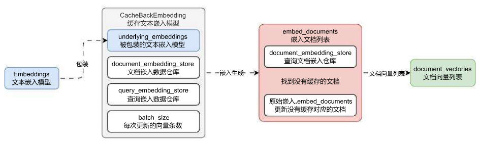

# CacheBackEmbedding 组件的使用

## 01. CacheBackEmbedding 使用与场景

通过嵌入模型计算传递数据的向量需要昂贵的算力，对于重复的内容，Embeddings 计算的结果肯定是一致的，如果数据重复仍然二次计算，会导致效率非常低，而且增加无用功。

所以在 LangChain 中提供了一个叫 `CacheBackEmbedding` 的包装类，一般通过类方法 `from_bytes_store` 进行实例化，它接受以下参数：

1. `underlying_embedder`：用于嵌入的嵌入模型。
2. `document_embedding_cache`：用于缓存文档嵌入的任何存储库（ByteStore）。
3. `batch_size`：可选参数，默认为 None，在存储更新之间要嵌入的文档数量。
4. `namespace`：可选参数，默认为`""`，用于文档缓存的命名空间。此命名空间用于避免与其他缓存发生冲突。例如，将其设置为所使用的嵌入模型的名称。
5. `query_embedding_cache`：可选默认为 None 或者不缓存，用于缓存查询 / 文本嵌入的 ByteStore，或这是为 True 以使用与 `document_embedding_cache` 相同的存储。

> 注意事项：CacheBackEmbedding 默认不缓存 embed_query 生成的向量，如果要缓存，需要设置 query_embedding_cache 的值，另外请尽可能设置 namespace，以避免使用不同嵌入模型嵌入的相同文本发生冲突。

使用示例：

```python
import dotenv
import numpy as np
from langchain.embeddings import CacheBackedEmbeddings
from langchain.storage import LocalFileStore
from langchain_openai import OpenAIEmbeddings
from numpy.linalg import norm

dotenv.load_dotenv()


def cosine_similarity(vector1: list, vector2: list) -> float:
    """计算传入两个向量的余弦相似度"""
    # 1.计算内积/点积
    dot_product = np.dot(vector1, vector2)

    # 2.计算向量的范数/长度
    norm_vec1 = norm(vector1)
    norm_vec2 = norm(vector2)

    # 3.计算余弦相似度
    return dot_product / (norm_vec1 * norm_vec2)


embeddings = OpenAIEmbeddings(model="text-embedding-3-small")
embeddings_with_cache = CacheBackedEmbeddings.from_bytes_store(
    embeddings,
    LocalFileStore("./cache/"),
    namespace=embeddings.model,
    query_embedding_cache=True,
)

query_vector = embeddings_with_cache.embed_query("你好，我是慕小课，我喜欢打篮球")
documents_vector = embeddings_with_cache.embed_documents([
    "你好，我是慕小课，我喜欢打篮球",
    "这个喜欢打篮球的人叫慕小课",
    "求知若渴，虚心若愚"
])

print(query_vector)
print(len(query_vector))

print("============")

print(len(documents_vector))
print("vector1与vector2的余弦相似度:", cosine_similarity(documents_vector[0], documents_vector[1]))
print("vector2与vector3的余弦相似度:", cosine_similarity(documents_vector[0], documents_vector[2]))
```

## 02. CacheBackEmbedding 运行流程

CacheBackEmbedding 底层的运行流程非常简单，本质上就是封装了一个持久化存储的数据存储仓库，在每次进行数据嵌入前，会从前数据存储仓库中检索对对应的向量，然后逐个匹配对应的数据是否相等，找到缓存中没有的文本，然后将这些文本调用嵌入生成向量，最后将生成的新向量存储到数据仓库中，从而完成对数据的存储。

运行流程如下：

