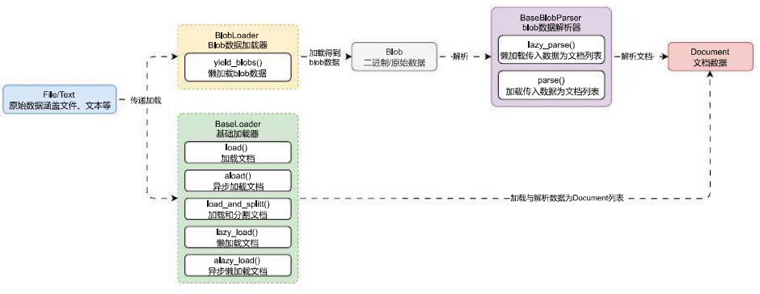

# Blob 与 BlobParser 代替文档加载器

## 01. LangChain 中的 Blob 方案

许多文档加载器都涉及到解析文件，此类加载器之间的差异通常源于文件解析方式，而不是文件加载方式。例如，你可以使用 `open()` 函数来读取 PDF 或 Markdown 文件的二进制内容，但是需要不同的解析逻辑来将二进制数据转换为文本。

在 LangChain 中也提供了一个类似的解决方案 Blob，其灵感来源于 Blob webAPI 规范（这是前端 Web 浏览器中定义的相关规范）。

Blob WebAPI 规范文档链接：[https://developer.mozilla.org/en](https://link.wtturl.cn/?target=https%3A%2F%2Fdeveloper.mozilla.org%2Fen&scene=im&aid=497858&lang=zh)‑US/docs/Web/API/Blob。

该方案下有 `Blob`、`BlobLoader` 和 `BaseBlobParser` 三个类，含义如下：

1. **Blob**：LangChain 封装的数据对象，通过引用或值表示原始数据，该类提供一个接口，以表示不同形式具体化的二进制数据，使用该类可以有助于将数据加载器的开发与解析器耦合。
2. **BlobLoader**：Blob 数据加载器，类似 DocumentLoader，不过 BlobLoader 被设计成可以加载任何数据（未来的规划）。
3. **BlobParser**：Blob 数据解析器，用于将传入的 Blob 数据转换成文档列表。

在这个方案下，文档加载器的运行流程变成如下：



例如某一个需求（加载对应的文本信息，其中每行数据都作为一个 Document 组件），使用 Blob 的方案来实现，只需自定义一个解析器并实现 `lazy_parse()` 方法即可，示例代码如下：

```python
from typing import Iterator

from langchain_core.document_loaders import Blob
from langchain_core.document_loaders.base import BaseBlobParser
from langchain_core.documents import Document


class CustomParser(BaseBlobParser):
    """自定义解析器，提取文本文件的每一行为一个Document元素"""

    def lazy_parse(self, blob: Blob) -> Iterator[Document]:
        line_number = 0
        with blob.as_bytes_io() as f:
            for line in f:
                yield Document(
                    page_content=line,
                    metadata={"source": blob.source, "line_number": line_number}
                )
                line_number += 1


blob = Blob.from_path("./喵喵.txt")
parser = CustomParser()
documents = list(parser.lazy_parse(blob))

print(documents)
print(len(documents))
print(documents[0].metadata)
```

输出内容：

```python
[Document(page_content='喵喵😺\r\n', metadata={'source': './喵喵.txt', 'line_number': 0}), Document(page_content='喵喵😺\r\n', metadata={'source': './喵喵.txt', 'line_number': 1}), Document(page_content='喵😻😻', metadata={'source': './喵喵.txt', 'line_number': 2})]
3
{'source': './喵喵.txt', 'line_number': 0}
```

除了 `from_path()` 函数，Blob 类还可以在构造时传递 data 参数，直接从内存中加载内容，而无需从文件中获取，示例如下：

```
blob = Blob(data="喵喵😺\r\n喵喵😺\r\n喵😺😺")
```

## 02. Blob 数据存储类

LangChain 中设计的 Blob 数据存储类和 Blob webAPI 规范 定义的类非常接近，拥有以下方法和属性：

1. **data**：原始数据，支持存储字节、字符串数据。
2. **mimetype**：文件的 mimetype 类型。
3. **encoding**：文件的编码，默认值为 utf‑8。
4. **path**：文件的原始路径，支持传递字符串路径或者 Path 类。
5. **metadata**：存储的元数据，一般都有 source 字段。
6. **source()**：只读函数 / 属性，用于返回数据的来源。
7. **as_string()**：将数据转换成字符串。
8. **as_bytes()**：将数据转换成字节数据。
9. **as_bytes_io()**：将数据转换成缓冲流字节数据。
10. **from_path()**：从对应的路径中加载 Blob 数据（文件）。
11. **from_data()**：从对应的原始数据中加载 Blob 数据（非文件）。

## 03. Blob 加载器

解析器封装了将二进制数据解析为 Document 组件所需的逻辑，而 Blob 加载器则封装了从给定存储位置加载 Blob 所需的逻辑。不过目前在 LangChain 中，只集成了一个 `FileSystemBlobLoader`，即文件系统二进制数据加载器。

这个加载器可以加载传入文件夹下的特定文件，代码示例：

```python
from langchain_community.document_loaders.blob_loaders import FileSystemBlobLoader

loader = FileSystemBlobLoader(".", show_progress=True)
for blob in loader.yield_blobs():
    print(blob.source)
```

输出内容：

```
100%|██████████| 3/3 [00:00<00:00, 58.15it/s]
1.Blob解析器示例.py
2.FileSystemBlobLoader示例.py
喵喵.txt
```

如果要实现一个 Blob 加载器，只需要继承 `BlobLoader` 类，并实现 `yield_blobs()` 方法即可，`BlobLoader` 类的代码如下：

```
# langchain_core/document_loaders/blob_loaders::BlobLoader->yield_blobs
class BlobLoader(ABC):
    """Abstract interface for blob loaders implementation.

    Implementer should be able to load raw content from a storage system according
    to some criteria and return the raw content lazily as a stream of blobs.
    """

    @abstractmethod
    def yield_blobs(
        self,
    ) -> Iterable[Blob]:
        """A lazy loader for raw data represented by LangChain's Blob object.

        Returns:
            A generator over blobs
        """
```

## 04. Blob 通用加载器

在上面的示例中，Blob 加载器与解析器是分开使用的，其实在 LangChain 中还封装了一个由 `BlobLoader` 与 `BaseBlobParser` 组成的类 ——`GenericLoader`，这个类旨在提供标准化的方法，让 `BlobLoader` 使用更简单，不过目前也仅支持 `FileSystemBlobLoader`。

使用示例如下：

```python
from langchain_community.document_loaders.generic import GenericLoader

loader = GenericLoader.from_filesystem(".", glob="*.txt", show_progress=True)

for idx, doc in enumerate(loader.lazy_load()):
    print(f"当前加载第{idx + 1}个文件，文件信息:{doc.metadata}")
```

输出内容：

```
100%|██████████| 1/1 [00:00<00:00, 19.76it/s]
当前加载第1个文件，文件信息:{'source': '喵喵.txt'}
```

整体来说，Blob 解决方案目前 LangChain 封装与集成得非常少，如果需要使用 Blob 的形式来加载文件，目前还需要大量编写加载文件与解析数据的逻辑，效率比较低，不过随着未来 LangChain 团队封装的 Blob 解析逻辑越来越多，会逐渐代替 DocumentLoader 的方案。对于目前的版本来说，大家只需要知道有这个东西即可。