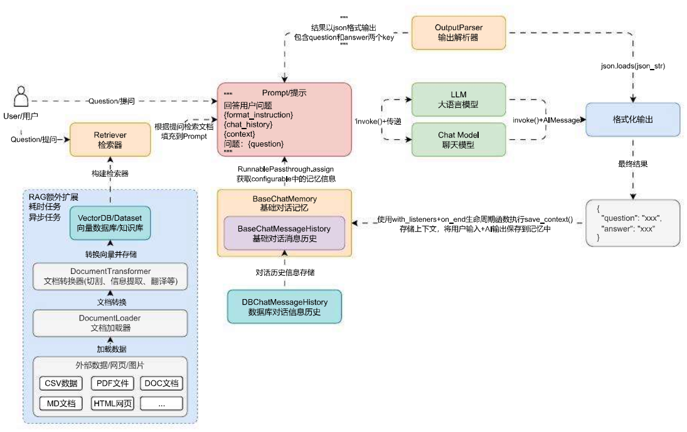
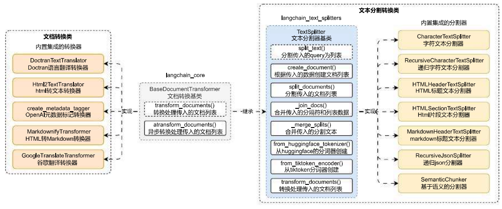

# 文档转换器与字符分割器组件的使用

## 01. DocumentTransformer 组件

在 LangChain 中，使用**文档加载器**加载得到的文档一般来说存在着几个问题：原始文档太大、原始文档的数据格式不符合需求（需要英文但是只有中文）、原始文档的信息没有经过提炼等问题。

如果将这类数据直接转换成向量并存储到数据库中，会导致在执行相似性搜索和 RAG 的过程中，错误率大大提升。所以在 LLM 应用开发中，在加载完数据后，一般会执行多一步**转换**的过程，即将加载得到的**文档列表**进行转换，得到符合需求的**文档列表**。

转换涵盖的操作就非常多，例如：**文档切割、文档属性提取、文档翻译、HTML 转文本、重排、元数据标记**等都属于转换。

在前面的聊天机器人架构中添加上转换步骤，更新后的**聊天机器人架构 / 运行流程**如下所示：



在 LangChain 中针对文档的转换也统一封装了一个基类 `BaseDocumentTransformer`，所有涉及到文档的转换的类均是该类的子类，将大块文档切割成 chunk 分块的文档分割器也是 `BaseDocumentTransformer` 的子类实现。

`BaseDocumentTransformer` 基类封装了两个方法：

1. `transform_documents()`：抽象方法，传递文档列表，返回转换后的文档列表。
2. `atransform_documents()`：转换文档列表函数的异步实现，如果没有实现，则会委托 `transform_documents()` 函数实现。

在 LangChain 中，文档转换组件分成了两类：**文档分割器 (使用频率高)**、**文档处理转换器 (使用频率低，老版本写法)**。

并且目前 LangChain 团队已经将**文档分割器**这个高频使用的部分单独拆分成一个 Python 包，哪怕不使用 LangChain 框架本身进行开发，也可以使用其文本分割包，快速分割数据，在使用前必须执行以下命令安装：

```
pip install -qU langchain-text-splitters
```

对于文本分割器来说，除了继承 `BaseDocumentTransformer`，还单独设置了文本分割器基类 `TextSplitter`，从而去实现更加丰富的功能，`BaseDocumentTransformer` 衍生出来的类图：



## 02. 字符分割器基础使用技巧

在文档分割器中，最简单的分割器就是 ——**字符串分割器**，这个组件会基于给定的字符串进行分割，默认为 `\n\n`，并且在分割时会尽可能保证数据的连续性。分割出来每一块的长度是通过字符数来衡量的，使用起来也非常简单，实例化 `CharacterTextSplitter` 需传递多个参数，信息如下：

1. `separator`：分隔符，默认为 `\n\n`。
2. `is_separator_regex`：是否正则表达式，默认为 `False`。
3. `chunk_size`：每块文档的内容大小，默认为 `4000`。
4. `chunk_overlap`：块与块之间重叠的内容大小，默认为 `200`。
5. `length_function`：计算文本长度的函数，默认为 `len`。
6. `keep_separator`：是否将分隔符保留到分割的块中，默认为 `False`。
7. `add_start_index`：是否添加开始索引，默认为 `False`，如果是的话会在元数据中添加该切块的起点。
8. `strip_whitespace`：是否删除文档头尾的空白，默认为 `True`。

如果想将文档切割为不超过 500 字符，并且每块之间文本重叠 50 个字符，可以使用 `CharacterTextSplitter` 来实现，代码如下：

```python
from langchain_community.document_loaders import UnstructuredMarkdownLoader
from langchain_text_splitters import CharacterTextSplitter

# 1.构建Markdown文档加载器并获取文档列表
loader = UnstructuredMarkdownLoader("./项目API文档.md")
documents = loader.load()

# 2.构建分割器
text_splitter = CharacterTextSplitter(
    separator="\n\n",
    chunk_size=500,
    chunk_overlap=50,
    add_start_index=True,
)

# 3.分割文档列表
chunks = text_splitter.split_documents(documents)

# 4.输出信息
for chunk in chunks:
    print(f"块内容大小:{len(chunk.page_content)},元数据:{chunk.metadata}")
```

输出内容：

```
Created a chunk of size 771, which is longer than the specified 500
Created a chunk of size 980, which is longer than the specified 500
Created a chunk of size 542, which is longer than the specified 500
Created a chunk of size 835, which is longer than the specified 500
块内容大小:251,元数据:{'source': './项目API文档.md', 'start_index': 0}
块内容大小:451,元数据:{'source': './项目API文档.md', 'start_index': 246}
块内容大小:771,元数据:{'source': './项目API文档.md', 'start_index': 699}
块内容大小:435,元数据:{'source': './项目API文档.md', 'start_index': 1472}
块内容大小:497,元数据:{'source': './项目API文档.md', 'start_index': 1859}
块内容大小:237,元数据:{'source': './项目API文档.md', 'start_index': 2359}
块内容大小:980,元数据:{'source': './项目API文档.md', 'start_index': 2598}
块内容大小:438,元数据:{'source': './项目API文档.md', 'start_index': 3580}
块内容大小:293,元数据:{'source': './项目API文档.md', 'start_index': 4013}
块内容大小:498,元数据:{'source': './项目API文档.md', 'start_index': 4261}
块内容大小:463,元数据:{'source': './项目API文档.md', 'start_index': 4712}
块内容大小:438,元数据:{'source': './项目API文档.md', 'start_index': 5129}
块内容大小:542,元数据:{'source': './项目API文档.md', 'start_index': 5569}
块内容大小:464,元数据:{'source': './项目API文档.md', 'start_index': 6113}
块内容大小:835,元数据:{'source': './项目API文档.md', 'start_index': 6579}
块内容大小:489,元数据:{'source': './项目API文档.md', 'start_index': 7416}
```

说明：会出现超过 `chunk_size` 的块，是因为 `CharacterTextSplitter` **优先按分隔符切分**；如果单个分隔片段本身就大于 chunk_size，就不会再强行截断，直接保留整块。

使用 `CharacterTextSplitter` 进行分割时，虽然传递了 `chunk_size` 为 500，但是仍然没法确保分割出来的文档一直保持在这个范围内，这是因为在底层 `CharacterTextSplitter` 是先按照分割符号拆分整个文档，然后循环遍历拆分得到的列表，将每个列表逐个相加，直到最接近 `chunk_size` 窗口大小时则完成一个 Document 的组装。

但是如果基于分割符号得到的文本，本身长度已经超过了 `chunk_size`，则会直接进行警告，并且将对应的文本单独变成一个块。

核心代码如下：

```python
# langchain_text_splitters/character->CharacterTextSplitter::split_text
def split_text(self, text: str) -> List[str]:
    """Split incoming text and return chunks."""
    # First we naively split the large input into a bunch of smaller ones.
    separator = (
        self._separator if self._is_separator_regex else
    re.escape(self._separator)
    )
    splits = _split_text_with_regex(text, separator, self._keep_separator)
    _separator = "" if self._keep_separator else self._separator
    return self._merge_splits(splits, _separator)


def _split_text_with_regex(
    text: str, separator: str, keep_separator: bool
) -> List[str]:
    # Now that we have the separator, split the text
    if separator:
        if keep_separator:
            # The parentheses in the pattern keep the delimiters in the result.
            _splits = re.split(f"({separator})", text)
            splits = [_splits[i] + _splits[i + 1] for i in range(1, len(_splits),2)]
            if len(_splits) % 2 == 0:
                splits += _splits[-1:]
            splits = [_splits[0]] + splits
        else:
            splits = re.split(separator, text)
    else:
        splits = list(text)
    return [s for s in splits if s != ""]
```

### 逻辑总结

1. 先用分隔符对原文做**第一次粗切分**，得到一批片段 `splits`。
2. 调用 `_merge_splits` 把粗切片段向后累加合并，尽量贴近 `chunk_size`。
3. 如果某一个粗切片段本身就大于 `chunk_size`，不会再次截断，直接保留该片段并输出警告日志。
4. `keep_separator=True` 时利用正则捕获组，把分隔符保留进切分结果。