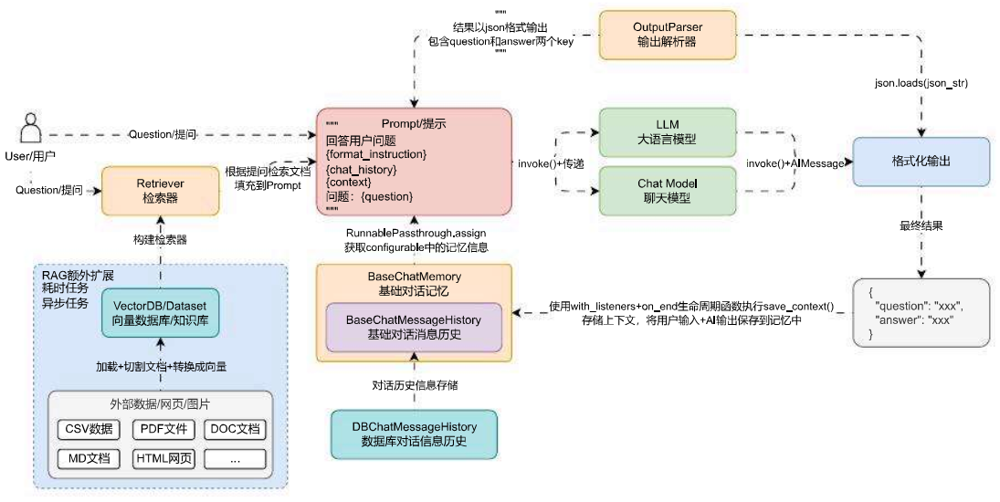
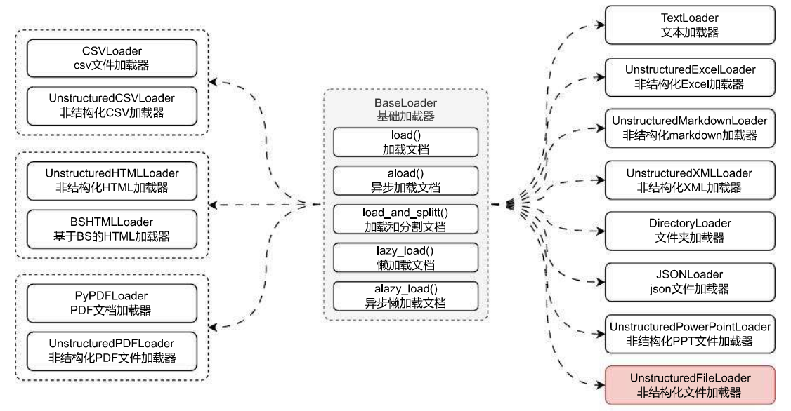

# Document 组件与文档加载器组件的使用

## 01. Document 与文档加载器

Document 类是 LangChain 中的核心组件，这个类定义了一个文档对象的结构，涵盖了文本内容和相关的元数据，**Document 也是文档加载器、文档分割器、向量数据库、检索器这几个组件之间交互传递的状态数据**。

在 LangChain 旧版本中，Document 还支持 lookup 检索功能，不过新版本下 Document 组件只拥有最基础的记录信息功能：

```
Document = page_content(页面内容) + metadata(元数据)
```

我们可以通过手动输入输入的形式来创建数据，但是在 RAG 开发中，一般会读取特定来源的数据，而非手动录入数据，例如：本地 markdown 文件、HTML 网页、PDF 文档、DOC 文档、URL 链接等多种方式来加载数据，然后再将原始文档按照特定切割成特定大小的文档，最后再将数据存储到向量数据库中，很少会手动录入数据。

所以在 RAG 应用外部，一般都会有一个额外的扩展，专门用于处理**读取数据‑切割数据‑存储数据**这个流程，并且这个流程非常耗时，例如上传一个 30M 的文档，需要执行加载 / 切割 / 文本嵌入，一般都会使用队列 / 异步进行处理，架构流程图更新如下：



在新的架构流程中，文档加载器起到的作用就是从各式各样的数据中提取出相应的信息，并转换成标准的 Document 组件，从而屏蔽不同类型文件的读取差异。

在 LangChain 中所有文档加载器的基类为 `BaseLoader`，封装了统一的 5 个方法：

1. `load()/aload()`：加载和异步加载文档，返回的数据为文档列表。
2. `load_and_split()`：传递分割器，加载并将大文档按照传入的分割器进行切割，返回的数据为分割后的文档列表。
3. `lazy_load()/alazy_load()`：懒加载和异步懒加载文档，返回的是一个迭代器，适用于传递的数据源有多份文档的情况，例如文件夹加载器，可以每次获得最新的加载文档，不需要等到所有文档都加载完毕。

在 LangChain 中封装了几十种文档加载器，几乎所有的文件都可以使用这些加载器完成数据的读取，而不需要手动去封装：



## 02. TextLoader 使用技巧与源码解析

在 LangChain 中最简单的加载器组件就是 TextLoader，这个加载器可以加载一个文本文件（源码、markdown、text 等存储成文本结构的文件，DOC 并不是文本文件），并把整个文件的内容读入到一个 Document 对象中，同时为文档对象的 `metadata` 添加 `source` 字段用于记录源数据的来源信息。

TextLoader 使用起来非常简单，传递对应的文本路径即可：

示例代码：

```python
from langchain_community.document_loaders import TextLoader

loader = TextLoader("./电商产品数据.txt", encoding="utf-8")
documents = loader.load()

print(documents)
print(len(documents))
print(documents[0].metadata)
```

输出内容：

```python
[Document(page_content='xxx', metadata={'source': './电商产品数据.txt'})]
1
{'source': './电商产品数据.txt'}
```

TextLoader 源码底层主要通过 `open` 函数与对应的编码方式打开对应的文件，获取其内容，并将传递的路径信息复制到生成的文档示例中的 `metadata` 字段中，从而实现数据的快速加载。

核心源码：

```python
# langchain_community/document_loaders/text.py->TextLoader::lazy_load
def lazy_load(self) -> Iterator[Document]:
    """Load from file path."""
    text = ""
    try:
        with open(self.file_path, encoding=self.encoding) as f:
            text = f.read()
    except UnicodeDecodeError as e:
        if self.autodetect_encoding:
            detected_encodings = detect_file_encodings(self.file_path)
            for encoding in detected_encodings:
                logger.debug(f"Trying encoding: {encoding.encoding}")
                try:
                    with open(self.file_path, encoding=encoding.encoding) as f:
                        text = f.read()
                    break
                except UnicodeDecodeError:
                    continue
        else:
            raise RuntimeError(f"Error loading {self.file_path}") from e
    except Exception as e:
        raise RuntimeError(f"Error loading {self.file_path}") from e

    metadata = {"source": str(self.file_path)}
    yield Document(page_content=text, metadata=metadata)

```

以 TextLoader 为例，扩展到 LangChain 封装的其他文档加载器，使用技巧都是一模一样的，在实例化加载器的时候，传递对应的信息（文件路径、网址、目录等），然后调用加载器的 load () 方法即可一键加载文档。