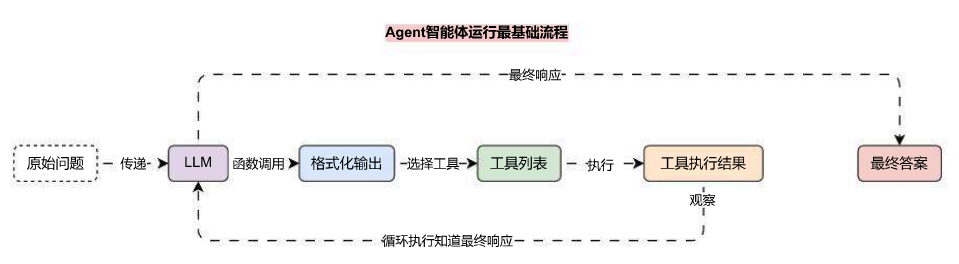

# 基于 ReACT 架构的 Agent 智能体设计与实现

## 01. Agent 概念与介绍

在 LLM 应用中，如果我们知道用户输入所需的工具使用特定顺序时，使用 LCEL 表达式构建链应用非常有用，但是对于某一些特例，我们使用工具的次数与顺序取决于输入，在这种情况下，我们希望让 LLM 本身决定使用工具的次数和顺序，而 Agent 智能体能做到这一点。

在 LangChain 中，Agent 是一个核心概念，它代表了一种能够利用语言模型（LLM）和其他工具来执行复杂任务的系统，Agent 设计的目的是为了处理那些语言模型可能无法直接解决的问题，尤其是当这些任务涉及到多个步骤或者需要外部数据源的情况。

无论一个 Agent 设计得多么复杂，使用什么架构，最基础的工作流程其实都非常简单，只有 5 个步骤：

1. **输入理解**：Agent 首先解析用户输入，理解其意图和需求。
2. **计划定制**：基于对输入的理解，Agent 会定制一个执行计划，决定使用哪些工具和执行的顺序。
3. **工具调用**：Agent 按照计划调用相应的工具，执行必要的操作。
4. **结果整合**：收集所有工具返回的结果，进行整合和解析，形成最终的输出。
5. **反馈循环**：如果任务没有完成或者需要进一步的消息，Agent 可以迭代上述过程直到满足条件为止。

运行流程图如下：



对比前面的函数调用，其实 Agent 的运行流程非常接近，多了一步**执行工具**和**观察结果**的步骤，甚至在前面的课时中，我们其实已经实现了该流程，只是没有将代码封装到一起而已，所以，对于一个 Agent 来说，其组成模块包括 3 个部分：

1. **Tools**：Agent 可以访问的工具集，每个工具通常执行一个特定的功能。
2. **Executor**：执行 Agent 计划的逻辑。
3. **Prompt Templates**：指导 Agent 如何理解和处理输入的模板，可以定制化以适应不同任务。

在 LangChain v0.2.0 版本中，有两种实现 Agent 的技巧，一种使用的是**传统 Agent 组件**，一种使用 **LangGraph**，**传统 Agent 组件**特别适合入门的开发者，所以在这一章中我们会使用该方式，下一章在考虑使用 LangGraph 创建更加复杂、灵活性和控制性更强的 Agent 应用。

## 02. ReACT 智能体运行流程与实现

ReACT 是 LangChain 最早支持的 Agent 架构，ReACT = Reason + Action，即**推理与行动**，目前绝大部分 Agent 架构都是在 ReACT 架构上进行衍生的，该架构最早是 Yao 等人在 2022 年发布的论文中首次被提出，论文参考地址：https://arxiv.org/pdf/2210.03629。

在 LangChain 中，要想创建基于 ReACT 架构的智能体，其实也非常简单，导入 `AgentExecutor`、`create_react_agent`，在实例化的时候，传递对应的**工具 + prompt** 即可，其中 ReACT 架构的智能体 prompt 是有要求的。

- ReACT prompt 文档：https://smith.langchain.com/hub/hwchase17/react

例如实现一个带有谷歌实时搜索的 ReACT 架构的 Agent，其完整示例代码如下：

```python
import dotenv
from langchain import hub
from langchain.agents import create_react_agent, AgentExecutor
from langchain_community.tools import GoogleSerperRun
from langchain_community.utilities import GoogleSerperAPIWrapper
from langchain_core.pydantic_v1 import BaseModel, Field
from langchain_core.tools import render_text_description_and_args
from langchain_openai import ChatOpenAI

dotenv.load_dotenv()


class GoogleSerperArgsSchema(BaseModel):
    query: str = Field(description="执行谷歌搜索的查询语句")


# 1.定义工具与工具列表
google_serper = GoogleSerperRun(
    name="google_serper",
    description=(
        "一个低成本的谷歌搜索API。"
        "当你需要回答有关时事的问题时，可以调用该工具。"
        "该工具的输入是搜索查询语句。"
    ),
    args_schema=GoogleSerperArgsSchema,
    api_wrapper=GoogleSerperAPIWrapper(),
)
tools = [google_serper]

# 2.定义智能体提示模板
prompt = hub.pull("hwchase17/react")

# 3.创建大语言模型
llm = ChatOpenAI(model="gpt-3.5-turbo-16k")
agent = create_react_agent(
    llm=llm,
    tools=tools,
    prompt=prompt,
    tools_renderer=render_text_description_and_args,
)

agent_executor = AgentExecutor(agent=agent, tools=tools, verbose=True)

print(agent_executor.invoke({"input": "马拉松的最新世界纪录是多少?"}))
```

当提问 `马拉松的最新世界纪录是多少？` 时，该智能体的输出内容如下：

```
> Entering new AgentExecutor chain...
I should use the google_serper tool to search for the latest world record in marathon.
Action: google_serper
Action Input: {'query': 'latest world record in marathon'}Kenyan athlete Kelvin Kiptum set a men's world record time of 2:00:35 on October 8, 2023, at the 2023 Chicago Marathon. Ethiopian athlete Tigst Assefa broke the ... Missing: query | Show results with:query. Here's a complete list of the marathon world‑record holders and all time top 26.2‑mile runners. Missing: query | Show results with:query. In the 2023 Chicago marathon Kelvin Kiptum from Kenya, set a new marathon world record with a time of two hours and 35 seconds, taking 34 seconds off the ... Missing: query | Show results with:query. Exactly four years ago, Kipchoge made history with his 1:59:40 unofficial time in Vienna, the fastest any runner had ever covered the marathon. Missing: query | Show results with:query.
Kenyan Kelvin Kiptum broke the marathon world record to win the Chicago Marathon in 2 hours and 35 seconds, nearly breaking the two‑hour ... Kelvin Kiptum set a new world record as he ran the Chicago marathon in 2hr 0min 35sec. Subscribe to Guardian Sport ⊳ http://bit.ly/GDNSport ... Missing: query | Show results with:query. The current marathon world records are held by Kelvin Kiptum (2:00:35) and Tigist Assefa (2:11:53). Here are the top 20 fastest marathons of all ... Missing: query | Show results with:query. CHICAGO (AP) − Kelvin Kiptum set a world record in the Chicago Marathon on Sunday, finishing in 2 hours, 35 seconds to shatter fellow Kenyan ...The latest world record in marathon is 2:00:35, set by Kenyan athlete Kelvin Kiptum at the 2023 Chicago Marathon.
Final Answer: The latest world record in marathon is 2:00:35.

> Finished chain.
{'input': '马拉松的最新世界纪录是多少?', 'output': 'The latest world record in marathon is 2:00:35.'}
```

## 03. ReACT 智能体的缺陷

在 ReACT 架构中，通过对 LLM 的输出内容进行信息提取用于执行不同的逻辑，如果向 ReACT 智能体 提问`马拉松的世界纪录是多少？`，它底层**推理‑行动**的完整 Prompt 如下：

```
Answer the following questions as best you can. You have access to the following tools:

google_serper − 一个低成本的谷歌搜索API。当你需要回答有关时事的问题时，可以调用该工具。该工具的输入是搜索查询语句。，args: {'query': {'title': 'Query', 'description': '执行谷歌搜索的查询语句', 'type': 'string'}}

Use the following format:

Question: the input question you must answer
Thought: you should always think about what to do
Action: the action to take, should be one of [google_serper]
Action Input: the input to the action
Observation: the result of the action
... (this Thought/Action/Action Input/Observation can repeat N times)
Thought: I now know the final answer
Final Answer: the final answer to the original input question

Begin!
```

```
Question: 马拉松的最新世界纪录是多少?
Thought:I should use the google_serper tool to search for the latest world record in marathon.
Action: google_serper
Action Input: {'query': 'latest world record in marathon'}
Observation: Kenyan athlete Kelvin Kiptum set a men's world record time of 2:00:35 on October 8, 2023, at the 2023 Chicago Marathon. Ethiopian athlete Tigst Assefa broke the ... Missing: query | Show results with:query. Here's a complete list of the marathon world‑record holders and all time top 26.2‑mile runners.
Missing: query | Show results with:query. In the 2023 Chicago marathon Kelvin Kiptum from Kenya, set a new marathon world record with a time of two hours and 35 seconds, taking 34 seconds off the ... Missing: query | Show results with:query. Exactly four years ago, Kipchoge made history with his 1:59:40 unofficial time in Vienna, the fastest any runner had ever covered the marathon. Missing: query | Show results with:query. Kenyan Kelvin Kiptum broke the marathon world record to win the Chicago Marathon in 2 hours and 35 seconds, nearly breaking the two‑hour ... Kelvin Kiptum set a new world record as he ran the Chicago marathon in 2hr 0min 35sec. Subscribe to Guardian Sport ⊳ http://bit.ly/GDNSport ... Missing: query | Show results with:query. The current marathon world records are held by Kelvin Kiptum (2:00:35) and Tigist Assefa (2:11:53). Here are the top 20 fastest marathons of all ... Missing: query | Show results with:query. CHICAGO (AP) − Kelvin Kiptum set a world record in the Chicago Marathon on Sunday, finishing in 2 hours, 35 seconds to shatter fellow Kenyan ...
Thought: The latest world record in marathon is 2:00:35, set by Kenyan athlete Kelvin Kiptum at the 2023 Chicago Marathon.
Final Answer: The latest world record in marathon is 2:00:35.
```

可以完整的观察到 `Question`(原始问题)、`Thought`(观察)、`Action`(执行动作)、`Action input`(动作输入)、`Observation`(观察工具输出)、`Thought`(观察)、`Final Answer`(最终答案) 一系列完整的运行流程，输出格式非常规范，所以程序不会抛出错误。

但是我们都知道 LLM 的输出是不稳定的，假设我们提问 `你好，你是？` 时，按推理来说，这段原始提问是不需要调用工具，所以可以直接输出答案，对于 ReACT 来说，需要大语言模型输出如下格式的数据：

```
I now know the final answer
Final Answer: 我是一个人工智能助手，旨在帮助回答问题和提供信息。请问有什么我可以帮忙的吗？
```

和上一次生成内容组装成完整的对话语句如下：

```
Question: 你好，你是?
Thought: I now know the final answer
Final Answer: 我是一个人工智能助手，旨在帮助回答问题和提供信息。请问有什么我可以帮忙的吗？
```

这样 ReACT 智能体 底层检测到 `Final Answer` 这个关键词，就可以提取出最终答案，但是 LLM 的输出是极其不稳定的，在实际测试中，哪怕是 GPT‑4o 模型，它会输出如下的数据：

```
我是一个人工智能助手，旨在帮助回答问题和提供信息。请问有什么我可以帮忙的吗？
```

乍得一看好像很合理，但是 ReACT 智能体 是根据不同的输出结构来提取出后续要执行的步骤是什么，如果这个时候组装上之前的提问，就变成了：

```
Question: 你好，你是?
Thought: 我是一个人工智能助手，旨在帮助回答问题和提供信息。请问有什么我可以帮忙的吗？
```

ReACT 智能体 检测到只有 `Thought` 即观察，并没有后续的步骤了，肯定抛出错误，因为在 `Thought` 后一般会携带 `Action` 或者 `Final Answer`，程序识别不了后续的步骤是什么，结果肯定出错。

另外 ReACT 智能体 在使用时，如果需要修改 Prompt 为中文，一般还需要同步修改**输出解析器**，使用代价非常大。

这是因为 ReACT 智能体 底层是通过解析响应内容中**特定关键词**来提醒后续步骤的，如果 Prompt 改成中文，不调整输出解析器，在代码底层还是会提取 `Thought` 的数据，程序 100% 会抛出错误。