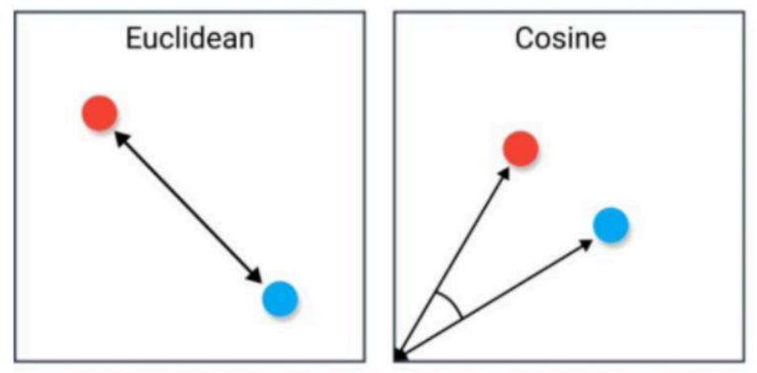

# 传统数据库与向量数据库的使用差异

# 01. 两种数据库的差异

## 1.1 搜索方式差异

传统数据库，比如关系型数据库，擅长处理结构化数据，如存储在表格中的文本和数字等。它们通过预定义的查询语言（如 SQL）来进行精确匹配或条件搜索。这种方式在处理银行交易、客户信息等数据时效果显著，但在处理复杂的模式识别问题时就显得力不从心。

例如，通过 `SELECT + WHERE` 可以精准查询到 id 为 `e0d13c78‑870b‑46df‑b2f5‑693ae9d5d727` 的用户。

```sql
SELECT * FROM account WHERE id='e0d13c78‑870b‑46df‑b2f5‑693ae9d5d727'
```

但是想通过 SQL 来查询和 `我喜欢打篮球游泳与编程` 这句话语义相近的内容，就无能为力了。

相比之下，向量数据库不是通过匹配确切的数值，而是通过一种称为**相似性搜索**的方法来工作。它们可以快速找到与查询向量最相似的数据点（目前绝大部分向量数据库都支持在**相似性搜索**的基础上添加筛选条件），即使这些数据点在数值上并不完全相同。

例如，在一个向量数据库中，即使没有完全相同的照片，我们仍然可以找到风格相似的图片。通过这种方式，向量数据库打破了传统数据库的局限，为处理和分析大规模、复杂的数据提供了更灵活和强大的解决方案。

## 1.2 数据处理与存储差异

传统数据库采用基于行的存储方式，传统数据库将数据存储为行记录，每一行包含多个字段，并且每个字段都有固定的列。传统数据库通常使用索引来提高查询性能，例如下方就是一个典型的传统数据库表格：

| 电影ID |  电影名称  |      导演      |    类型     | 评分 |
| :----: | :--------: | :------------: | :---------: | :--: |
|   1    |   阿凡达   | 詹姆斯・卡梅隆 | 科幻 / 冒险 | 8.8  |
|   2    | 飞屋环游记 |  皮特・道格特  | 动画 / 冒险 | 8.2  |
|   3    | 泰坦尼克号 | 詹姆斯・卡梅隆 | 爱情 / 剧情 | 7.8  |

这种方式在处理结构化数据时非常高效，但在处理非结构化或半结构化数据时效率低下。

向量数据库将数据以列形式存储，即每个列都有一个独立的存储空间，这使得向量数据库可以更加灵活地处理复杂的数据结构。向量数据库还可以进行列压缩（稀疏矩阵），以减少存储空间和提高数据的访问速度。

并且在向量数据库中，将数据表示为高维向量，其中每个向量对应于数据点。**这些向量之间的距离表示它们之间的相似性。** 这种方式使得非结构化或半结构化数据的存储和检索变得更加高效。

以电影数据库为例，我们可以将每部电影表示为一个特征向量。假设我们使用四个特征来描述每部电影：**动作、冒险、爱情、科幻**。每个特征都可以在 0 到 1 的范围内进行标准化，表示该电影在该特征上的强度。

例如，电影 "阿凡达" 的向量表示可以是 [0.9, 0.8, 0.2, 0.9]，其中数字分别表示动作、冒险、爱情、科幻的特征强度。其他电影也可以用类似的方式表示。这些向量可以存储在向量数据库中，如下所示：

| 电影 ID |       特征向量       |
| :-----: | :------------------: |
|    1    | [0.9, 0.8, 0.2, 0.9] |
|    2    | [0.7, 0.9, 0.1, 0.2] |
|    3    | [0.2, 0.1, 0.9, 0.1] |
|    …    |          …           |

现在，如果我们想要查找与电影 "阿凡达" 相似的电影，我们可以计算向量之间的距离，找到最接近的向量，从而实现相似性匹配，而无需复杂的 SQL 查询。这就像使用地图找到两个地点之间的最短路径一样简单。

## 1.3 优缺点横向对比

尽管向量数据库在处理高维数据和实现快速检索方面有着显著优势，但它并不是一种 “一刀切” 的解决方案。在某些应用场景中，其他类型的数据库可能更合适，而且向量数据库与传统关系数据库协同发展、相互补充。

|                |                      传统的关系型数据库                      |                          向量数据库                          |
| -------------- | :----------------------------------------------------------: | :----------------------------------------------------------: |
| 数据类型       |               数值、字符串、时间等传统数据类型               |      新的数据类型：向量数据不存储原始数据（有的也支持）      |
| 数据规模       |          小，1 亿条数据对于关系型数据库来说规模很大          |                    大，最少千亿数据是底线                    |
| 数据组织方式   |                   基于表格，按照行和列组织                   |                  基于向量，按照向量维度组织                  |
| 查找方式       | 精确查找：点查 / 范围查询查询结果要么符合条件要么不符合条件  |  近似查找查询结果是与输入条件最相似的，近似计算能力要就较高  |
| 低延时，高并发 |                              否                              |                              是                              |
| 上层应用       |                             较弱                             |   对外提供统一的 API，更适合大规模 AI 应用程序的部署和使用   |
| 下游应用场景   | 央企、国企。央企国企工作因工作内容要求容错率低，传统数据库能够提供更为准确的搜索结果。 | 互联网公司。向量数据库的结果正确率相对较低，成本低，互联网公司的场景容错率较高，能够包容这一缺陷。 |

# 02. 相似性搜索算法

## 2.1 余弦相似度与欧式距离

在向量数据库中，支持通过多种方式来计算两个向量的相似度，例如：余弦相似度、欧式距离、曼哈顿距离、闵可夫斯基距离、汉明距离、Jaccard 相似度等多种。其中最常见的就是余弦相似度和欧式距离。

例如下图，左侧就是**欧式距离**，右侧就是**余弦相似度**。



① 余弦相似度主要用于衡量向量在方向上的相似性，特别适用于文本、图像和高维空间中的向量。它不受向量长度的影响，只考虑方向的相似程度，余弦相似度的计算公式如下（计算两个向量夹角的余弦值，取值范围为 [-1, 1]）：


②欧式距离衡量向量之间的直线距离，得到的值可能很大，最小为 0，通常用于低维空间或需要考虑向量各个维度之间差异的情况。欧式距离较小的向量被认为更相似，欧式距离的计算公式如下：


## 2.2 相似性搜索加速计算

在向量数据库中，数据按列进行存储，通常会将多个向量组织成一个 M×N 的矩阵，其中 M 是向量的维度（特征数），N 是向量的数量（数据库中的条目数），这个矩阵可以是稠密或者稀疏的，取决于向量的稀疏性和具体的存储优化策略。

这样计算相似性搜索时，本质上就变成了向量与 M×N 矩阵的每一行进行相似度计算，这里可以用到大量成熟的加速算法：

1. **矩阵分解方法：**

- SVD（奇异值分解）：可以通过奇异值分解将原始矩阵转换为更低秩的矩阵表示，从而减少计算量。
- PCA（主成分分析）：类似地，可以通过主成分分析将高维矩阵映射到低维空间，减少计算复杂度。

2. **索引结构和近似算法：**

- LSH（局部敏感哈希）：LSH 可以在近似相似度匹配中加速计算，特别适用于高维稀疏向量的情况。
- ANN（近似最近邻）算法：ANN 算法如 KD‑Tree、Ball‑Tree 等可以用来加速对最近邻搜索的计算，虽然主要用于向量空间，但也可以部分应用于相似度计算中。

3. **GPU 加速：**使用图形处理单元（GPU）进行并行计算可以显著提高相似度计算的速度，尤其是对于大规模数据和高维度向量。

4. **分布式计算：**由于行与行之间独立，所以可以很便捷地支持分布式计算每行与向量的相似度，从而加速整体计算过程。

向量数据库底层除了在算法层面上针对相似性搜索做了大量优化，在存储结构、索引机制等方面均做了大量的优化，这才使得向量数据库在处理高维数据和实现快速相似性搜索上展示出巨大的优势。