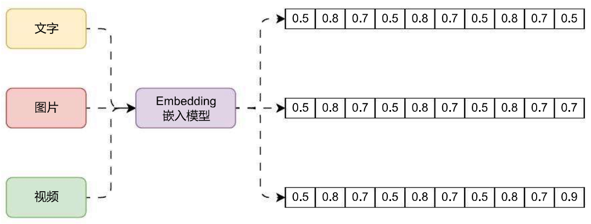
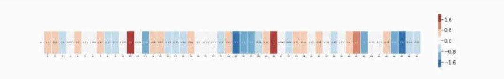
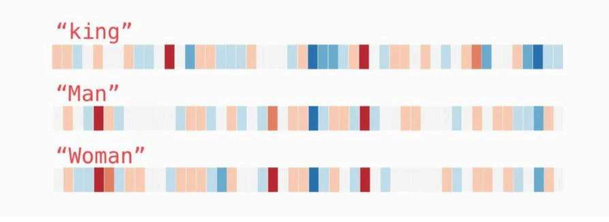
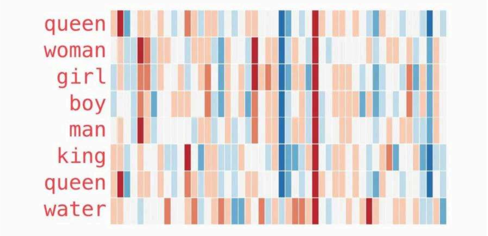
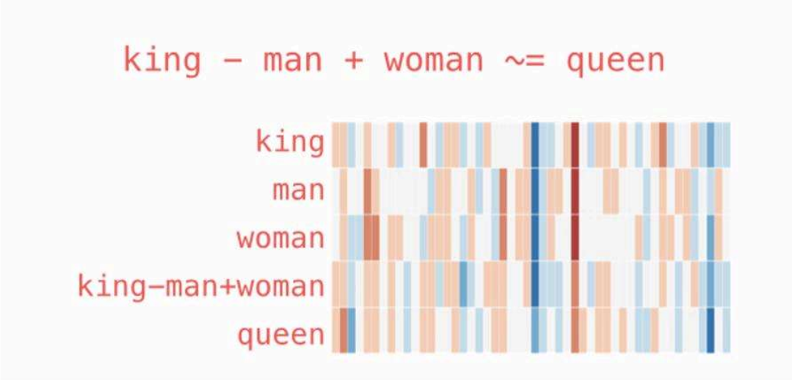

# Embedding嵌入模型介绍

# 01. 什么是 Embedding？

要想使用向量数据库的相似性搜索，存储的数据必须是向量，那么如何将高维度的文字、图片、视频等非结构化数据转换成向量呢？这个时候就需要使用到 Embedding 嵌入模型了，例如下方就是 Embedding 嵌入模型的运行流程：



Embedding 模型是一种在机器学习和自然语言处理中广泛应用的技术，它旨在将高维度的数据（如文字、图片、视频）映射到低维度的空间。Embedding 向量是一个 N 维的实值向量，它将输入的数据表示成一个连续的数值空间中的点。这种嵌入可以是一个词、一个类别特征（如商品、电影、物品等）或时间序列特征等。

而且通过学习，**Embedding 向量可以更准确地表示对应特征的内在含义，使几何距离相近的向量对应的物体有相近的含义**，甚至对向量进行加减乘除算法都有意义！

一句话理解 Embedding：**一种模型生成方法，可以将非结构化的数据，例如文本 / 图片 / 视频等数据映射成有意义的向量数据**。

目前生成 embedding 方法的模型有以下 4 类：

1. **Word2Vec（词嵌入模型）**：这个模型通过学习将单词转化为连续的向量表示，以便计算机更好地理解和处理文本。Word2Vec 模型基于两种主要算法 CBOW 和 Skip‑gram。
2. **GloVe**：一种用于自然语言处理的词嵌入模型，它与其他常见的词嵌入模型（如 Word2Vec 和 FastText）类似，可以将单词转化为连续的向量表示。GloVe 模型的原理是通过观察单词在语料库中的共现关系，学习得到单词之间的语义关系。具体来说，GloVe 模型将共现概率矩阵表示为两个词向量之间的点积和偏差的关系，然后通过迭代优化来训练得到最佳的词向量表示。GloVe 模型的优点是它能够在大规模语料库上进行有损压缩，得到较小维度的词向量，同时保持了单词之间的语义关系。这些词向量可以被用于多种自然语言处理任务，如词义相似度计算、情感分析、文本分类等。

3. **FastText**：一种基于词袋模型的词嵌入技术，与其他常见的词嵌入模型（如 Word2Vec 和 GloVe）不同之处在于，FastText 考虑了单词的子词信息。其核心思想是将单词视为字符的 n‑grams 的集合，在训练过程中，模型会同时学习单词级别和 n‑gram 级别的表示。这样可以捕捉到单词内部的细粒度信息，从而更好地处理各种形态和变体的单词。

4. **大模型 Embeddings（重点**）：和大模型相关的嵌入模型，如 OpenAI 官方发布的第二代模型：text‑embedding‑ada‑002。它最长的输入是 8191 个 tokens，输出的维度是 1536。

# 02. Embedding 带来的价值

1. **降维**：在许多实际问题中，原始数据的维度往往非常高。例如，在自然语言处理中，如果使用 Token 词表编码来表示词汇，其维度等于词汇表的大小，可能达到数十万甚至更高。通过 Embedding，我们可以将这些高维数据映射到一个低维空间，大大减少了模型的复杂度。
2. **捕捉语义信息**：Embedding 不仅仅是降维，更重要的是，它能够捕捉到数据的语义信息。例如，在词嵌入中，语义上相近的词在向量空间中也会相近。这意味着 Embedding 可以保留并利用原始数据的一些重要信息。
3. **适应性**：与一些传统的特征提取方法相比，Embedding 是通过数据驱动的方式学习的。这意味着它能够自动适应数据的特性，而无需人工设计特征。
4. **泛化能力**：在实际问题中，我们经常需要处理一些在训练数据中没有出现过的数据。由于 Embedding 能够捕捉到数据的一些内在规律，因此对于这些未见过的数据，Embedding 仍然能够给出合理的表示。
5. **可解释性**：尽管 Embedding 是高维的，但我们可以通过一些可视化工具（如 t‑SNE）来观察和理解 Embedding 的结构。这对于理解模型的行为，以及发现数据的一些潜在规律是非常有用的。

# 03. Embedding 的运算法则

通过对上文的理解，我们继续看看训练好的词向量实例（也被称为词嵌入），并探索他们的一些有趣属性（一个当成是玩笑的例子，主要用于帮助大家更好去理解 Embedding，该例子在其他 Embedding 模型下不一定能复现）。

这是一个 “king” 词的嵌入（使用 GloVe 方法生成的向量）：

```
[0.50451, 0.68607, -0.59517, -0.022801, 0.60046, -0.13498, -0.08813, 0.47377,
-0.61798, -0.31012, -0.076666, 1.493, -0.034189, -0.98173, 0.68229, 0.81722,
-0.51874, -0.31503, -0.55809, 0.66421, 0.1961, -0.13495, -0.11476, -0.30344,
0.41177, -2.223, -1.0756, -1.0783, -0.34354, 0.33505, 1.9927, -0.04234, -0.64319,
0.71125, 0.49159, 0.16754, 0.34344, -0.25663, -0.8523, 0.1661, 0.40102, 1.1685,
-1.0137, -0.21585, -0.15155, 0.78321, -0.91241, -1.6106, -0.64426, -0.51042]
```

这是一个 50 维的向量，通过数字我们很难观察其规律，但是我们可以将这个向量的每一个元素进行可视化颜色编码，由于范围是 [-2, 2]，越靠近 -2 则设置成蓝色，越靠近 2 则设置成红色，那么这一串向量就可以表示成这样：



我们忽略数字仅查看颜色，并且将 “King” 与其他单词进行比较（King 国王、Man 男人、Woman 女人）：



从色块分布图中，可以很容易的看出 King、Man、Woman 这三组向量的结构其实非常接近，色块颜色非常集中，这是否能意味着国王、男人、女人这三个词之间是具有强关联甚至是子集的因果关系。

接下来看下另外一个示例列表，这个示例展示了更多单词的向量分布的规律：



在这张分布图中也可以轻松看出一些信息：

1. 这几个单词的词向量在中间都有一条直的红色列，代表它们在这个维度上是相似的，但是从数值来看我们看不出这个维度是什么。
2. woman 和 girl 在很多地方都是相似的，man 和 boy 也一样。
3. girl 和 boy 也有一些彼此相似的地方，但这些和 woman/girl 不同，这些差异是否可以总结出 “年龄” 这个维度？
4. 上面的单词中，除了 water 其他的都和人相关，并且向量的倒数第三个元素是一个蓝色的色块，来到 water 这里却消失了。
5. king 和 queen 非常接近，但是存在一些比较明显的差异，这部分差异是否能体现出 “性别” 这个维度？

除了单个词的向量能展示出一些有意思的信息，对向量进行加减乘除也能得到一些有意思的结果。在 NLP 界有一个非常著名的公式：

```
Queen = King - Man + Woman
女王 = 国王 - 男人 + 女人
```

对这几个向量进行运算后，同样可可视化出来，结果如下：



你会发现 `king‑man+woman` 和 `queen` 的向量特征分布非常接近，也是 GloVe 集合中 40w 个字嵌入中最接近它的词。

这一个示例虽然不一定是一个正确的思路，但是从这个示例中仍然可以看到将对应的词转换成 Embedding 向量后，嵌入模型能够捕捉到数据的语义信息，并且语义上相近的词在向量空间中也会相近，这也为语义搜索提供了一个可能。