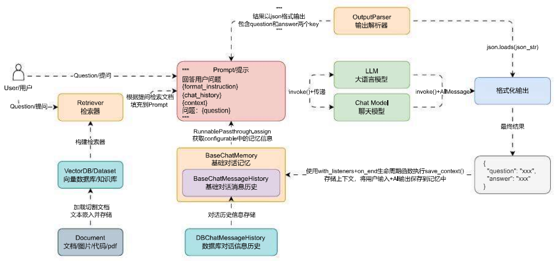

# 检索增强生成RAG基础架构介绍

# 01. 检索增强生成 RAG

## 1.1 什么是 RAG?

检索增强生成（RAG）是指对大型语言模型输出进行优化，使其能够在生成响应之前引用训练数据来源之外的权威知识库。大型语言模型（LLM）用海量数据进行训练，使用数十亿个参数为回答问题、翻译语言和完成句子等任务生成原始输出。在 LLM 本就强大的功能基础上，RAG 将其扩展为能访问特定领域或组织的内部知识库，所有都无需重新训练模型。是一种经济高效地改进 LLM 输出的方法，让它在各种情境下都能保持相关性、准确性和实用性。

简单理解：**RAG 就是从外部先检索对应的知识内容，和用户的提问一起构成 Prompt，再让 LLM 生成内容**。

以聊天机器人架构为例，给添加上 RAG 模块，更新后的运行流程如下：



## 1.2 RAG 的重要性及优点

我们可以将 LLM 看成是一个过于热情的员工，而且这个员工拒绝了解任何时事，但是他总是会很自信地回答每一个问题，更不幸的是这个员工回答态度非常好，内容非常流畅，一般情况下还很难看出是真是假！所以单纯利用 LLM 进行开发，存在非常大的缺陷：

1. LLM 的训练数据是静态的，这意味着 LLM 掌握的知识是有时间限制的，对于新知识不了解。
2. 当用户需要特定或者即时的数据时，LLM 往往提供通用或者过时的数据。
3. LLM 回答的内容可能是从非权威来源创建响应。
4. 由于术语混淆，不同的培训来源使用相同的术语来谈论不同的事情，因此会产生不确定的响应。

对比其他解决 LLM 幻觉的方案，RAG 带来的好处也非常明显：

1. **经济高效**：预训练和微调模型的成本很高，相比之下，RAG 是一种经济高效将新输入引入 LLM 的方案。
2. **信息即时**：使用 RAG 可以为 LLM 提供最新的研究、统计数据或新闻，确保数据的即时性。
3. **增强用户信任度**：RAG 允许 LLM 通过来源归属来呈现准确的信息。输出可以包括对来源的引文或引用。如果需要进一步说明或更详细的信息，用户也可以自己查找源文档。这可以增加对您的生成式人工智能解决方案的信任和信心。
4. **开发人员拥有更多控制权**：借助 RAG，开发人员可以更高效地测试和改进他们的聊天应用程序。他们可以控制和更改 LLM 的信息来源，以适应不断变化的需求或跨职能使用。开发人员还可以将敏感信息的检索限制在不同的授权级别内，并确保 LLM 生成适当的响应。此外，如果 LLM 针对特定问题引用了错误的信息来源，他们还可以进行故障排除并进行修复。组织可以更自信地为更广泛的应用程序实施生成式人工智能技术。

# 02. ChatGPT 手动模拟

人类与大语言模型的主要交接方式就是通过 Prompt，所以通过 Playground/ChatGPT 手动模拟 RAG 的过程其实也非常简单，使用用户的提问 query 进行搜索，得到搜索相关的内容，将搜索的内容与预设的 Prompt 模板、用户的 query 拼接成最终提示词，传递给大语言模型即可模拟最基础的 RAG 运行流程。

例如用户提问：“公司有销售什么产品么？”，会触发一下流程：

① 调用 检索器 并传递 公司有销售什么产品么？ 作为搜索语句进行检索得到对应文档，将这些文档整理合并得到对应的文本，输出：

```
1. 潮汕手工牛肉丸
产品名称：潮汕手工牛肉丸
电商网址：shop.example.com/beefballs
产品描述：潮汕手工牛肉丸选用优质牛肉，纯手工捶打制作，口感 Q 弹有嚼劲。全程无添加防腐剂和人工色素，确保天然健康，适合家庭火锅、煮汤等多种烹饪方式。
原材料：优质牛肉、生姜、盐、胡椒粉
制作工艺：传统手工捶打
口感：Q 弹鲜美，肉质紧实
净重：500 克 / 袋、1000 克 / 袋
保质期：6 个月（冷冻保存）
发货方式：顺丰冷链配送，确保新鲜
物流信息：24 小时内发货，预计 2‑3 天到货
推荐菜系：
‑ 牛肉丸火锅：搭配蔬菜、菌类，煮至牛肉丸浮起即可享用。
‑ 牛肉丸煮汤：与青菜、萝卜等食材同煮，营养丰富。
价格：500 克：68 元 / 袋、1000 克：128 元 / 袋

2. 潮汕猪肉卷
产品名称：潮汕猪肉卷
电商网址：shop.example.com/porkroll
产品描述：潮汕猪肉卷采用猪后腿肉为主要原料，配以特制香料腌制，手工卷制而成。口感鲜嫩多汁，香味四溢，是潮汕传统名菜之一。
原材料：猪后腿肉、香料、盐、糖
制作工艺：精细切割，手工卷制
口感：鲜嫩多汁，咸香可口
净重：400 克 / 袋、800 克 / 袋
保质期：3 个月（冷冻保存）
发货方式：顺丰冷链配送，确保新鲜
物流信息：24 小时内发货，预计 2‑3 天到货
推荐菜系：
‑ 猪肉卷煎烤：切片后煎至金黄，外脆里嫩。
‑ 猪肉卷炖煮：切块后与蔬菜同炖，风味更佳。
价格：400 克：58 元 / 袋、800 克：108 元 / 袋

3. 潮汕三宝（酱油、甜醋、虾酱）
产品名称：潮汕三宝
电商网址：shop.example.com/chaoshanthree
产品描述：潮汕三宝包含酱油、甜醋和虾酱。酱油由大豆、麦子自然发酵而成，甜醋以糯米酿制，虾酱选用新鲜海虾发酵，是潮汕菜肴必备调味品。
酱油：大豆、麦子自然发酵，500ml / 瓶
甜醋：糯米酿制，500ml / 瓶
虾酱：新鲜海虾发酵，200 克 / 瓶
保质期：酱油和甜醋 12 个月，虾酱 6 个月
发货方式：顺丰配送，确保完好
物流信息：24 小时内发货，预计 2‑3 天到货
推荐菜系：
‑ 酱油：适合调味、蘸料、炒菜。
‑ 甜醋：用于凉拌菜、蘸料。
‑ 虾酱：适合炒菜、做蘸料。
价格：128 元 / 套（含酱油、甜醋、虾酱各一瓶）

4. 潮汕鸭母捻
产品名称：潮汕鸭母捻
电商网址：shop.example.com/duckegg
产品描述：潮汕鸭母捻是一种传统甜点，使用糯米粉制作，内馅有花生、芝麻、红豆等多种口味，外皮软糯，汤底清甜。
原材料：糯米粉、花生、芝麻、红豆、糖
制作工艺：手工包制
口感：软糯香甜，馅料丰富
净重：500 克 / 袋
保质期：3 个月（冷冻保存）
发货方式：顺丰冷链配送，确保新鲜
物流信息：24 小时内发货，预计 2‑3 天到货
推荐菜系：
‑ 甜汤：加入红糖水煮沸，香甜可口。
‑ 咸汤：搭配咸菜、肉片，别有风味。
价格：45 元 / 袋
```

② 接下来将用户的输入 query 和检索得到的文档文本 context 合并到预设的提示模板中，如下：

```
你是一个由OpenAI开发的聊天机器人，善于根据上下文内容帮助用户解决问题，回复的内容尽可能简洁，如果需要用户提供额外的信息，请进行引导，如果不知道就说不知道。

<context>
{context}
<context>

用户的提问是：{query}
```

③ 将构建好的提示词传递给大语言模型，得到对应的输出内容如下：

```
公司销售以下产品：
1. 潮汕手工牛肉丸
2. 潮汕猪肉卷
3. 潮汕三宝（酱油、甜醋、虾酱）
4. 潮汕鸭母捻

每种产品都有详细的描述、价格和购买信息。
```

这样就可以完成一个手动 RAG 的过程模拟，实际在代码中，无论多么复杂的 RAG、无论如何进行 RAG 优化，**本质上都是执行外部检索，然后将外部检索的内容和用户原始提问合并成最终 Prompt，再向大语言模型发起提问，最终得到对应的内容**。