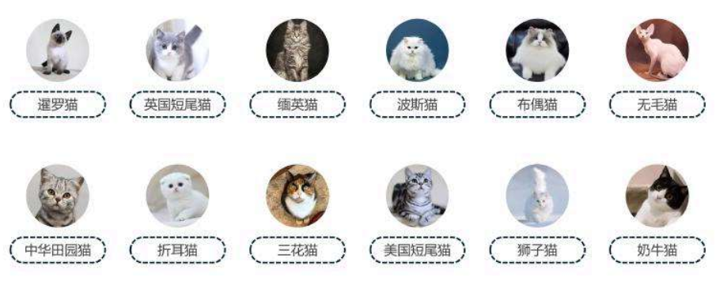
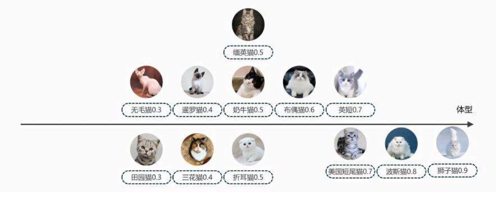
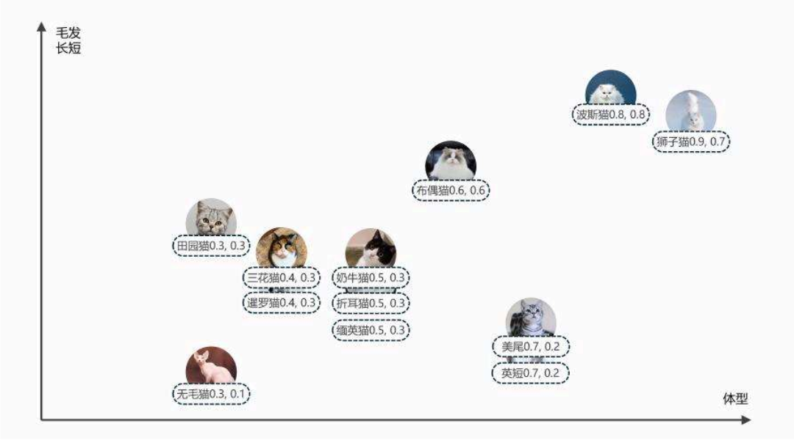
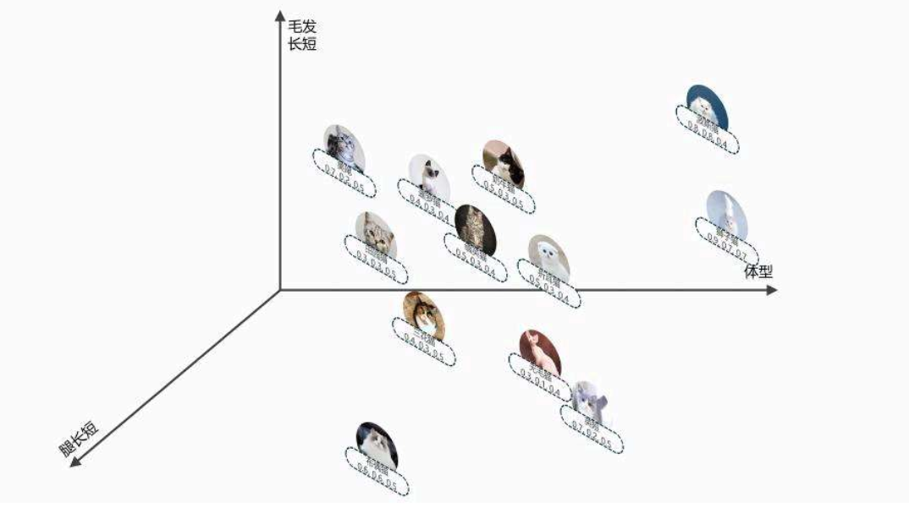
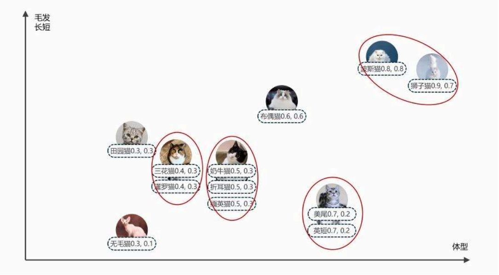
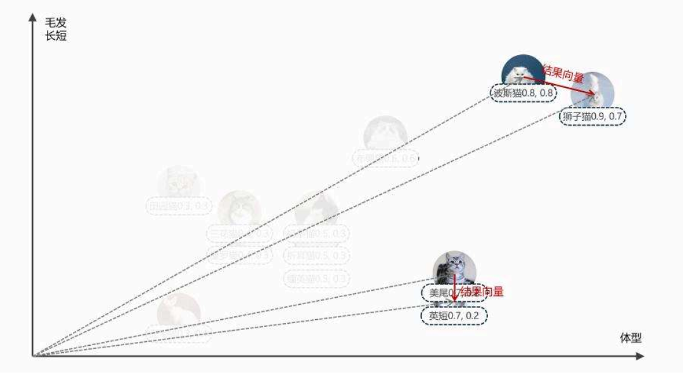
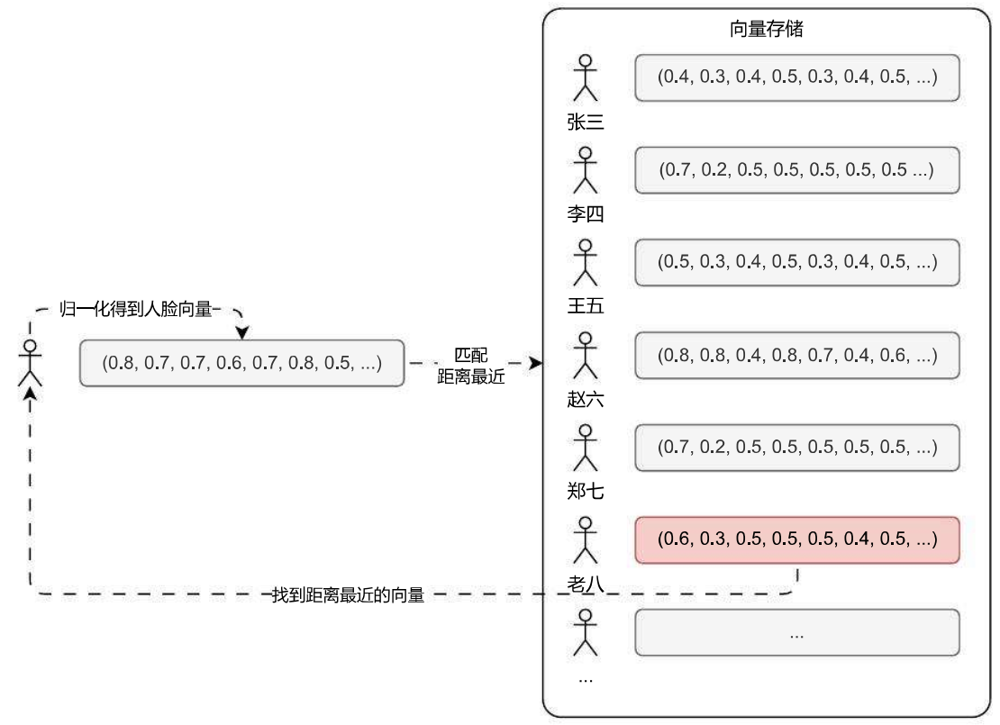
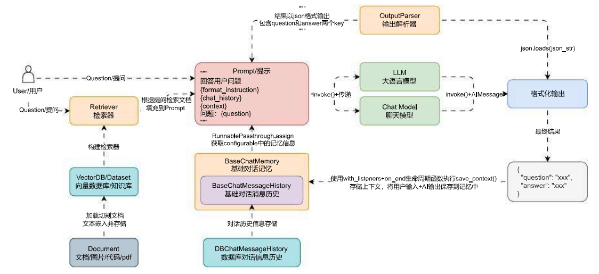

# 向量数据库的介绍与用途

# 01.“猫” 与向量的关系与衍生

这里我们以 猫 引出 词向量，再引出 向量数据库 的概念，通过这一个小小的演示，大家就能快速掌握词向量与向量数据库。

平时有养猫或者熟悉猫的小伙伴对于下面这一张猫的品类图，很快就能区分出它们的品种，之所以能做到这点，是因为我们会从不同的角度来观察这些猫的特征，如下：



如果我们使用一个水平轴来表示 体型大小 这个特征，这些不同品种的猫将落在不同的坐标点上，这样就可以通过体型的大小区分出一些品种，如下：



然而，如果仅仅靠体型一个特征，依旧会有很多品种的猫特征相近，比如缅英猫、奶牛猫和折耳猫就非常接近，所以我们继续添加多一个特征，比如毛发的长短，继续建立一个毛发的垂直轴，这样子就可以区分出更多品种。



现在每个品种的猫就可以表示为一个二维的坐标点，但是哪怕有两个特征，仍然会有一些品种无法区分。

所以我们需要从更多的角度来观察，例如腿的长短，这个时候再建立一个腿的长短的 z 轴，又有更多的品种被区分出来，现在每个品种的猫就可以表示为一个三维的坐标点，如下：



如果这个时候还想引入更多的特征进行区分，比如：眼睛大小、尾巴长短、毛发颜色、声音大小、耳朵形状等等，虽然在坐标图上没法展示出来，但是我们却可以很轻松地将这些特征使用数值的方式展示出来，例如下方：

```
1. 暹罗猫: (0.4, 0.3, 0.4, 0.5, 0.3, 0.4, 0.5, ...)
2. 英国短毛猫: (0.7, 0.2, 0.5, 0.5, 0.5, 0.5, 0.5, ...)
3. 缅甸猫: (0.5, 0.3, 0.4, 0.5, 0.3, 0.4, 0.5, ...)
4. 波斯猫: (0.8, 0.8, 0.4, 0.8, 0.7, 0.4, 0.6, ...)
5. 布偶猫: (0.7, 0.6, 0.5, 0.8, 0.5, 0.4, 0.5, ...)
6. 无毛猫: (0.6, 0.1, 0.4, 0.5, 0.3, 0.4, 0.5, ...)
7. 中华田园猫: (0.5, 0.3, 0.5, 0.5, 0.5, 0.4, 0.5, ...)
8. 折耳猫: (0.6, 0.3, 0.4, 0.5, 0.3, 0.4, 0.7, ...)
9. 三花猫: (0.5, 0.3, 0.5, 0.5, 0.5, 0.5, 0.5, ...)
10. 美国短毛猫: (0.7, 0.2, 0.5, 0.5, 0.5, 0.5, 0.5, ...)
11. 狮子猫: (0.9, 0.7, 0.7, 0.8, 0.7, 0.8, 0.5, ...)
12. 奶牛猫: (0.6, 0.3, 0.5, 0.5, 0.5, 0.4, 0.5, ...)
```

当记录的特征足够大，维度足够大时，区分的程度也会越高，当看到一只猫，只需要将它转换成对应的多维坐标数据 / 向量，就可以很轻松地找到这只猫的分类归属，而且不仅仅是猫，几乎所有的事物都可以使用这一套方式进行表达。

所以一个字、一个词、一句话、一篇文本、甚至一张图片都可以用这样一个多维坐标数据，亦或者说向量记录对应的特征，而将文本转换为记录特征的向量就可以被称为词向量。

# 02. 向量数据库概念与用途

向量数据库就是一种专门用于存储和处理向量数据的数据库系统，传统的关系型数据库通常不擅长处理向量数据，因为它们需要将数据映射为结构化的表格形式，而向量数据的维度较高、结构复杂，导致存储和查询效率低下，所以向量数据库应运而生。

由于高维的向量我们在三维空间没法绘图，这里我们以二维向量的形式扩展到多维，来一起看下向量的神通广大之处！

例如下图，在二维坐标上，概念上更接近的点，在图表上也更聚集，而那些概念上不同的点则一般距离比较远。



如果将两个点之间作差，得到一条新的向量，甚至我们可以使用这条结果向量来表示两个点之间的关联（越短表示关联越大），如下：



所以最常见的应用就是人脸识别，将不同的人脸归一化（固定大小）后生成对应的向量，然后将千千万万张人脸的向量进行存储。

进行人脸识别时，只需要将这张人脸按照统一的标准归一化并转换成向量，接下来在向量数据库中搜索与这个向量最接近的向量，就可以巧妙实现人脸识别。



这也是向量数据库的最常使用场景：人脸识别、图像搜索、音频识别、智能推荐系统等。

而在 RAG 中，我们将对应的知识文档按照特定的规则拆分成合适的大小，再转换成向量存储到向量数据库中，当人类提问时，将人类提问 query 转换成向量并进行搜索，找到在特征上更接近的文本块，这些文本块就可以看成和 query 具有强关联或者说有因果关系。

这样就可以将这些文本块作为这次提问的额外补充知识，让 LLM 基于补充知识 + 提问生成对应的内容，从而实现知识库问答。

