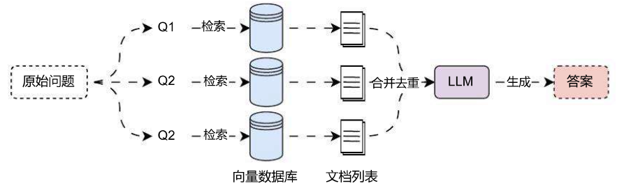
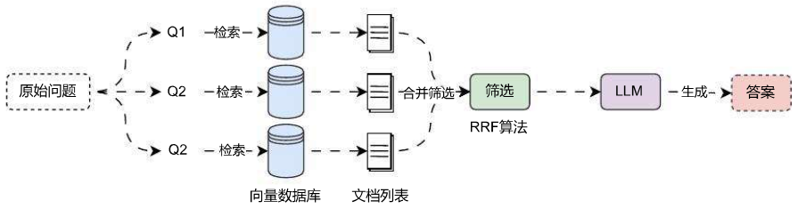
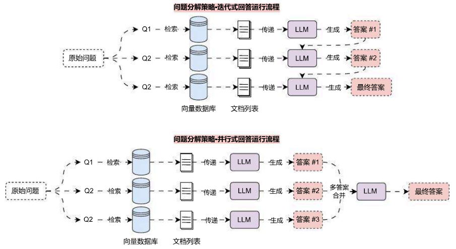
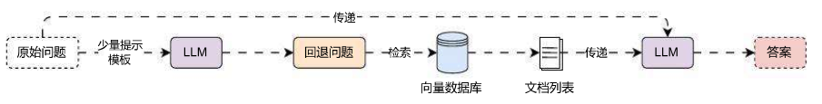
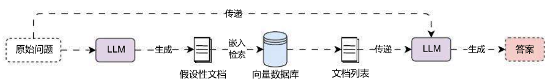
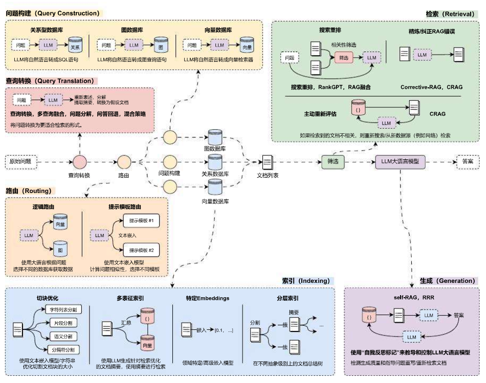

## 多检索器集成多种算法实现混合检索

### 01. 集成检索器的优势与使用

在 LangChain 中，封装了一个集成检索器 `EnsembleRetriever`，这个检索器接受一个检索器列表作为输入，并根据 RRF 算法对每个检索器的 `get_relevant_documents()` 方法产生的文档列表进行集成和重新排序。

集成检索器可以利用不同算法的优势，从而获得比任何单一算法更好的性能。集成检索器一个常见的案例是将**稀疏检索器 (如 BM25)** 和**密集检索器 (如嵌入相似度)** 结合起来，因为它们的优势是互补的，这种检索方式也被称为**混合检索**（稀疏检索器擅长于关键词检索，密集检索器擅长基于语义相似性检索）。

混合检索器被广泛应用于各类 AI 应用开发平台，例如：Dify、Coze、智谱等平台，也是课程 LLMOps 项目会使用的检索策略。

在 LangChain 中使用 `EnsembleRetriever` 非常简单，传递 `retrievers`(检索器列表) 和 `weights`(检索器权重) 即可。

例如使用 BM25 关键词搜索 和 FAISS 相似度搜索 进行结合，实现混合搜索，首先安装 `rank_bm25` 包，命令如下

```
pip install -U rank_bm25
```

混合搜索实例代码如下：

```
import dotenv
from langchain.retrievers import EnsembleRetriever
from langchain_community.retrievers import BM25Retriever
from langchain_community.vectorstores import FAISS
from langchain_core.documents import Document
from langchain_openai import OpenAIEmbeddings

dotenv.load_dotenv()

# 1.创建文档列表
documents = [
    Document(page_content="笨笨是一只很喜欢睡觉的猫咪", metadata={"page": 1}),
    Document(page_content="我喜欢在夜晚听音乐，这让我感到放松。", metadata={"page": 2}),
    Document(page_content="猫咪在窗台上打盹，看起来非常可爱。", metadata={"page": 3}),
    Document(page_content="学习新技能是每个人都应该追求的目标。", metadata={"page": 4}),
    Document(page_content="我最喜欢的食物是意大利面，尤其是番茄酱的那种。", metadata={"page": 5}),
    Document(page_content="昨晚我做了一个奇怪的梦，梦见自己在太空飞行。", metadata={"page": 6}),
    Document(page_content="我的手机突然关机了，让我有些焦虑。", metadata={"page": 7}),
    Document(page_content="阅读是我每天都会做的事情，我觉得很充实。", metadata={"page": 8}),
    Document(page_content="他们一起计划了一次周末的野餐，希望天气能好。", metadata={"page": 9}),
    Document(page_content="我的狗喜欢追逐球，看起来非常开心。", metadata={"page": 10}),
]

# 2.构建BM25关键词检索器
bm25_retriever = BM25Retriever.from_documents(documents)
bm25_retriever.k = 4

# 3.创建FAISS向量数据库检索
faiss_db = FAISS.from_documents(documents,
embedding=OpenAIEmbeddings(model="text-embedding-3-small"))
faiss_retriever = faiss_db.as_retriever(search_kwargs={"k": 4})

# 4.初始化集成检索器
ensemble_retriever = EnsembleRetriever(
    retrievers=[bm25_retriever, faiss_retriever],
    weights=[0.5, 0.5],
)

# 5.执行检索
docs = ensemble_retriever.invoke("除了猫，你养了什么宠物呢？")
print(docs)
print(len(docs))
```

输出内容：

```
[Document(metadata={'page': 10}, page_content='我的狗喜欢追逐球，看起来非常开心。'),
Document(metadata={'page': 3}, page_content='猫咪在窗台上打盹，看起来非常可爱。'),
Document(metadata={'page': 9}, page_content='他们一起计划了一次周末的野餐，希望天气能好。'),
Document(metadata={'page': 1}, page_content='笨笨是一只很喜欢睡觉的猫咪'),
Document(metadata={'page': 8}, page_content='阅读是我每天都会做的事情，我觉得很充实。'),
Document(metadata={'page': 7}, page_content='我的手机突然关机了，让我有些焦虑。'),
Document(metadata={'page': 5}, page_content='我最喜欢的食物是意大利面，尤其是番茄酱的那种。')]
7
```

在实际的开发中，除了硬编码不同检索器与对应的权重，还可以在运行时配置检索器，在检索时动态控制某个检索器输出内容的数量、权重等，例如：

```
faiss_retriever = faiss_db.as_retriever(search_kwargs={"k": 4}).configurable_fields(
    search_kwargs=ConfigurableField(
        id="search_kwargs_faiss",
        name="搜索参数",
        description="要使用的搜索参数",
    )
)

config = {"configurable": {"search_kwargs_faiss": {"k": 1}}}
docs = ensemble_retriever.invoke("苹果", config=config)
```

### 02. 查询转换阶段优化策略总结

至此，在 RAG 的**查询转换**阶段，目前市面上主流的优化策略其实我们都已经讲解完了，涵盖了：多查询重写、RAG 多查询结果融合、问题分解策略、回答回退策略、HyDE 混合策略、集成检索器策略等，不同的优化策略有不同的优缺点：

1. **多查询重写**：实现简单，使用参数较小的模型也可以完成对查询的转换（不涉及回答），因为多查询可以并行检索，所以性能较高，但是在合并的时候，没有考虑到不同文档的权重，仅仅按照顺序进行合并，会让某些高权重的文档在使用时可能被剔除。



2. **多查询融合**：在多查询重写的基础上引入了 RRF 算法，对不同查询检索到的文档列表的每一篇文档计算对应的权重，将排名靠前亦或者是出现次数更多的文档放置到合并文档的靠前部分。



3. **问题分解策略**：通过将复杂问题 / 数学问题分解成多个子问题，从而实现对每个子问题的检索‑生成流程，最后再将所有子问题的答案进行合并，在转换缓解涉及到对子问题的回答，所以对于中间 LLM 的要求比较高，性能相对也比较差，在上下文长度不足的情况下，拆分问题并迭代回答，可能会让最终答案偏离原始的提问。



4. **回答回退策略**：通过提出一个前置问题 / 通用问题用于优化原始的复杂问题，从而获得更大的搜索范围，提升检索到相关性高的文档的概率，因为中间 LLM 没涉及到回答，所以可以使用参数量较小的模型来实现，性能相对较高。



5. **HyDE 混合策略**：通过将 query 转换成 doc 的思想，并执行 doc‑doc 实现对称性检索，从而提升找到相似性文档的概率，但是对于上下文不足，或者是开放性问题，HyDE 混合策略的效果相对较差。



6. **集成检索器策略**：目前使用频率最高的检索器策略，集成多种不同的检索方式，充分利用不同算法的优点，最后再使用 RRF 算法对不同检索器检索到的数据进行合并，从而得到最终文档列表。

