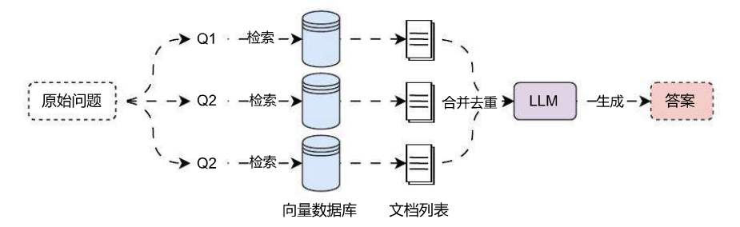

# 多查询重写策略提升检索准确性

## 01. Multi‑Query 多查询策略

**多查询策略**也被称为**子查询**，是一种用于生成子问题的技术，其核心思想是在问答过程中，为了更好地理解和回答主问题，系统会自动生成并提出与主问题相关的子问题，这些子问题通常具有更具体的细节，可以帮助大语言模型更深入地理解主问题，从而进行更加准确的检索并提供正确的答案。

**多查询策略**会从多个角度重写用户问题，为每个重写的问题执行检索，并将检索到的文档列表进行合并后去重，返回唯一文档，该策略的运行流程非常简单，如下：



在 LangChain 中，针对多查询策略封装了一个检索器 `MultiQueryRetriever`，该检索器可以通过构造函数亦或者 `from_llm` 类方法进行实例化，参数如下：

1. `retriever`：基础检索器，必填参数。
2. `llm`：大语言模型，用于将原始问题转换成多个问题，必填参数。
3. `prompt`：转换原始问题为多个问题的提示模板，非必填，已有默认值。
4. `parser_key`：解析键，该参数在未来将被抛弃，非必填，已弃用，新版本中保留参数，但没有任何使用的地方。
5. `included_original`：是否保留原始问题，默认为 `False`，如果设置为 `True`，则除了检索新问题，还会检索原始问题。

例如以 weaviate 向量数据库作为检索器，使用多查询策略优化普通的 RAG 检索缓解，对应的代码具象化如下：

```python
import dotenv
import weaviate
from langchain.retrievers import MultiQueryRetriever
from langchain_openai import OpenAIEmbeddings, ChatOpenAI
from langchain_weaviate import WeaviateVectorStore
from weaviate.auth import AuthApiKey

dotenv.load_dotenv()

# 1.构建向量数据库与检索器
db = WeaviateVectorStore(
    client=weaviate.connect_to_wcs(
        cluster_url="https://eftofnujtxqcsa0sn272jw.c0.us‑west3.gcp.weaviate.cloud",
        auth_credentials=AuthApiKey("21pzYy0or12dxH9xCoZG1O2b0euDeKJNEbB0"),
    ),
    index_name="DatasetDemo",
    text_key="text",
    embedding=OpenAIEmbeddings(model="text‑embedding‑3‑small"),
)
retriever = db.as_retriever(search_type="mmr")

# 2.创建多查询检索器
multi_query_retriever = MultiQueryRetriever.from_llm(
    retriever=retriever,
    llm=ChatOpenAI(model="gpt‑3.5‑turbo‑16k", temperature=0),
)

# 3.执行检索
docs = multi_query_retriever.invoke("关于LLMOps应用配置的文档有哪些")
print(docs)
print(len(docs))
```

输出内容：

```
[Document(metadata={'source': './项目API文档.md', 'start_index': 0.0}, page_content='LLMOps 项目 API 文档\n\n应用 API 接口统一以 JSON 格式返回，并且包含 3 个字段：code、data 和 message，分别代表业务状态码、业务数据和接口附加信息。\n业务状态码共有 6 种，其中只有 success(成功) 代表业务操作成功，其他 5 种状态均代表失败，并且失败时会附加相关的信息：fail(通用失败)、not_found(未找到)、unauthorized(未授权)、forbidden(无权限) 和 validate_error(数据验证失败)。\n\n接口示例：\n```json { "code": "success", "data": { "redirect_url": "https://github.com/login/oauth/authorize?client_id=f69102c6bb97d90d69768&redirect_uri=http%3A%2F%2Flocalhost%3A5001%2Foauth%2Fauthorize%2Fgithub&scope=user%3Aemail" }, "message": "" }```'),
Document(metadata={'source': './项目API文档.md', 'start_index': 3042.0}, page_content='1.2 [todo]更新应用草稿配置信息\n接口说明：更新应用的草稿配置信息，涵盖：模型配置、长记忆模式等，该接口会查找该应用原始的草稿配置并进行更新，如果没有原始草稿配置，则创建一个新配置作为草稿配置。\n接口信息：授权+POST:/apps/:app_id/config\n接口参数：\n请求参数：\n\napp_id -> str：需要修改配置的应用 id。\nmodel_config -> json：模型配置信息。\n\ndialog_round -> int：携带上下文轮数，类型为非负整型。\nmemory_mode -> string：记忆类型，涵盖长记忆 long_term_memory 和 none 代表无。\n请求示例：\n```json { "model_config": { "dialog_round": 10 }, "memory_mode": "long_term_memory" }```\n响应示例：\n```json { "code": "success", "data": {}, "message": "更新AI应用配置成功" }```'),
Document(metadata={'source': './项目API文档.md', 'start_index': 5818.0}, page_content='json { "code": "success", "data": { "list": [ { "id": "1550b71a‑1444‑47ed‑a59d‑c2f080fbae94", "conversation_id": "2d7d3e3f‑95c9‑4d9d‑ba9c‑9daaf09cc8a8", "query": "能详细讲解下LLM是什么吗？", "answer": "LLM 即 Large Language Model，大语言模型，是一种基于深度学习的自然语言处理模型，具有很高的语言理解和生成能力，能够处理各式各样的自然语言任务，例如文本生成、问答、翻译、摘要等。它通过在大量的文本数据上进行训练，学习到语言的模式、结构和语义知识" } ]'),
Document(metadata={'source': './项目API文档.md', 'start_index': 675.0}, page_content='json { "code": "success", "data": { "list": [ { "app_count": 0, "created_at": 1713105994, "description": "这是专门用来存储慕课LLMOps课程信息的知识库", "document_count": 13, "icon": "https://imooc‑llmops‑1257184990.cos.ap‑guangzhou.myqcloud.com/2024/04/07/96b5e270‑c54a‑4424‑aece‑ff8a2b7e4331.png", "id": "c0759ca8‑2d35‑4480‑83a8‑1f41f29d1401", "name": "慕课LLMOps课程知识库", "updated_at": 1713106758, "word_count": 8850 } ], "paginator": { "current_page": 1, "page_size": 20, "total_page": 1, "total_record": 2 } } }'),
Document(metadata={'source': './项目API文档.md', 'start_index': 2324.0}, page_content='json { "code": "success", "data": { "id": "5e7834dc‑bbca‑4ee5‑9591‑8f297f5acded", "name": "慕课LLMOps聊天机器人", "icon": "https://imooc‑llmops‑1257184990.cos.ap‑guangzhou.myqcloud.com/2024/04/23/e4422149‑cf7‑41b3‑ad55‑ca8d2caa8f13.png", "description": "这是一个慕课LLMOps的Agent应用", "published_app_config_id": null, "drafted_app_config_id": "1550b71a‑1444‑47ed‑a59d‑c2f080fbae94", "debug_conversation_id": "1550b71a‑1444‑47ed‑a59d‑c2f080fbae94", "published_app_config": null, "drafted_app_config": { "id": "755dc464‑67cd‑42ef‑9c56‑b7528b44e7c8" } }'),
Document(metadata={'source': './项目API文档.md', 'start_index': 2042.0}, page_content='dialog_round -> int：携带上下文轮数，类型为非负整型。\nmemory_mode -> string：记忆类型，涵盖长记忆 long_term_memory 和 none 代表无。\nstatus -> string：应用配置的状态，drafted代表草稿、published 代表已发布配置。\nupdated_at -> int：应用配置的更新时间。\ncreated_at -> int：应用配置的创建时间。\nupdated_at -> int：应用的更新时间。\ncreated_at -> int：应用的创建时间。\n响应示例：')]
6
```

亦或者在 LangSmith 平台上也可以观测到整个执行的流程。

## 02. 核心及注意事项

从 LangSmith 平台记录的运行流程，可以很清晰看到这个检索器会先调用大语言模型生成 3 条与原始问题相关的子问题，然后再逐个使用传递的检索器检索 3 个子问题，得到对应的文档列表，最后再将所有文档列表进行合并去重，得到最终的文档。

在 `MultiQueryRetriever` 这个检索器中，预设了一段 prompt，用于将原始问题生成 3 个关联子问题，并使用 `\n` 分割得到具体问题。

这段 prompt 如下：

```python
# langchain/retrievers/multi_query.py
DEFAULT_QUERY_PROMPT = PromptTemplate(
    input_variables=["question"],
    template="""You are an AI language model assistant. Your task is to generate 3 different versions of the given user question to retrieve relevant documents from a vector database. By generating multiple perspectives on the user question, your goal is to help the user overcome some of the limitations of distance‑based similarity search. Provide these alternative questions separated by newlines. Original question: {question}""",
)
```

在 LangChain 中，所有预设的 prompt 绝大部分场景都是使用 OpenAI 的大语言模型进行调试的，所以效果会比较好，对于其他的模型，例如国内的模型，一般来说还需要将对应的提示换成中文语言，所以可以考虑使用 ChatGPT 翻译原有的 prompt，更新后：

```python
multi_query_retriever = MultiQueryRetriever.from_llm(
    retriever=retriever,
    llm=ChatOpenAI(model="gpt‑3.5‑turbo‑16k", temperature=0),
    prompt=ChatPromptTemplate.from_template(
        "你是一个AI语言模型助手。你的任务是生成给定用户问题的3个不同版本，以从向量数据库中检索相关文档。"
        "通过提供用户问题的多个视角，你的目标是帮助用户克服基于距离的相似性搜索的一些限制。"
        "请用换行符分隔这些替代问题。"
        "原始问题：{question}"
    )
)
```

基于中文 prompt 生成的问题列表如下：

1. LLMOps 应用配置的文档有哪些资源可供参考？
2. 我可以在哪里找到关于 LLMOps 应用配置的文档？
3. 有哪些文档可以帮助我了解 LLMOps 应用配置的相关信息？

对于该检索器，不同的模型生成的 query 格式可能并不一样，某些模型生成的多条 query 可能并不是按照 `\n` 进行分割，这个时候查询的效果可能不如原始问题，所以在使用该检索器时，一定要多次测试 prompt 的效果，或者设置 `included_original` 为 `True`，确保生成内容不符合规范时，仍然可以使用原始问题进行检索。

另外，在 `MultiQueryRetriever` 的底层进行合并去重，并没有任何特别的，仅仅只做了循环遍历并记录唯一的文档而已，核心代码：

```
# langchain/retrievers/multi_query.py
def _unique_documents(documents: Sequence[Document]) -> List[Document]:
    return [doc for i, doc in enumerate(documents) if doc not in documents[:i]]
```

多查询策略是最基础 + 最简单的 RAG 优化，不涉及到复杂的逻辑与算法，会稍微影响单次对话的耗时。并且由于需要转换 query 一般较小，以及生成 sub‑queries 时对 LLM 的能力要求并不高，在实际的 LLM 应用开发中，通常使用参数较小的本地模型 + 针对性优化的 prompt 即可完成任务。

而且为了减少模型的幻觉以及胡说八道，一般都将 `temperature` 设置为 0，确保生成的文本更加有确定性。