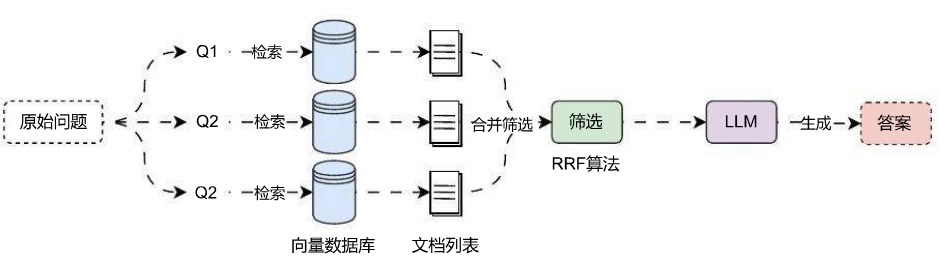

# RAG 多查询结果融合策略

## 01. 多查询结果融合策略及 RRF

在多查询重写策略中，虽然可以生成多条查询并执行多次检索器检索，但是在合并数据的时候，并没有考虑最终结果的文档数，极端情况下，原始的 k 设置为 4，可能会返回 16 个文档（3 条子查询的文档，1 条原始问题查询的文档），除此之外，多查询重写策略并不会考虑对应文档的权重，只按默认顺序进行合并。

于是就诞生了 RAG 融合的概念，它的主要思想是在 Multi‑Query 的基础上，对其检索结果进行重新排序（即 reranking）后输出 Top K 个结果，最后再将这 Top K 个结果喂给 LLM 并生成最终答案，运行流程如下：



在 RAG 融合 中，对文档列表进行排序 & 去重合并的算法为 RRF (Reciprocal Rank Fusion)，即倒排序排名算法，该算法是滑铁卢大学（CAN）和 Google 合作开发的，而且该算法的原理其实非常简单，公式如下：
$$
(RRF_{score}(d \in D)=\sum_{r\in R} \frac{1}{k+r(d)})
$$
论文原文链接：https://plg.uwaterloo.ca/~gvcormac/cormacksigir09-rrf.pdf

在 RRF 算法中，D 表示相关文档的全集，k 是固定常数 60，r (d) 表示当前文档 d 在其子集中的位置，该算法会对全集 D 进行二重遍历，外层遍历文档全集 D，内层遍历文档子集，在做内层变量的时候，我们会累计当前文档在其子集中的位置并取倒数作为其权重。

常数 k 被设定为 60，这个值是在进行初步调查时确定的，在论文中，通过四个试点实验，每个实验结合了 30 种搜索配置应用于不同的 TREC 集合的结果，发现 k=60 接近最优值，k 值是多少并不是关键，主要是通过 k 值，可以很容易发现一个事实：

> 虽然高排名的文档更加重要，但低排名文档的重要性并不会像使用指数函数那样消失。

RRF 算法的 Python 实现具象化如下：

```python
def rrf(results: list[list], k: int = 60) -> list[tuple]:
    """倒数排名融合RRF算法，用于将多个结果生成单一、统一的排名"""

    # 1.初始化一个字典，用于存储每一个唯一文档的得分
    fused_scores = {}

    # 2.遍历每个查询对应的文档列表
    for docs in results:
        # 3.内层遍历文档列表得到每一个文档
        for rank, doc in enumerate(docs):
            # 4.将文档使用langchain提供的dump工具转换成字符串
            doc_str = dumps(doc)
            # 5.检测该字符串是否存在得分，如果不存在则赋值为0
            if doc_str not in fused_scores:
                fused_scores[doc_str] = 0
            # 6.计算多结果得分，排名越小越靠前，k为控制权重的参数
            fused_scores[doc_str] += 1 / (rank + k)

    # 7.提取得分并进行排序
    reranked_results = [
        (loads(doc), score)
        for doc, score in sorted(fused_scores.items(), key=lambda x: x[1], reverse=True)
    ]

    return reranked_results
```

## 02. 多查询结果融合策略实现

在 LangChain 中并没有直接实现 RAG 多查询结果融合策略 的检索器，所以可以考虑自定义实现，或者是继承 `MultiQueryRetriever` 并重写 `retrieve_docments()` 与 `unique_union()` 方法来实现对文档的 RRF 排名计算与合并。

重写方法的思路其实也非常简单，在方法内部将每次检索到的内容填充到一个两层列表中，然后传递给 RRF 函数即可。

完整代码实现如下：

```python
from typing import List

import dotenv
import weaviate
from langchain.load import dumps, loads
from langchain.retrievers import MultiQueryRetriever
from langchain_core.callbacks import CallbackManagerForRetrieverRun
from langchain_core.documents import Document
from langchain_openai import ChatOpenAI, OpenAIEmbeddings
from langchain_weaviate import WeaviateVectorStore
from weaviate.auth import AuthApiKey

dotenv.load_dotenv()


class RAGFusionRetriever(MultiQueryRetriever):
    """RAG多查询结果融合检索器"""
    k: int = 4

    def __init__(self, k: int = 4, **kwargs):
        super().__init__(**kwargs)
        self.k = k

    def retrieve_documents(
            self, queries: List[str], run_manager: CallbackManagerForRetrieverRun
    ) -> List[List]:
        """重写检索文档，返回二层嵌套的列表"""
        documents = []
        for query in queries:
            docs = self.retriever.invoke(
                query, config={"callbacks": run_manager.get_child()}
            )
            documents.append(docs)
        return documents

    def unique_union(self, documents: List[List]) -> List[Document]:
        """使用RRF算法对文档列表进行排序&合并"""
        # 1.初始化一个字典，用于存储每一个唯一文档的得分
        fused_scores = {}

        # 2.遍历每个查询对应的文档列表
        for docs in documents:
            # 3.内层遍历文档列表得到每一个文档
            for rank, doc in enumerate(docs):
                # 4.将文档使用langchain提供的dump工具转换成字符串
                doc_str = dumps(doc)
                # 5.检测该字符串是否存在得分，如果不存在则赋值为0
                if doc_str not in fused_scores:
                    fused_scores[doc_str] = 0
                # 6.计算多结果得分，排名越小越靠前，k为控制权重的参数
                fused_scores[doc_str] += 1 / (rank + 60)

        # 7.提取得分并进行排序
        reranked_results = [
            (loads(doc), score)
            for doc, score in sorted(fused_scores.items(), key=lambda x: x[1], reverse=True)
        ]

        return [item[0] for item in reranked_results[:self.k]]


# 1.构建向量数据库与检索器
db = WeaviateVectorStore(
    client=weaviate.connect_to_wcs(
        cluster_url="https://eftofnujtxqcsa0sn272jw.c0.us‑west3.gcp.weaviate.cloud",
        auth_credentials=AuthApiKey("21pzyYy0or12dHx9CoZG102b0euDeKJNEbB0"),
    ),
    index_name="DatasetDemo",
    text_key="text",
    embedding=OpenAIEmbeddings(model="text‑embedding‑3‑small"),
)
retriever = db.as_retriever(search_type="mmr")

rag_fusion_retriever = RAGFusionRetriever.from_llm(
    retriever=retriever,
    llm=ChatOpenAI(model="gpt‑3.5‑turbo‑16k", temperature=0),
)

# 3.执行检索
docs = rag_fusion_retriever.invoke("关于LLMOps应用配置的文档有哪些")

print(docs)
print(len(docs))
```

输出内容：

```
[Document(metadata={'source': './项目API文档.md', 'start_index': 0.0}, page_content='LLMOps 项目 API 文档\n应用 API 接口统一以 JSON 格式返回，并且包含 3 个字段：code、data 和 message，分别代表业务状态码、业务数据和接口附加消息。\n业务状态码共有 6 种，其中只有 success(成功) 代表业务操作成功，其他 5 种状态均代表失败，并且失败时会附加相关的信息：fail(通用失败)、not_found(未找到)、unauthorized(未授权)、forbidden(无权限) 和 validate_error(数据验证失败)。\n\n接口示例：\n{ "code": "success", "data": { "redirect_url": "https://github.com/login/oauth/authorize?client_id=f69102c6b97d90d69768&redirect_uri=http%3A%2F%2F1ocalhost%3A5A001%2Foauth%2Fauthorize%2Fgithub&scope=user%3Aemail" }, "message": "" }'),
Document(metadata={'source': './项目API文档.md', 'start_index': 5818.0}, page_content='json { "code": "success", "data": { "list": [ { "id": "1550b71a‑1444‑47ed‑a59d‑c2f080fbae94", "conversation_id": "2d7d3e3f‑95c9‑4d9b‑9a9c‑9daaf09cc8a8", "query": "能详细讲解下LLM是什么吗？", "answer": "LLM 即 Large Language Model，大语言模型，是一种基于深度学习的自然语言处理模型，具有很高的语言理解生成能力，能够处理各式各样的自然语言任务，例如文本生成、问答、翻译、摘要等。它通过在大量的文本数据上进行训练，学习到语言的模式、结构和语义知识" },
Document(metadata={'source': './项目API文档.md', 'start_index': 3042.0}, page_content='1.2 [todo]更新应用草稿配置信息\n接口说明：更新应用的草稿配置信息，涵盖：模型配置、长记忆模式等，该接口会查找该应用原始的草稿配置并进行更新，如果没有原始草稿配置，则创建一个新配置作为草稿配置。\n\n接口信息：授权\n+POST:/apps/:app_id/config\n接口请求参数：\n\tapp_id → str: 需要修改配置的应用 id.\n\tmodel_config → json: 模型配置信息.\n\tdialog_round → int: 携带上下文轮数，类型为非负整数.\n\tmemory_mode → string: 记忆类型，涵盖长记忆 long_term_memory 和 none 代表无。\n请求示例：\n\tjson { "model_config": { }, "dialog_round": 10 }, "memory_mode": "long_term_memory" }\n响应示例：\n\tjson { "code": "success", "data": { }, "message": "更新AI应用配置成功" }\n1.3 [todo]获取应用调试长记忆'),
Document(metadata={'source': './项目API文档.md', 'start_index': 675.0}, page_content='json { "code": "success", "data": { "list": [ { "app_count": 0, "created_at": 1713105994, "description": "这是专门用来存储慕课LLMOps课程信息的知识库", "document_count": 13, "icon": "https://imooc‑llmops‑1257184990.cos.ap‑guangzhou.myqcloud.com/2024/04/07/96b5e270‑4480‑c54a‑55c4‑4424‑aace‑feff8a2b7e431.png", "id": "c0759ca8‑2d35‑4480‑83a8‑1f41f29d1401", "name": "慕课LLMOps课程知识库", "updated_at": 1713106758, "word_count": 8850 } ], "paginator": { "current_page": 1, "page_size": 20, "total_page": 1, "total_record": 2 } }')]
4
```