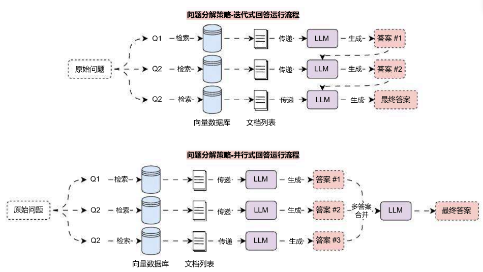

# 问题分解策略提升复杂问题检索正确率

## 01. 复杂问题检索的难点与分解

在 RAG 应用开发中，对于一些提问相对复杂的原始问题来说，无论是使用原始问题进行检索，亦或者生成多个相关联的问题进行检索，往往都很难在向量数据库中找到关联性高的文档，导致 RAG 效果偏差。

例如向向量数据库中存储了一份机器的说明文档，对于这类数据，如果提问如何完成某个部件的维修这类问题，一般都会涉及到多个步骤与顺序，执行相似性搜索会有很大概率没法找到有关联的文档。

造成这个问题的原因有几种：

1. 复杂问题由多个问题按顺序步骤组成，执行相似性搜索时，向量数据库存储的都是基础文档数据，往往相似度低，但是这些数据在现实世界又可能存在很大的关联（文本嵌入模型的限制，一条向量不可能无损记录段落信息）。
2. 问题复杂度高或者涉及到数学问题，导致 LLM 没法一次性完成答案的生成，一次性传递大量的相关性文档，极大压缩了大语言模型生成内容上下文长度的限制。

对于这类 RAG 应用场景，可以使用 Decomposition 问题分解策略，将一个复杂问题分解成多个子问题，和多查询重写策略不一样的是，这个策略生成的子问题使用的是深度优先，即解决完第一个问题后，对应的资料传递给第二个问题，以此类推；亦或者是并行将每个问题的答案合并成最终问题。

所以 Decomposition 问题分解策略可以划分成两种方案：迭代式回答 与 并行式回答，两种方案的运行流程如下：



其中迭代式回答，会将上一次的 **提问** + **答案**，还有这一次的 检索上下文 一起传递给 LLM，让其生成答案，迭代到最后一次，就是最终答案。而 并行式回答 则会同时检索，并同时调用 LLM 生成答案，最后再将答案进行汇总，让 LLM 整理生成最终答案。

## 02. 问题分解策略‑迭代式回答实现

在 LangChain 中，并没有针对 问题分解策略 实现对应的 检索器 或者 预设链，所以只能自行实现这个优化策略，由于问题分解策略同样也是先生成对应的子问题（深入优先），所以需要单独构建一条链先进行问题的分解，然后迭代执行响应的检索，得到上下文，并使用 LLM 回复该问题，将得到的 迭代答案 + 问题，传递给下一个子问题。

代码实现:

```python
from operator import itemgetter

import dotenv
import weaviate
from langchain_core.output_parsers import StrOutputParser
from langchain_core.prompts import ChatPromptTemplate
from langchain_core.runnables import RunnablePassthrough
from langchain_openai import ChatOpenAI, OpenAIEmbeddings
from langchain_weaviate import WeaviateVectorStore
from weaviate.auth import AuthApiKey

dotenv.load_dotenv()


def format_qa_pair(question: str, answer: str) -> str:
    """格式化传入的问题+答案"""
    return f"Question: {question}\nAnswer: {answer}\n\n".strip()


# 1.定义分解子问题的prompt
decomposition_prompt = ChatPromptTemplate.from_template(
    "你是一个乐于助人的AI助理，可以针对一个输入问题生成多个相关的子问题。\n"
    "目标是将输入问题分解成一组可以独立回答的子问题或子任务。\n"
    "生成与以下问题相关的多个搜索查询：{question}\n"
    "并使用换行符进行分割，输出（3个子问题/子查询）："
)

# 2.构建分解问题链
decomposition_chain = (
    {"question": RunnablePassthrough()}
    | decomposition_prompt
    | ChatOpenAI(model="gpt-3.5-turbo-16k", temperature=0)
    | StrOutputParser()
    | (lambda x: x.strip().split("\n"))
)

# 3.构建向量数据库与检索器
db = WeaviateVectorStore(
    client=weaviate.connect_to_wcs(
        cluster_url="https://mbakeruerziae6psyex7ng.c0.us-west3.gcp.weaviate.cloud",
        auth_credentials=AuthApiKey("Z1tPva9ZS0xUcfafe1sggGyyH6tnTYQYJvBx"),
    ),
    index_name="DatasetDemo",
    text_key="text",
    embedding=OpenAIEmbeddings(model="text-embedding-3-small"),
)
retriever = db.as_retriever(search_type="mmr")

# 4.执行提问获取子问题
question = "关于LLMOps应用配置的文档有哪些"
sub_questions = decomposition_chain.invoke(question)

# 5.构建迭代问答链
prompt = ChatPromptTemplate.from_template("""这是你需要回答的问题：
---
{question}
---

这是所有可用的背景问题和答案对：
---
{qa_pairs}
---

这是与问题相关的额外背景信息：
---
{context}
---

使用上述背景信息和所有可用的背景问题和答案对来回答这个问题：
{question}""")

chain = (
    {
        "context": itemgetter("question") | retriever,
        "question": itemgetter("question"),
        "qa_pairs": itemgetter("qa_pairs"),
    }
    | prompt
    | ChatOpenAI(model="gpt-3.5-turbo-16k", temperature=0)
    | StrOutputParser()
)

# 5.循环遍历所有子问题进行检索并获取答案
qa_pairs = ""
for sub_question in sub_questions:
    answer = chain.invoke({"question": sub_question, "qa_pairs": qa_pairs})
    qa_pairs += "\n---\n" + format_qa_pair(sub_question, answer)
    print(f"问题: {sub_question}")
    print(f"答案: {answer}")
    print("========================")
```

输出内容:

```
问题：1. 如何配置 LLMOps 应用？
答案：根据提供的背景信息，LLMOps 应用的配置可以通过以下步骤完成：

1. 获取应用的长记忆内容：使用授权 + GET:/apps/:app_id/long‑term‑memory 接口，其中 app_id 参数为需要获取长记忆的应用 id。该接口将返回该应用最新调试会话的长记忆内容。
2. 获取应用的详细信息：使用授权 + GET:/apps/:app_id 接口，其中 app_id 参数为需要获取详细信息的应用 id。该接口将返回该应用的 id、名称、图标、描述等信息。
3. 根据获取到的应用信息和长记忆内容进行配置：根据获取到的应用信息和长记忆内容，可以进行相应的配置操作，例如设置应用的名称、图标、描述等。

需要注意的是，具体的配置操作可能会根据 LLMOps 应用的具体需求而有所不同，以上步骤仅提供了一般的配置流程。

========================
问题：2. LLMOps 应用配置的最佳实践是什么？
答案：LLMOps 应用配置的最佳实践是根据具体需求和业务场景进行配置，并遵循以下几个原则：

1. 状态管理：LLMOps 应用配置有两种状态，即草稿（drafted）和已发布（published）。在进行配置时，应确保配置的状态正确，并根据需要进行相应的状态转换。
2. 更新和创建时间：配置应包含更新时间（updated_at）和创建时间（created_at），以便跟踪配置的变更历史和创建时间。
3. 记忆类型：配置中的记忆类型（memory_mode）可以选择长期记忆（long_term_memory）或无记忆（none）。根据应用的需求，选择适当的记忆类型。
4. 应用更新时间：配置中还应包含应用的更新时间（updated_at）和创建时间（created_at），以便跟踪应用的变更历史和创建时间。

综上所述，LLMOps 应用配置的最佳实践是根据具体需求和业务场景进行配置，并确保状态管理、时间跟踪和记忆类型的正确设置。

========================
问题：3. 如何在 LLMOps 应用中查找相关的配置文档？
答案：在 LLMOps 应用中查找相关的配置文档，可以参考项目的 API 文档。根据提供的背景信息，可以看到 API 文档中包含了关于应用配置的接口说明和示例。
```

