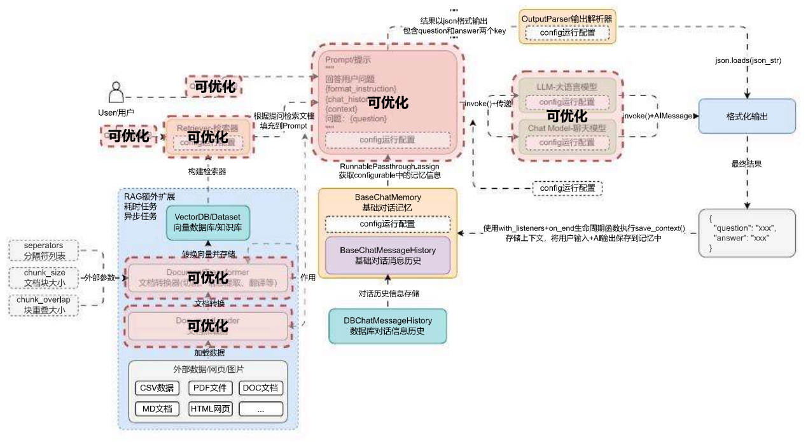
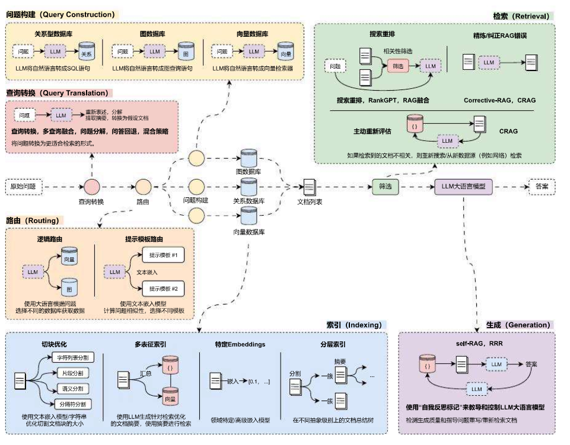

# RAG 开发 6 个阶段优化策略分析

## 01. LLM 应用中的 RAG 开发阶段

在 RAG 应用开发中，无论架构多复杂，接入了多少组件，使用了多少优化策略与特性，所有优化的最终目标都是**提升 LLM 生成内容的准确性**，而对于 Transformer 架构类型的大模型来说，要实现这个目标，一般只需要 3 个步骤：

1. **传递更准确的内容**：传递和提问准确性更高的内容，会让 LLM 能识别到关联的内容，生成的内容准确性更高。
2. **让重要的内容更靠前**：GPT 模型的注意力机制会让传递 Prompt 中更靠前的内容权重更高，越靠后权重越低。
3. **尽可能不传递不相关内容**：缩短每个块的大小，尽可能让每个块只包含关联的内容，缩小不相关内容的比例。

看起来很简单，但是目前针对这 3 个步骤很多研究员提出了不少方案，比较遗憾的是，目前也没有一种统一的方案，不同的场合仍然需要考虑不同的方案结合才能实现相对好一点的效果，并不是所有场合都适合配置很复杂的优化策略。

> **Important** 在 RAG 应用开发中，使用的优化策略越多，单次响应成本越高，性能越差，需要合理使用。

映射到 RAG 中，其实就是**切割合适的文档块、更准确的搜索语句、正确地排序文档、剔除重复无关的检索内容**，所以在 RAG 应用开发中，想进行优化，可以针对 `query`(提问查询)、`TextSplitter`(文本分割器)、`VectorStore`(向量数据库)、`Retriever`(检索器)、`Prompt`(基础 prompt 编写) 这几个组件。

在前面的 LLM 应用开发中，我们构建了一个应用开发流程图，涵盖了向量数据库、检索器、Prompt、记忆、输出解析器、大语言模型、运行时配置、大模型生成等阶段，可以优化 RAG 的组件使用红圈覆盖如下：

在完整的 LLM 应用流程中拆解 RAG 开发阶段并进行优化看起来相对繁琐，可以考虑单独将 RAG 开发阶段的流程拎出来，并针对性对每个阶段进行优化与调整，按照不同的功能模块，共可以划分成 6 个阶段：**查询转换、路由、查询构建、索引、检索 和 生成**。

## 02. RAG 开发 6 个阶段优化策略

在 RAG 开发的 6 个阶段中，不同的阶段拥有不同的优化策略，需要针对不同的应用进行特定性的优化，目前市面上常见的优化方案有：**问题转换、多路召回、混合检索、搜索重排、动态路由、图查询、问题重建、自检索**等数十种优化策略，每种策略所在的阶段并不一致，效果也有差异，并且相互影响。

并且 RAG 优化和 LangChain 并没有关系，无论使用任何框架、任何编程语言，进行 RAG 开发时，掌握优化的思路才是最重要的！

将对应的优化策略整理到 RAG 运行流程中，优化策略与开发阶段对应图如下：

