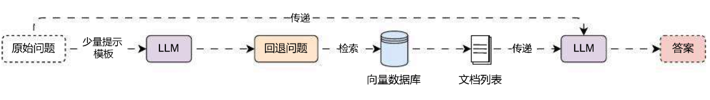

# Step‑Back 回答回退策略扩大检索范围

## 01. LangChain 少量示例提示模板

在与 LLM 的对话中，提供少量这样的示例被称为**少量示例**，这是一种简单但强大的指导生成的方式，在某些情况下可以显著提高模型性能（与之对应的是零样本），少量示例可以降低 Prompt 的复杂度，快速告知 LLM 生成内容的规范。

在 LangChain 中，针对少量示例也封装对应的提示模板 ——**FewShotPromptTemplate**，这个提示模板只需要传递**示例列表**与**示例模板**即可快速构建**少量示例提示模板**，使用示例如下：

```python
import dotenv
from langchain_core.output_parsers import StrOutputParser
from langchain_core.prompts import ChatPromptTemplate, FewShotChatMessagePromptTemplate
from langchain_openai import ChatOpenAI

dotenv.load_dotenv()

# 1.构建示例模板与示例
example_prompt = ChatPromptTemplate.from_messages([
    ("human", "{question}"),
    ("ai", "{answer}"),
])

examples = [
    {"question": "帮我计算下2+2等于多少？", "answer": "4"},
    {"question": "帮我计算下2+3等于多少？", "answer": "5"},
    {"question": "帮我计算下20*15等于多少？", "answer": "300"},
]

# 2.构建少量示例提示模板
few_shot_prompt = FewShotChatMessagePromptTemplate(
    example_prompt=example_prompt,
    examples=examples,
)
print("少量示例模板:", few_shot_prompt.format())

# 3.构建最终提示模板
prompt = ChatPromptTemplate.from_messages([
    ("system", "你是一个可以计算复杂数学问题的聊天机器人"),
    few_shot_prompt,
    ("human", "{question}"),
])

# 4.创建大语言模型与链
llm = ChatOpenAI(model="gpt-3.5-turbo-16k", temperature=0)
chain = prompt | llm | StrOutputParser()

# 5.调用链获取结果
print(chain.invoke("帮我计算下14*15等于多少"))
```

输出内容：

```
少量示例模板: Human: 帮我计算下2+2等于多少?
AI: 4
Human: 帮我计算下2+3等于多少?
AI: 5
Human: 帮我计算下20*15等于多少?
AI: 300

210
```

少量示例提示模板 在底层会根据传递的**示例模板**与**示例**格式化对应的**消息列表**或者**字符串**，从而将对应的示例参考字符串信息添加到完整的提示模板中，简化了 Prompt 编写的繁琐程度。

对于聊天模型可以使用 `FewShotChatMessagePromptTemplate`，而文本补全基座模型可以使用 `FewShotPromptTemplate`。

## 02. Step‑Back 回答回退策略的优点

对于一些复杂的问题，除了使用**问题分解**来得到子问题亦或者依赖问题，还可以为复杂问题生成一个前置问题，通过前置问题来执行相应的检索，这就是 **Step‑Back 回答回退策略（后退提示）**，这是一种用于增强语言模型的推理和问题解决能力的技巧，它鼓励 LLM 从一个给定的问题或问题后退一步，提出一个更抽象、更高级的问题，涵盖原始查询的本质。

概念来源：https://arxiv.org/pdf/2310.06117.pdf

后退提示背后的概念是，许多复杂的问题或任务包含很多复杂的细节和约束，这使 LLM 难以直接检索和应用相关信息。通过引入一个后退问题，这个问题通常更容易回答，并且围绕一个更广泛的概念或原则，让 LLM 可以更有效地构建它们的推理。

Step‑Back 回答回退策略的运行流程也非常简单，构建一个**少量示例提示模板**，让 LLM 根据传递的问题生成一个后退问题，使用**后退问题**执行相应的检索，利用检索到的文档 + 原始问题执行 RAG 索引增强生成，运行流程如下：



在 LangChain 中并没有封装好的 **回答回退策略检索器**，所以可以执行相应的封装，实现一个自定义检索器，实现代码如下：

```python
from typing import List

import dotenv
import weaviate
from langchain_core.callbacks import CallbackManagerForRetrieverRun
from langchain_core.documents import Document
from langchain_core.language_models import BaseLanguageModel
from langchain_core.output_parsers import StrOutputParser
from langchain_core.prompts import ChatPromptTemplate, FewShotChatMessagePromptTemplate
from langchain_core.retrievers import BaseRetriever
from langchain_core.runnables import RunnablePassthrough
from langchain_openai import OpenAIEmbeddings, ChatOpenAI
from langchain_weaviate import WeaviateVectorStore
from weaviate.auth import AuthApiKey


dotenv.load_dotenv()


class StepBackRetriever(BaseRetriever):
    """回答回退检索器"""
    retriever: BaseRetriever
    llm: BaseLanguageModel

    def _get_relevant_documents(
        self, query: str, *, run_manager: CallbackManagerForRetrieverRun
    ) -> List[Document]:
        """根据传递的query执行问题回退并检索"""
        # 1.构建少量提示模板
        examples = [
            {"input": "网上有关于AI应用开发的课程吗？", "output": "网上有哪些课程？"},
            {"input": "张三出生在哪个国家？", "output": "张三的个人经历是怎样的？"},
            {"input": "司机可以开快车吗？", "output": "司机可以做什么？"},
        ]

        example_prompt = ChatPromptTemplate.from_messages([
            ("human", "{input}"),
            ("ai", "{output}")
        ])

        few_shot_prompt = FewShotChatMessagePromptTemplate(
            examples=examples,
            example_prompt=example_prompt,
        )

        # 2.构建生成回退问题提示
        system_prompt = "你是一个世界知识的专家。你的任务是回退问题，将问题改述为更一般或者前置问题，这样更容易回答，请参考示例来实现。"
        prompt = ChatPromptTemplate.from_messages([
            ("system", system_prompt),
            few_shot_prompt,
            ("human", "{question}")
        ])

        # 3.构建生成回退问题的链
        chain = (
            {"question": RunnablePassthrough()}
            | prompt
            | self.llm
            | StrOutputParser()
            | self.retriever
        )

        return chain.invoke(query)


# 1.构建向量数据库与检索器
db = WeaviateVectorStore(
    client=weaviate.connect_to_wcs(
        cluster_url="https://mbakeruerziae6psyyex7ng.c0.us-west3.gcp.weaviate.cloud",
        auth_credentials=AuthApiKey("Z1tPva9zSX0ucfafelsggGyyH6tnTYQyJvBX"),
    ),
    index_name="DatasetDemo",
    text_key="text",
    embedding=OpenAIEmbeddings(model="text-embedding-3-small"),
)
retriever = db.as_retriever(search_type="mmr")

# 2.创建回答回退检索器
step_back_retriever = StepBackRetriever(
    retriever=retriever,
    llm=ChatOpenAI(model="gpt-3.5-turbo-16k", temperature=0),
)

# 3.检索文档
documents = step_back_retriever.invoke("人工智能会让世界发生翻天覆地的变化吗?")
print(documents)
print(len(documents))
```

输出内容：

```
[Document(metadata={'source': './项目API文档.md', 'start_index': 5818.0}, page_content='json { "code": "success", "data": { "list": [ { "id": "1550b71a‑1444‑47ed‑a59d‑c2f080fbae94", "conversation_id": "2d7d3e3f‑95c9‑4d9d‑ba9c‑9daaf09cc8a8", "query": "能详细讲解下LLM是什么吗？", "answer": "LLM 即 Large Language Model，大语言模型，是一种基于深度学习的自然语言处理模型，具有很高的语言理解和生成能力，能够处理各式各样的自然语言任务，例如文本生成、问答、翻译、摘要等。它通过在大量的文本数据上进行训练，学习到语言的模式、结构和语义知识。'}, Document(metadata={'source': './项目API文档.md', 'start_index': 6359.0}, page_content='‑1.7 [todo]删除特定的调试消息。\n接口说明：用于删除 AI 应用调试对话过程中指定的消息，该删除会在后端执行删除操作，并且只有当会话 id 和消息 id 都匹配上时，才会删除对应的调试消息。\n接口信息：授权\n+POST:/apps/:app_id/messages/:message_id/delete\n接口参数：\n请求参数：\n\napp_id ‑> uuid: 路由参数，需要删除消息归属的应用 id，格式为 uuid。\n\nmessage_id ‑> uuid: 路由参数，需要删除的消息 id，格式为 uuid。\n\n请求示例：\njson { "app_id": "1550b71a‑1444‑47ed‑a59d‑c2f080fbae94", "message_id": "2d7d3e3f‑95c9‑4d9d‑ba9c‑9daaf09cc8a8" }\n响应示例：\njson { "code": "success", "data": {}, "message": "删除调试信息成功" }'), Document(metadata={'source': './项目API文档.md', 'start_index': 490.0}, page_content='带有分页数据的接口会在 data 内固定传递 list 和 paginator 字段，其中 list 代表分页后的列表数据，paginator 代表分页的消息数据。\npaginator 内存在 4 个字段：current_page(当前页数)，page_size(每页数据条数)，total_page(总页数)、total_record(总记录条数)。示例数据如下：'), Document(metadata={'source': './项目API文档.md', 'start_index': 2042.0}, page_content='dialog_round ‑> int：携带上下文轮数，\nmemory_mode ‑> string：记忆类型，涵盖长记忆 long_term_memory 和 none 代表无。\nstatus ‑> string：应用配置的状态，drafted 代表草稿、published 代表已发布配置。\nupdated_at ‑> int：应用配置的更新时间。\ncreated_at ‑> int：应用配置的创建时间。\n响应示例：')]
4
```

对比**问题分解策略**，回答回退策略 仅仅多调用一次 LLM，所以相应速度更快，性能更高，并且复杂度更低，对于一些参数量较小的模型，也可以实现不错的效果，对于**问题分解策略‑迭代式回答**，再一些极端的情况下，模型输出了有偏差的内容，每次都在有偏差的【问题 + 答案】生成新内容，很有可能会导致最后的输出完全偏离开始的预设。

就像早些年很火的 谷歌翻译将同一句话翻译 20 次，输出的内容就完全偏离了原来的预设：

> 原文：吕布拜义父。 使用谷歌翻译 20 次后：在这个世界上，还有很多儿子等着我去当。

本质上就是因为无论是**谷歌翻译**还是 **LLM 大语言模型**，执行转换操作时，信息产生了丢失，并且随着迭代的增加，信息丢失得越来越多。