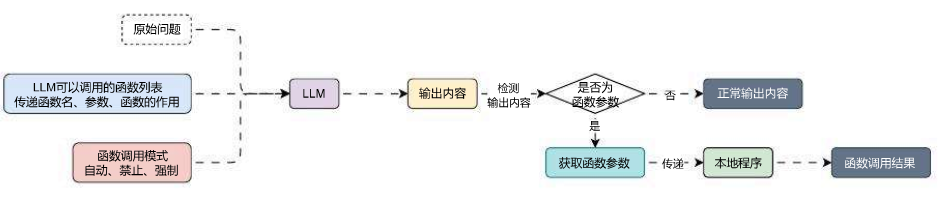
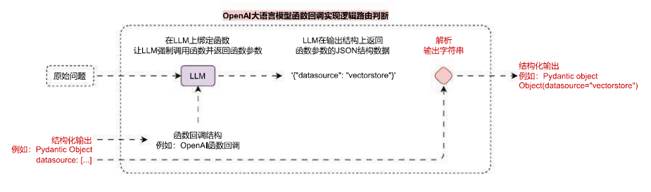

# 使用检索器逻辑路由缩减检索范围

## 01. 大模型的函数回调与规范化输出

让 LLM 执行**函数回调**听起来是一个很高级的技术，但是理解起来其实很简单，简单来说，就是传递给 LLM 一大堆工具 / 函数（传递函数名字、参数描述、函数作用等），让 LLM 自行识别，在当前用户的提问下，识别出最适合调用的函数（选择一个、多个、或者不调用、亦或者强制调用其中某个），然后把要调用的函数的参数作为 LLM 的输出内容。

执行完上面这一步，虽然说是 LLM 函数回调，但是 LLM 并不会真正调用本地的函数，本地的函数仍然是需要本地的程序根据 LLM 的输出内容来调用，拥有 `function call` 就意味着 LLM 可以智能选择不同的工具，并且规范化输出。

所以对于一个完整的**函数回调**运行过程来说，除了要有 LLM 的参与，还要有本地程序的参与，完整运行流程如下：



既然 LLM 可以强制调用某个函数，并且函数某个函数的参数输出对应的数据，所以其实可以考虑利用**函数回调这个功能来执行相应的规范化输出，我们构建一个假函数，并告知 LLM 强制调用这个函数，让 LLM 返回其函数的参数信息**，只需要将需要规范化的数据写成函数参数，并配上对应的解释，其实就可以实现规范化输出。

通过这种方式约束大语言模型生成的内容，比 Prompt 可靠性更高，而且性能更佳。

OpenAI 大语言模型函数回调文档：[https://platform.openai.com/docs/api-reference/chat/create](https://link.wtturl.cn/?target=https%3A%2F%2Fplatform.openai.com%2Fdocs%2Fapi-reference%2Fchat%2Fcreate&scene=im&aid=497858&lang=zh)

在 LangChain 中使用 OpenAI 的**函数回调**来执行规范化输出，其实非常简单，调用大语言模型的 `.with_structured_output()` 方法并传递一个 `BaseModel` 的子类即可，在底层，这个函数会自动将对应的 `BaseModel` 转换成函数回调，并强制让 LLM 调用。

例如：

```python
from langchain_core.pydantic_v1 import BaseModel, Field

class RouteQuery(BaseModel):
    """将用户查询映射到最相关的数据源"""
    datasource: Literal["python_docs", "js_docs", "golang_docs"] = Field(
        description="根据给定用户问题，选择哪个数据源最相关以回答他们的问题"
    )

llm = ChatOpenAI(model="gpt-3.5-turbo-16k", temperature=0)
structured_llm = llm.with_structured_output(RouteQuery)
```

使用起来传递对应的 `prompt` 给大语言模型，大语言模型会自动按照传递的模型规范，生成对应的类实例，从而实现规范输出。

如果单纯靠 `prompt` 来约束大语言模型的输出，例如有这么一段 `prompt`：

```python
根据给定用户问题，选择哪个数据源最相关以回答他们的问题。

目前有 3 个数据源：python_docs、js_docs、golang_docs。

用户的问题是：

为什么下面的代码不工作了，请帮我检查下：

from langchain_core.prompts import ChatPromptTemplate
prompt = ChatPromptTemplate.from_messages(["human", "speak in {language}"])
prompt.invoke("中文")
```

大语言模型会非常热情地帮助我们解答问题，得到的回复是：

```
根据用户的问题，涉及到 `langchain_core` 中的 `ChatPromptTemplate` 类的使用问题。这个类可能与语言处理或者自然语言生成有关。考虑到问题中的代码以及 `"中文"` 这一指示，最相关的数据源应该是 `python_docs`，因为这里涉及到 Python 代码的调用和可能的语法或库的使用问题。

因此，建议查看 `python_docs` 数据源以获取与 `ChatPromptTemplate` 类和相关 Python 代码的信息，以便更好地帮助用户解决问题。
```

虽然我们人类可以从这么一大长串内容中看出，是需要寻找 `python_docs` 的数据源，但是对于程序来说，要的其实只是 `python_docs` 这个字符串，并不是要这么一大长串带有语义场景的文本，大语言模型越热情，返回的数据越难处理。

所以**函数回调**在进行规范化输出时，作用特别大！而且不仅仅是规范化输出，函数回调的作用还远远不仅如此。

## 02. 检索器的逻辑路由实现

在 RAG 应用开发中，想根据不同的问题检索不同的**检索器 / 向量数据库**，其实只需要设定要对应的 Prompt，然后让 LLM 根据传递的问题返回需要选择的**检索器 / 向量数据库**的名称，然后根据得到的名称选择不同的**检索器**即可。

但是对于 LLM 来说，如果使用普通的 prompt 来约束输出内容的格式与规范，因为 LLM 的特性，很难保证输出格式符合特定的需求，所以可以考虑使用**函数回调**来实现，即设定一个**虚假的函数**，告诉 LLM，这个函数有对应的参数，让 LLM 强制调用这个函数，这个时候 LLM 就会输出函数的调用参数，从而保证输出的统一性。

使用**函数回调**实现的检索器逻辑路由运行流程图如下：



假设目前有 3 个向量数据库 / 集合，分别代表 `python_docs`、`js_docs`、`golang_docs`，需要根据用户传递的问题判断与哪个向量数据库最接近，使用最接近的向量数据库进行检索，代码示例：

```python
from typing import Literal

import dotenv
from langchain_core.prompts import ChatPromptTemplate
from langchain_core.pydantic_v1 import BaseModel, Field
from langchain_core.runnables import RunnablePassthrough
from langchain_openai import ChatOpenAI

dotenv.load_dotenv()


class RouteQuery(BaseModel):
    """将用户查询映射到最相关的数据源"""
    datasource: Literal["python_docs", "js_docs", "golang_docs"] = Field(
        description="根据给定用户问题，选择哪个数据源最相关以回答他们的问题"
    )


def choose_route(result: RouteQuery):
    if "python_docs" in result.datasource.lower():
        return "chain for python_docs"
    elif "js_docs" in result.datasource.lower():
        return "chain for js_docs"
    else:
        return "golang_docs"


# 1.构建大语言模型并进行结构化输出
llm = ChatOpenAI(model="gpt-3.5-turbo-16k", temperature=0)
structured_llm = llm.with_structured_output(RouteQuery)

# 2.创建路由逻辑链
prompt = ChatPromptTemplate.from_messages([
    ("system", "你是一个擅长将用户问题路由到适当的数据源的专家。\n请根据问题涉及的编程语言，将其路由到相关数据源"),
    ("human", "{question}")
])
router = {"question": RunnablePassthrough()} | prompt | structured_llm | choose_route

# 3.执行相应的提问，检查映射的路由
question = """为什么下面的代码不工作了，请帮我检查下：

from langchain_core.prompts import ChatPromptTemplate
prompt = ChatPromptTemplate.from_messages(["human", "speak in {language}"])
prompt.invoke("中文")"""

# 4.选择不同的数据库
print(router.invoke(question))
```

输出内容：

```python
datasource='python_docs'
chain for python_docs
```