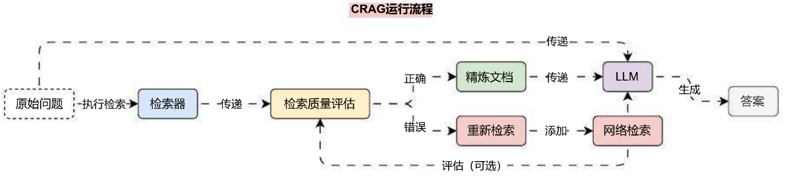
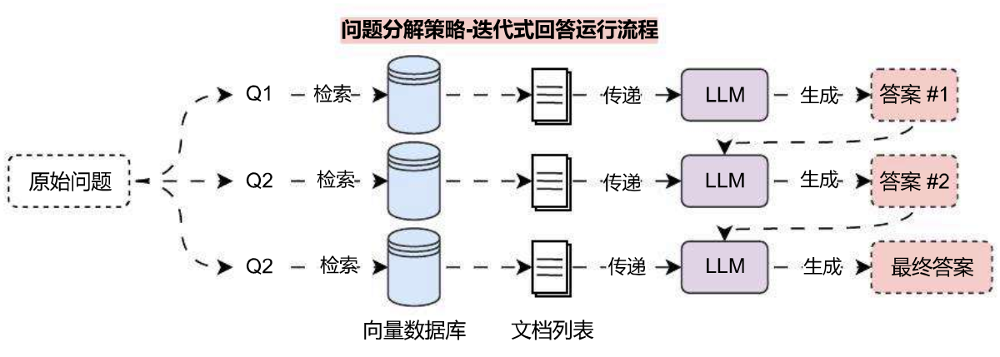
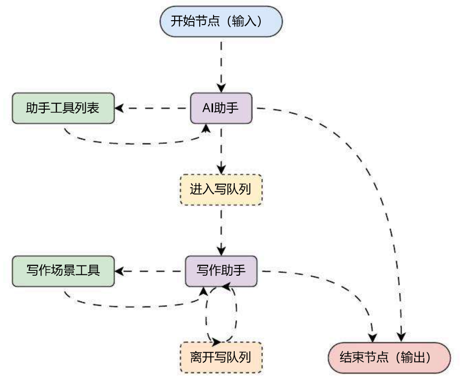
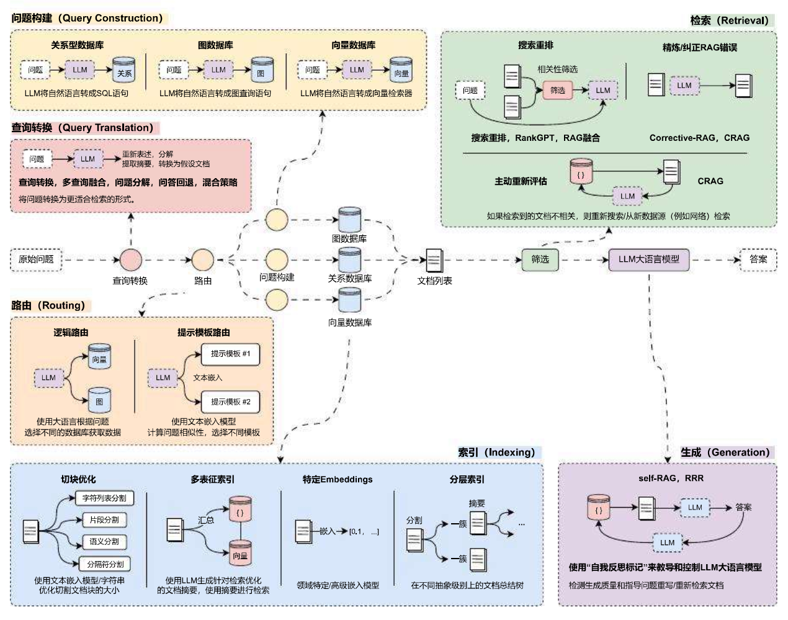

# 纠正性索引增强生成 CRAG 优化策略

## 01. 纠正性检索增强生成简介

纠正性检索增强生成（Corrective Retrieval‑Augmented Generation，CRAG）是一种先进的自然语言处理技术，旨在提高检索的生成方法的鲁棒性和准确性。在 CRAG 中引入了一个轻量级的检索评估器来评估检索到的文档的质量，并根据评估结果触发不同的知识检索动作，以确保生成结果的准确性。

CRAG 的工作流程包含了以下几个步骤：

1. **检索文档**：首先，基于用户的查询，系统执行检索操作以获取相关的文档或信息。
2. **评估检索质量**：CRAG 使用一个轻量级的检索评估器对检索到的每个文档进行质量评估，计算出一个量化的置信度分数。
3. **触发知识检索动作**：根据置信度分数，CRAG 将触发以下三个动作之一：
   - **正确**：如果评估器认为文档与查询高度相关，将采用该文档进行知识精炼。
   - **错误**：如果文档被评估为不相关或误导性，CRAG 将利用网络搜索寻找更多知识来源。
4. **知识精炼**：对于评估为正确的文档，CRAG 将进行知识精炼，抽取关键信息并过滤掉无关信息。
5. **网络搜索**：在需要时，CRAG 会执行网络搜索以寻找更多高质量的知识来源，以纠正或补充检索结果。
6. **分解‑重组**：CRAG 采用一种分解‑重组算法，将检索到的文档解构为关键信息块，筛选重要信息，并重新组织成结构化知识。
7. **生成文本**：最后，利用经过优化和校正的知识，传递给 LLM，生成对应文本。

运行流程如下：



## 02. 组件构成与 LCEL 表达式缺陷

在上述的 CRAG 运行流程中，需要的组件涵盖了：检索器、评估组件、判断组件（路由组件）、重检索、网络搜索工具 等，并且该链的运行并不是线性运行的，而是存在条件判断与循环（可选）迭代多步的可能，对于 LCEL 表达式构建的单链应用来说，要实现这个功能难度非常大，亦或者说代码会非常臃肿。

这就是 LCEL 表达式构建链应用的缺陷，其实在问题分解策略时，就已经可以感受到，例如问题分解策略‑迭代式回答运行流程中，每一次子问题生成的回复要传递给下一次子问题作为上下文，如下：



该功能本身是链应用 的一部分，但是在代码中，我们只能通过循环来完成该过程，核心代码如下：

```python
qa_pairs = ""
for sub_question in sub_questions:
    answer = chain.invoke({"question": sub_question, "qa_pairs": qa_pairs})
    qa_pair = format_qa_pair(sub_question, answer)
    qa_pairs += "\n---\n" + qa_pair
    print(f"问题: {sub_question}")
    print(f"答案: {answer}")
```

而且涉及到工具类的调用，也没法在 LCEL 表达式构建的链应用中判断是否需要执行工具，并自动将工具的处理结果返回给 LLM（无法回退，只能从前往后流动），对于这类涵盖了单代理、多代理、多 LLM 集成、多智能体、分层、顺序、循环等复杂场景的应用，一般的 LCEL 表达式就无法实现了，这个时候可以考虑使用 LangGraph 来构建 循环图结构 类型的应用结构。

LangGraph 官网：https://www.langchain.com/langgraph。

LangGraph 是 LCEL 表达式的扩充 / 超集，旨在克服传统 LangChain 链条运行时无法循环的限制，LangChain 以循环图（一个数学概念）作为 Agent 应用的框架基础，对比单条链顺序执行，在图结构中可以轻松引入循环。

例如下方就是一张 LangGraph 循环图示例（有向无环 / 有环图）：



最后，CRAG 这个优化策略会涉及到**循环调用**与**工具回调**，后续将进行讲解。

