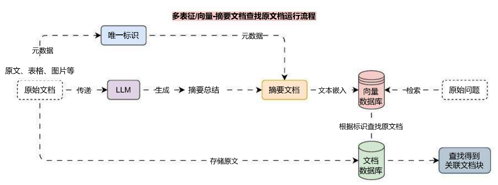

# MultiVector 实现多向量检索检索文档

## 01. 多表征 / 向量索引

我们为每一个文档块生成一条向量用于记录该文本的特征信息，如果能从多个维度记录该文档块的信息，会大大增加该文档块被检索到的概率，**多个维度记录信息**等同于为文档块生成**多个向量**，支持的方法如下：

1. 把文档切割成更小的块：通过检索更小的块，但是查找其父类文档（ParentDocumentRetriever）。
2. 摘要：使用 LLM 为每个文档块生成一段摘要，将其和原文档一起嵌入或者代替，返回时返回原文档。
3. 假设性问题：使用 LLM 为每个文档块生成适合回答的假设性问题，将其和原文档一起嵌入或者代替，返回时返回原文档。

通过这种方式可以为一个文档块生成多条特征 / 向量，在检索时能提升关联文档被检索到的概率，多向量检索的运行流程其实也非常简单，以**摘要文档**检索**原文档**为例，运行流程图如下：

通过上面的运行流程，可以很容易知道在**原始文档**和**摘要文档**中都在元数据中设置了**唯一标识**，从向量数据库中找到符合规则的数据后，通过查找其**元数据**的唯一标识，即可在**文档数据库**中匹配出原文档，完成整个多表征 / 向量的检索。

## 02. 多向量索引示例

在 LangChain 中，为多向量索引的集成封装了 `MultiVectorRetriever` 类，实例化该类只需要传递 **向量数据库**、**字节存储数据库（文档数据库）**、**id 标识（关联标识）** 即可快速完成整个运行流程的集成。

以 **FAISS 向量数据库** 和 **本地文件存储库** 为例，构建一个 `存储摘要->检索原文` 的优化策略，代码示例如下：

```python
import uuid
import dotenv
from langchain.retrievers import MultiVectorRetriever
from langchain.storage import LocalFileStore
from langchain_community.document_loaders import UnstructuredFileLoader
from langchain_community.vectorstores import FAISS
from langchain_core.documents import Document
from langchain_core.output_parsers import StrOutputParser
from langchain_core.prompts import ChatPromptTemplate
from langchain_openai import ChatOpenAI, OpenAIEmbeddings
from langchain_text_splitters import RecursiveCharacterTextSplitter

dotenv.load_dotenv()

# 1.创建加载器、文本分割器并处理文档
loader = UnstructuredFileLoader("./电商产品数据.txt")
text_splitter = RecursiveCharacterTextSplitter(chunk_size=500, chunk_overlap=50)
docs = loader.load_and_split(text_splitter)

# 2.定义摘要生成链
summary_chain = (
    {"doc": lambda x: x.page_content}
    | ChatPromptTemplate.from_template("总结以下文档的内容：\n\n{doc}")
    | ChatOpenAI(model="gpt-3.5-turbo-16k", temperature=0)
    | StrOutputParser()
)

# 3.批量生成摘要与唯一标识
summaries = summary_chain.batch(docs, {"max_concurrency": 5})
doc_ids = [str(uuid.uuid4()) for _ in enumerate(docs)]

# 4.构建摘要文档
summary_docs = [
    Document(page_content=summary, metadata={"doc_id": doc_ids[idx]})
    for idx, summary in enumerate(summaries)
]

# 5.构建文档数据库与向量数据库
byte_store = LocalFileStore("./multy‑vector")
db = FAISS.from_documents(
    summary_docs,
    embedding=OpenAIEmbeddings(model="text‑embedding‑3‑small"),
)

# 6.构建多向量检索器
retriever = MultiVectorRetriever(
    vectorstore=db,
    byte_store=byte_store,
    id_key="doc_id",
)

# 7.将摘要文档和原文档存储到数据库中
retriever.docstore.mset(list(zip(doc_ids, docs)))

# 8.执行检索
search_docs = retriever.invoke("推荐一些潮州特产?")
print(search_docs)
print(len(search_docs))
```

输出示例：

```
[Document(metadata={'source': './电商产品数据.txt'}, page_content='产品名称：潮汕鱼丸
\n电商网址: shop.example.com/fishballs\n产品描述：潮汕鱼丸采用新鲜鱼肉，加入少量淀粉和调味料，手工捶打成丸，Q弹爽滑，鱼香浓郁。\n产品特点:\n原材料：新鲜鱼肉、淀粉、盐、胡椒粉\n制作工艺：传统手工捶打\n口感：Q弹爽滑，鲜美可口\n净重：500克/袋、1000克/袋\n保质期：6个月（冷冻保存）\n发货方式：顺丰冷链配送，确保新鲜\n物流信息：24小时内发货，预计2\n3天到货\n推荐菜系:\n鱼丸火锅：搭配各类蔬菜、菌类，煮至鱼丸浮起即可。\n鱼丸煮汤：与蔬菜同煮，味道鲜美。\n价格:\n500克：55元/袋\n1000克：100元/袋\n6. 潮汕豆腐花\n产品名称：潮汕豆腐花\n电商网址: shop.example.com/tofupudding\n产品描述：潮汕豆腐花使用优质黄豆，传统工艺制作，质地细腻，入口即化，豆香浓郁。\n产品特点:\n原材料：黄豆、水、石膏\n制作工艺：传统手工点浆\n口感：细腻嫩滑，豆香浓郁\n净重：450克/盒\n保质期：5天（冷藏保存）'), Document(metadata={'source': './电商产品数据.txt'}, page_content='产品特点:\n原材料：猪后腿肉、香料、盐、糖\n制作工艺：精细切割，手工卷制\n口感：鲜嫩多汁，咸香可口\n净重：400克/袋、800克/袋\n保质期：3个月（冷冻保存）\n发货方式：顺丰冷链配送，确保新鲜\n物流信息：24小时内发货，预计2\n3天到货\n推荐菜系:\n猪肉卷煎烤：切片后煎至金黄，外脆里嫩。\n猪肉卷炖煮：切块后与蔬菜同炖，风味更佳。\n价格:\n400克：58元/袋\n800克：108元/袋\n3. 潮汕三宝（酱油、甜醋、虾酱）\n产品名称：潮汕三宝\n电商网址: shop.example.com/chaoshanthree\n产品描述：潮汕三宝包含酱油、甜醋和虾酱。酱油由大豆、麦子自然发酵而成，甜醋以糯米酿制，虾酱选用新鲜海虾发酵，是潮汕菜肴必备调味品。\n产品特点:\n酱油：大豆、麦子自然发酵，500ml/瓶\n甜醋：糯米酿制，500ml/瓶\n虾酱：新鲜海虾发酵，200克/瓶\n保质期：酱油和甜醋12个月，虾酱6个月\n发货方式：顺丰配送，确保完好\n物流信息：24小时内发货，预计2\n3天到货\n推荐菜系：'), Document(metadata={'source': './电商产品数据.txt'}, page_content='口感：鲜嫩多汁，味道浓郁\n净重：500克/袋、1000克/袋\n保质期：3个月（冷冻保存）\n发货方式：顺丰冷链配送，确保新鲜\n物流信息：24小时内发货，预计2\n3天到货\n推荐菜系:\n红烧狮子头：加热后直接食用，适合作为主菜。\n狮子头炖菜：与蔬菜同炖，味道更佳。\n价格:\n500克：60元/袋\n1000克：110元/袋\n10. 潮汕香菇肉酱\n产品名称：潮汕香菇肉酱\n电商网址: shop.example.com/mushroomsauce\n产品描述：潮汕香菇肉酱采用香菇和猪肉为主要原料，加入特制酱料炒制而成，香气扑鼻，味道鲜美。\n产品特点:\n原材料：香菇、猪肉、酱料\n制作工艺：精细切割，炒制均匀\n口感：鲜香可口，酱香浓郁\n净重：200克/瓶、400克/瓶\n保质期：6个月（常温保存）\n发货方式：顺丰配送，确保完好\n物流信息：24小时内发货，预计2\n3天到货\n推荐菜系:\n拌饭：加入米饭中，提升口感。\n拌面：加入面条中，风味独特。\n价格:\n200克：35元/瓶\n400克：65元/瓶'), Document(metadata={'source': './电商产品数据.txt'}, page_content='口感：细腻嫩滑，豆香浓郁\n净重：450克/盒\n保质期：5天（冷藏保存）\n发货方式：顺丰冷链配送，确保新鲜\n物流信息：24小时内发货，预计2\n3天到货\n推荐菜系:\n甜食：加糖水、红豆、芝麻食用。\n咸食：加入虾米、葱花、酱油食用。\n价格：25元/盒\n7. 潮汕鱼露\n产品名称：潮汕鱼露\n电商网址: shop.example.com/fishsauce\n产品描述：潮汕鱼露以新鲜小鱼为原料，经过发酵、过滤而成，味道鲜美，是潮汕菜肴必备调味品。\n产品特点:\n原材料：小鱼、盐\n制作工艺：自然发酵，传统工艺\n口感：鲜美咸香\n净重：500ml/瓶\n保质期：12个月\n发货方式：顺丰配送，确保完好\n物流信息：24小时内发货，预计2\n3天到货\n推荐菜系:\n凉拌菜：作为调味料使用，提升菜肴鲜味。\n炒菜：适合炒菜提鲜。\n价格：38元/瓶\n8. 潮汕糯米肠\n产品名称：潮汕糯米肠\n电商网址: shop.example.com/glutinousrice')]
```

除了使用**摘要**来检索全文，多向量检索一般还适用于**子文档检索父文档**和**假设性查询检索**，其中**假设性查询检索**是利用 LLM 对切块后的文档生成多个**假设性标题**，在向量数据库中存储**假设性标题**文档块，使用检索到的数据查找**原始文档**。

核心代码修正如下：

```python
from typing import List
import dotenv
from langchain_core.documents import Document
from langchain_core.prompts import ChatPromptTemplate
from langchain_core.pydantic_v1 import BaseModel, Field

from langchain_openai import ChatOpenAI

dotenv.load_dotenv()


class HypotheticalQuestions(BaseModel):
    """生成假设性问题"""
    questions: List[str] = Field(
        description="假设性问题列表，类型为字符串列表",
    )


# 1.构建一个生成假设性问题的prompt
prompt = ChatPromptTemplate.from_template("生成一个包含3个假设性问题的列表，这些问题可以用于回答下面的文档:\n\n{doc}")

# 2.创建大语言模型，并绑定对应的规范化输出结构
llm = ChatOpenAI(model="gpt-3.5-turbo-16k", temperature=0)
structured_llm = llm.with_structured_output(HypotheticalQuestions)

# 3.创建链应用
chain = (
    {"doc": lambda x: x.page_content}
    | prompt
    | structured_llm
)

hypothetical_questions: HypotheticalQuestions = chain.invoke(
    Document(page_content="我叫慕小课，我喜欢打篮球，游泳")
)
print(hypothetical_questions)
```

输出内容：

```
questions=['如果你不能打篮球，你会选择什么运动？', '如果你不能游泳，你会选择什么运动？', '如果你不能进行任何体育运动，你会选择什么爱好？']
```

接下来针对每个文档生成的**假设性查询**创建 `Document` 列表，并添加 `doc_id`，添加到向量数据库中，并将 `doc_id` 与原始文档进行绑定，存储到文档数据库 / 字节数据库即可。