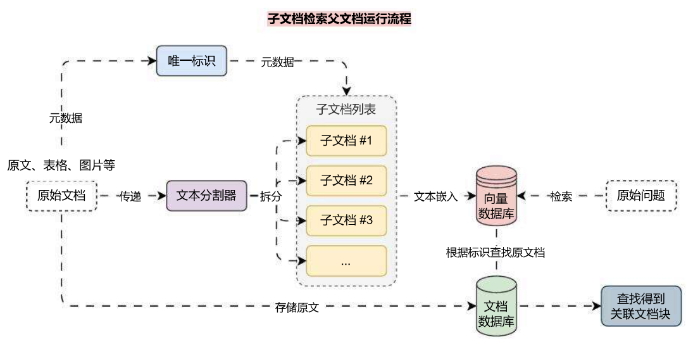
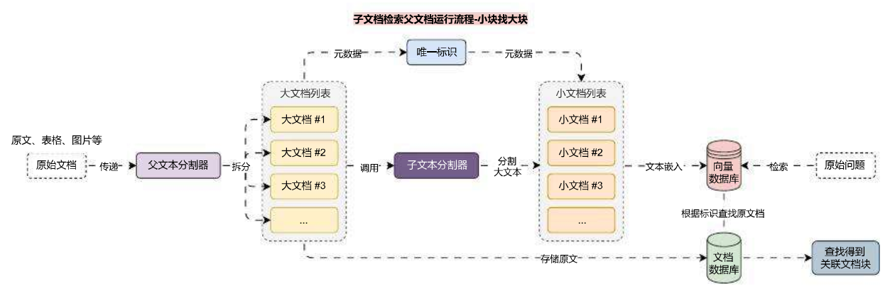

# 父文档检索器实现拆分和存储平衡

## 01. 拆分文档与检索的冲突

在 RAG 应用开发中，文档拆分 和 文档检索 通常存在相互冲突的愿望，例如：

1. 我们可能希望拥有小型文档，以便它们的嵌入可以最准确地反映它们的含义，如果太长，嵌入 / 向量没法记录太多文本特征。
2. 但是又希望文档足够长，这样能保留每个块的上下文。

这个时候就可以考虑通过**拆分子文档块，检索父文档块**的策略来实现这种平衡，即在检索中，首先获取小块，然后再根据小块元数据中存储的 id，使用 id 来查找这些块的父文档，并返回那些更大的文档，该策略适合一些不是特别能拆分的文档，或者是文档上下文关联性很强的场景。

> Important 请注意，这里的 “父文档” 指的是小块来源的文档，可以是整个原始文档，也可以是切割后比较大的文档块。

子文档 -> 父文档 的运行流程也非常简单，其实和 多向量检索器 一模一样，如下：



除了使用 `MultiVectorRetriever` 来实现该运行流程，在 LangChain 中，还封装了`ParentDocumentRetriever`，可以更加便捷地完成该功能，使用技巧也非常简单，传递**向量数据库**、**文档数据库**和**子文档分割器**即可。

**代码示例：**

```python
import dotenv
import weaviate
from langchain.retrievers import ParentDocumentRetriever
from langchain.storage import LocalFileStore
from langchain_community.document_loaders import UnstructuredFileLoader
from langchain_openai import OpenAIEmbeddings
from langchain_text_splitters import RecursiveCharacterTextSplitter
from langchain_weaviate import WeaviateVectorStore
from weaviate.auth import AuthApiKey

dotenv.load_dotenv()

# 1.创建加载器与文档列表，并加载文档
loaders = [
    UnstructuredFileLoader("./电商产品数据.txt"),
    UnstructuredFileLoader("./项目API文档.md"),
]
docs = []
for loader in loaders:
    docs.extend(loader.load())

# 2.创建文本分割器
text_splitter = RecursiveCharacterTextSplitter(
    chunk_size=500,
    chunk_overlap=50,
)

# 3.创建向量数据库与文档数据库
vector_store = WeaviateVectorStore(
    client=weaviate.connect_to_wcs(
        cluster_url="https://mbakeruerziae6psyex7ng.c0.us-west3.gcp.weaviate.cloud",
        auth_credentials=AuthApiKey("Z1tPVa9ZSOxUcfafelSggGyyH6tnTYQYJvBx"),
    ),
    index_name="ParentDocument",
    text_key="text",
    embedding=OpenAIEmbeddings(model="text-embedding-3-small"),
)
store = LocalFileStore("./parent-document")

# 4.创建父文档检索器
retriever = ParentDocumentRetriever(
    vectorstore=vector_store,
    byte_store=store,
    child_splitter=text_splitter,
)

# 5.添加文档
retriever.add_documents(docs, ids=None)

# 6.检索并返回内容
search_docs = retriever.invoke("分享关于LLMOps的一些应用配置")
print(search_docs)
print(len(search_docs))
```

输出内容会返回完整的文档片段，而不是拆分后的片段（但是在向量数据库中存储的是分割后的片段）：

```
[Document(metadata={'source': './项目API文档.md'}, page_content='LLMOps 项目 API 文档\n\n应用 API 接口统一以 JSON 格式返回，并且包含 3 个字段：code、data 和 message，分别代表业务状态码、业务数据和接口附加信息。\n\n业务状态码共有 6 种，其中只有 success(成功) 代表业务操作成功，其他 5 种状态均代表失败，并且失败时会附加相关的信息：fail(通用失败)、not_found(未找到)、unauthorized(未授权)、forbidden(无权限)和validate_error(数据验证失败)。\n\n接口示例：\n\njson\n{\n    "code": "success",\n    "data": {\n        "redirect_url": "https://github.com/login/oauth/authorize?client_id=f69102c6b97d90d69768&redirect_uri=http%3A%2F%2Flocalhost%3A5001%2Foauth%2Fauthorize%2Fgithub&scope=user%3Aemail"\n    },\n    "message": ...')]
1
```

## 02. 父文档检索器检索较大块

在上面的示例中，我们使用拆分的文档块检索数据原文档，但是有时候完整文档可能太大，我们不希望按原样检索它们。在这种情况下，我们真正想要做的是先将原始文档拆分成较大的块（例如 1000‑2000 个 Token），然后将其拆分为较小块，接下来索引较小块，但是检索时返回较大块（非原文档）。

运行流程变更如下：



在 `ParentDocumentRetriever` 中，只需要传递多一个**父文档分割器**即可，其他流程无需任何变化，更新后的部分代码如下：

```
parent_splitter = RecursiveCharacterTextSplitter(chunk_size=2000)
child_splitter = RecursiveCharacterTextSplitter(chunk_size=500, chunk_overlap=50)

retriever = ParentDocumentRetriever(
    vectorstore=vector_store,
    byte_store=store,
    parent_splitter=parent_splitter,
    child_splitter=child_splitter,
)
```