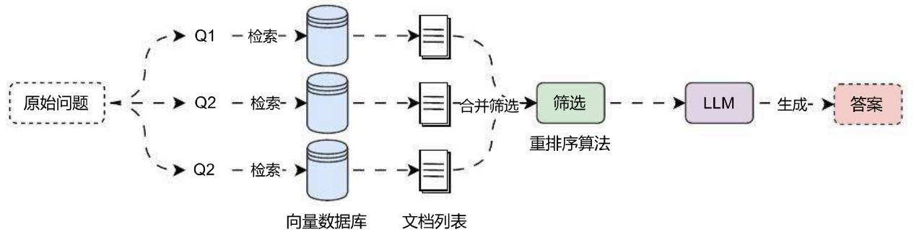

# ReRank 重排序提升 RAG 系统效果

## 01. ReRank 重排序

在完成对问题的改写、不同数据库查询的构建以及路由逻辑、向量数据库索引方面的优化后，我们可以考虑进一步优化**检索阶段**，一般涵盖了**重排序**、**纠正性 RAG**两种策略，其中**重排序**是使用频率最高，性价比最高，通常与**混合检索**一起搭配使用，也是目前主流的优化策略（Dify、Coze、智谱、绝大部分开源 Agent 项目都在使用）。

**重排序**的核心思想见字知其意，即对检索到的文档**调整顺序**，除此之外，**重排序**一般还会增加**剔除无关 / 多余数据**的步骤，在前面的课时中，我们学习的 **RRF** 算法其实就是重排序中最基础一种。

运行流程如下：



并且重排序 的逻辑是输入 文档列表，输出的仍然是 文档列表，和 DocumentTransformer 类似，不过在 LangChain 中 重排序 是一个 DocumentCompressor 组件（压缩组件），如果需要查找 重排序 组件，可以在 文档转换 / 检索器集成 列表中查找，一些高频使用的组件还进行了单独的封装，例如：LongContextReorder、Cohere Reranker 等。

在 LangChain 中，使用重排工具很简单，可以单独使用，也可以利用 ContextualCompressionRetriever 检索器进行二次包装合并，并传递检索器 + 重排工具，这样检索输出得到的结果就是经过重排的了。

## 02. Cohere 重排序

目前可用的重新排序模型并不多，一种是选择 Cohere 提供的在线模型，可以通过 API 访问，此外还有一些开源模型，如：bge‑rerank‑base 和 bge‑rerank‑large 等，体验与评分最好的是 Cohere 的在线模型，不过它是一项付费服务（注册账号提供免费额度），并且由于 Cohere 服务部署在海外，国内访问速度并没有这么快。

对于学习，我们可以使用 Cohere 的在线模型，如果是部署企业内部的服务，可以使用 bge‑rerank‑large，链接如下：

1. Cohere 在线模型：https://cohere.com/
2. bge‑rerank‑large 开源模型：https://huggingface.co/BAAI/bge‑reranker‑large

安装依赖：

```
pip install langchain-cohere
```

在 weaviate 向量数据库中，使用 Cohere 在线模型集成重排序示例代码（使用 weaviate 数据库的 DatasetDemo 集合，存储了`项目API文档.md`文档的内容，示例如下：

```python
import dotenv
import weaviate
from langchain.retrievers import ContextualCompressionRetriever
from langchain_cohere import CohereRerank
from langchain_openai import OpenAIEmbeddings
from langchain_weaviate import WeaviateVectorStore
from weaviate.auth import AuthApiKey

dotenv.load_dotenv()

# 1.创建向量数据库与重排组件
embedding = OpenAIEmbeddings(model="text-embedding-3-small")
db = WeaviateVectorStore(
    client=weaviate.connect_to_wcs(
        cluster_url="https://mbakeruerziae6psyx7ng0.co.us-west3.gcp.weaviate.cloud",
        auth_credentials=AuthApiKey("zltPva9zSOxUcfafelSggGyyH6tnTYQYJvBx"),
    ),
    index_name="DatasetDemo",
    text_key="text",
    embedding=embedding
)
rerank = CohereRerank(model="rerank-multilingual-v3.0")

# 2.构建压缩检索器
retriever = ContextualCompressionRetriever(
    base_retriever=db.as_retriever(),
    base_compressor=rerank,
)

# 3.执行搜索并排序
search_docs = retriever.invoke("关于LLMOps应用配置的信息有哪些呢？")
print(search_docs)
print(len(search_docs))
```

输出内容：

```
[Document(metadata={'source': './项目API文档.md', 'start_index': 2324.0, 'relevance_score': 0.9298237}, page_content='json { "code": "success", "data": { "id": "5e7834dc-bbca-4ee5-9591-8f297f5acded", "name": "慕课LLMOps聊天机器人", "icon": "https://imooc-11mops-1257184990.cos.ap-guangzhou.myqcloud.com/2024/04/23/e4422149-4cf7-41b3-ad55-ca8d2caa8f13.png", "description": "这是一个慕课LLMOps的Agent应用", "published_app_config_id": null, "drafted_app_config_id": null, "debug_conversation_id": "1550b71a-1444-47ed-a59d-c2f08f0bae94", "published_app_config": null, "drafted_app_config": { "id": "755dc464-67cd-42ef-9c56-b7528b44e7c8"'), Document(metadata={'source': './项目API文档.md', 'start_index': 0.0, 'relevance_score': 0.7358315}, page_content='LLMOps项目 API 文档\n\n应用 API 接口统一以 JSON 格式返回，并且包含 3 个字段：code、data 和 message，分别代表业务状态码、业务数据和接口附加信息。\n\n业务状态码共有 6 种，其中只有 success(成功) 代表业务操作成功，其他 5 种状态均代表失败，并且失败时会附加相关的信息：fail(通用失败)、not_found(未找到)、unauthorized(未授权)、forbidden(无权限)和validate_error(数据验证失败)。\n\n接口示例：\n\njson { "code": "success", "data": { "redirect_url": "https://github.com/login/oauth/authorize?client_id=f69102c6b97d90d69768&redirect_uri=http%3A%2F%2Flocalhost%3A5001%2Foauth2%2FAuthorize%2F2&github&scope=user%23Aemail" }, "message": "" }'), Document(metadata={'source': './项目API文档.md', 'start_index': 675.0, 'relevance_score': 0.098772585}, page_content='json { "code": "success", "data": { "list": [ { "app_count": 0, "created_at": 1713105994, "description": "这是专门用来存储慕课LLMOps课程信息的知识库", "document_count": 13, "icon": "https://imooc-11mops-1257184990.cos.ap-guangzhou.myqcloud.com/2024/04/07/96b5e270-c54a-4424-aece-ff8a2b7e4331.png", "id": "c0759ca8-2d35-4480-83a8-1f41f29d1401", "name": "慕课LLMOps课程知识库", "updated_at": 1713106758, "word_count": 8850 } ], "paginator": { "current_page": 1, "page_size": 20, "total_page": 1, "total_record": 2 } }')]
3
```

通过 LangSmith 观察该检索器的运行流程，可以发现，原始检索器找到了 4 条数据，但是经过重排序后，只返回了相关性高的 3 条（可设置），有一条被剔除了，这也是**压缩器**和**文档转换器**的区别（不过在旧版本的 LangChain 中，两个没有区别，所以在很多文档转换器的文档中都可以看到压缩器的存在）。