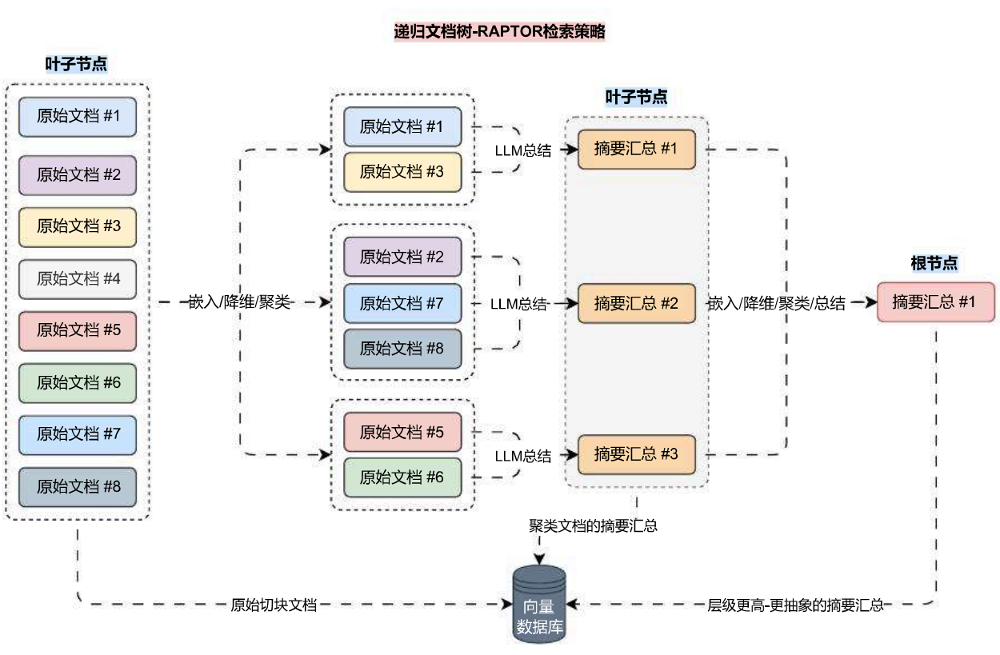
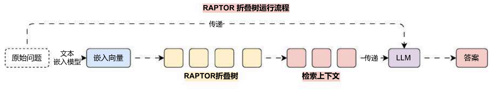
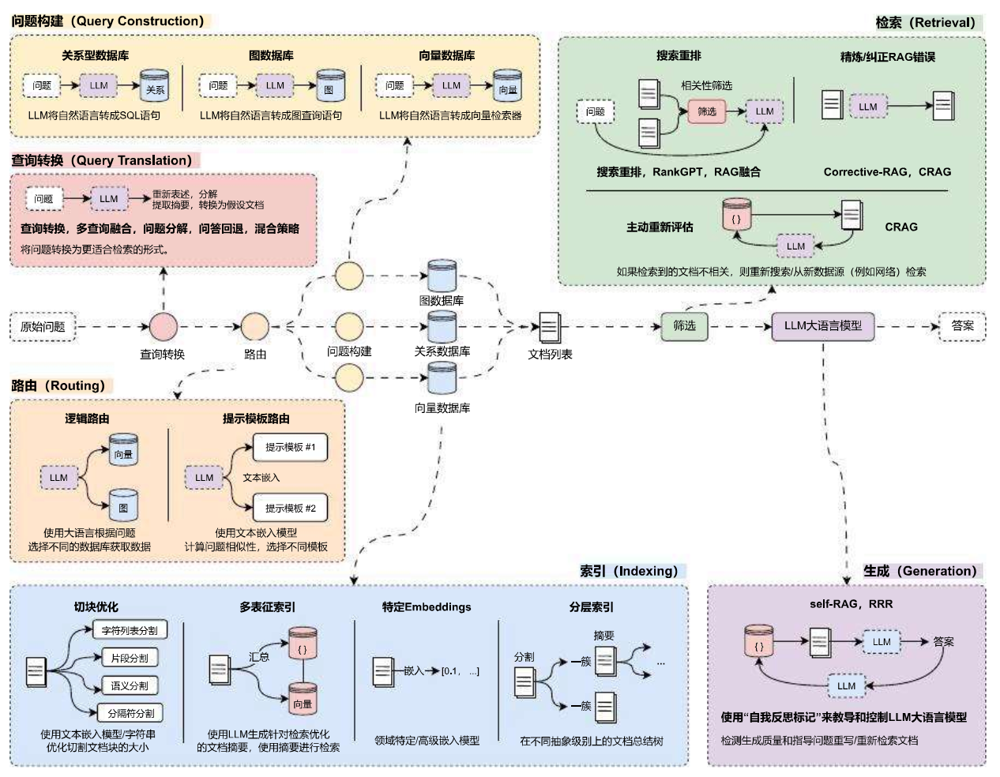

# 递归文档树检索实施高级 RAG 优化理解

## 01. RAPTOR 递归文档树策略

在传统的 RAG 中，我们通常依靠检索短的连续文本块来进行检索。但是，当我们处理的是长上下文时，我们就不能仅仅将文档分块嵌入到其中，或者仅仅使用上下文填充所有文档。相反，我们希望为 LLM 的长上下文找到一种好的最小化分块方法，这就是 RAPTOR 的用武之地，在 RAPTOR 中，均衡了**多文档、超长上下文、高准确性、超低成本**等特性。

RAPTOR 其实是一种用树状组织检索的递归抽象处理技术，它采用了一种自下而上的方法，通过对文本片段（块）进行聚类和归纳来形成一种分层结构，该技术在 https://arxiv.org/pdf/2401.18059 论文中被首次提出。

RAPTOR 的运行流程其实很简单，主要步骤如下：

1. 对原始文本进行分块，拆分成合适的大小；
2. 对拆分的文档块进行嵌入 / 向量化，向量目前处于高维，并将数据存储到向量数据库；
3. 将高维向量进行降维，降低运算成本，例如降低成 2 维或者 3 维；
4. 对降维向量进行聚类，找出同一类的文档组；
5. 合并文档组的文本，使用 LLM 对合并文档进行摘要汇总得到新的文本并文档，重复 ②‑⑤ 的步骤；
6. 直到最后只剩下一个文档并且该文档的长度符合大小时，结束整个流程；

可视化其运行流程后如下：

在执行检索的时候，RAPTOR 模型采用了两种主要的检索策略 ——**树遍历**和**折叠树**，对此两种策略，论文中更推荐**折叠树**检索策略。

**树遍历**方法从树的根节点开始，逐层向下进行检索，在每一层它根据查询向量与节点嵌入的余弦相似性选择最相关的前 k 个节点，然后将这些节点的子节点作为下一层的候选节点集，并重复选择过程，直到达到叶节点，最终将所有选中的节点文本进行拼接，形成检索到的上下文。

**折叠树**方法会先将整个 RAPTOR 树展平为单个层，即所有节点在同一层级上进行比较，计算查询向量与所有节点嵌入的余弦相似性，并选择最相关的前 k 个节点。

并且因为折叠树 和 向量数据库基础搜索 一样都是遍历所有向量（同层），所以只需要将数据存储到向量数据库中，并执行相似性搜索 其实就实现了折叠树 检索策略。

对比其他的 RAG 优化策略，RAPTOR 递归文档树 不仅保留了原始文档，还将同类文档进行层层抽象（层层总结），而且在文本嵌入模型 参数较小的情况下，一般也能实现不错的效果（低成本、高性能），不过因为该数据存储的是树状结构，每次在更新 / 新增数据时，操作对比其他优化策略麻烦很多。

该论文并没有提供更新 / 新增数据的策略，但是对于树状结构，一般的更新策略有：

1. 重新构建树结构：新增了大量文档时，可以重新构建整个 RAPTOR 树，确保数据不会遗漏。
2. 增量更新：如果新增的文档不是很多，可以考虑只更新部分树结构，将新文档的文本块作为新的叶子节点添加到树中，然后根据这些新节点的内容，调整或更新其上层节点的摘要信息。
3. 利用现有节点：如果新文档与现有树中的某些节点内容相似，可以考虑将新文档的文本块与现有节点合并，然后重新生成这些节点的摘要，以此来更新树结构。
4. 层次化更新：根据新文档的内容和重要性，选择在树的哪个层次上进行更新。如果新文档提供了对整个文档集的重要概述，可能需要在较高的层次上更新；如果新文档提供了细节信息，可能只需要在较低层次上更新。

## 02. RAPTOR 递归文档树的视线

在 LangChain 中并没有针对 RAPTOR 的实现，并且在该策略中涵盖了 高维数据降维、低维数据聚类、递归检索 等内容，对于该检索策略，目前使用得较少（更新与新增缺陷导致外挂文档增加时复杂度成倍递增），所以仅需要了解 RAPTOR 的运行流程即可。

除了 RAPTOR 的优化思想，LangChain 团队在路演中，还演示了一种基于 Token2Text 的优化策略 ——ColBERT，该策略会为段落中的每个 Token 生成一个受上下文影响的向量，在计算文档得分时并不是使用文档的向量相似性计算，而是通过查询嵌入与每个 Token 嵌入向量的最大相似性之和，不过由于性能偏低，并且需要高昂的计算成本，带来的提升不大，导致目前应用并不广，接受度较低。

感兴趣的同学可以通过以下资料进行阅读学习：

1. LangChain 文档：https://python.langchain.com/v0.2/docs/integrations/retrievers/ragatouille/
2. ColBERT 英文博文：https://hackernoon.com/how-colbert-helps-developers-overcome-the-limits-of-rag

## 03. 索引阶段优化策略总结

至此，在 RAG 的索引阶段，这些具有代表性的优化策略其实我们已经讲解完了，涵盖了分割策略（语义分割、递归字符分割）、多向量 / 表征检索、RAPTOR 递归文档树检索，其中 特定 Embeddings 即考虑使用维度更高的文本嵌入模型，并没有复杂的使用技巧。

目前在索引阶段，使用最多的优化策略还是在文档加载 / 分割 与 特定 Embeddings 上，因为无论是多向量 / 表征索引 还是 RAPTOR 递归文档树，都会使用额外的 LLM 对文档进行相应的总结、信息提取、分类汇总等，数据越多，信息失真的概率会越大（所以谨慎使用）。

