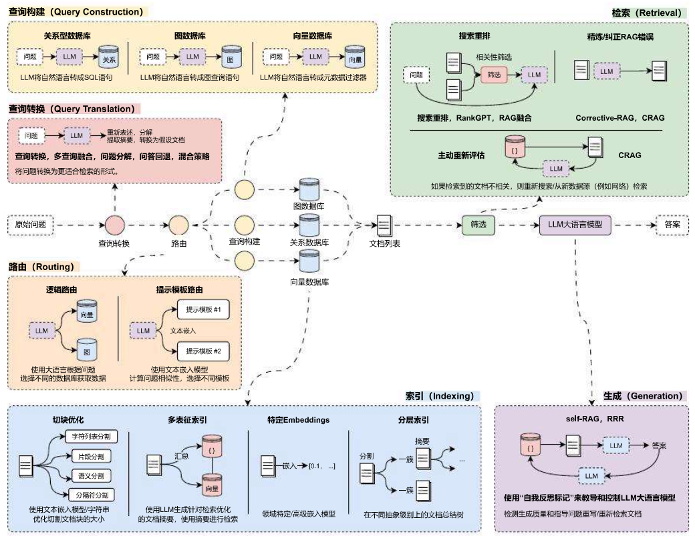
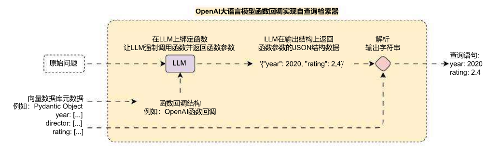

# 自查询检索器实现动态元数据过滤

## 01. 查询构建与自查询检索器

在 RAG 应用开发中，检索外部数据时，前面的优化案例中，无论是生成的子查询、问题分解、生成假设性文档，最后在执行检索的时候使用的都是固定的筛选条件（没有附加过滤的相似性搜索）。

但是在某些情况下，用户发起的原始提问其实隐式携带了筛选条件，例如提问：

> 请帮我整理下关于 2026 年全年关于 AI 的新闻汇总。

在这段原始提问中，如果执行相应的向量数据库相似性搜索，其实是附加了筛选条件的，即 `year=2026`，但是在普通的相似性搜索中，是不会考虑 2026 年这个条件的（因为没有添加元数据过滤器，2025 年和 2026 年数据在高维空间其实很接近），存在很大概率会将其他年份的数据也检索出来。

那么有没有一种策略，能根据用户传递的原始问题构建相应的元数据过滤器呢？这样在搜索的时候带上对应的元数据过滤器，不仅可以压缩检索范围，还能提升搜索的准确性。这个思想其实就是**查询构建**或者称为**自查询**。

并且除了向量数据库，类比映射到关系型数据库、图数据库也是同样的操作技巧，即：

1. 关系型数据库自查询：使用 LLM 将自然语言转换成 SQL 过滤语句。
2. 图数据库自查询：使用 LLM 将自然语言转换成图查询语句。
3. 向量数据库：使用 LLM 将自然语言转换成元数据过滤器 / 向量检索器。

这就是**查询构建**概念的由来，但是并不是所有的数据都支持**查询构建**的，需要看存储的 Document 是否存在元数据，对应的数据库类型是否支持筛选，在 LangChain 中是否针对性做了封装（如果没封装，自行实现难度比较大）。



将查询构建这个步骤单独拎出来，它的运行流程其实很简单，但是底层的操作非常麻烦，如下：



# 自查询检索器 SelfQueryRetriever

在 LangChain 中，针对一些高频使用的向量数据库封装了**自查询检索器**的相关支持 ——`SelfQueryRetriever`，无需自行构建转换语句与解析，使用该类进行二次包装即可。

所有支持**自查询检索器**的向量数据库都在这个链接内部可以看到使用示例：[https://imooc-langchain.shortvar.com/docs/integrations/retrievers/self_query/](https://link.wtturl.cn/?target=https%3A%2F%2Fimooc-langchain.shortvar.com%2Fdocs%2Fintegrations%2Fretrievers%2Fself_query%2F&scene=im&aid=497858&lang=zh)

> 注意：因为向量数据库的更新频率过快，LangChain 封装的部分向量数据库已经更新，但是 `SelfQueryRetriever` 内部的逻辑还未更新。

`SelfQueryRetriever` 使用起来也非常简单，以 Pinecone 向量数据库为例，首先安装对应的依赖：

```
pip install --upgrade --quiet lark
```

定义好**带元数据的文档**、**支持过滤的元数据**、**包装的向量数据库**、**文档内容的描述**等信息，即可进行快速包装，示例代码如下：

```python
import dotenv
from langchain.chains.query_constructor.base import AttributeInfo
from langchain.retrievers import SelfQueryRetriever
from langchain_core.documents import Document

from langchain_openai import OpenAIEmbeddings, ChatOpenAI
from langchain_pinecone import PineconeVectorStore

dotenv.load_dotenv()

# 1.构建文档列表并上传到数据库
documents = [
    Document(
        page_content="肖申克的救赎",
        metadata={"year": 1994, "rating": 9.7, "director": "弗兰克·德拉邦特"},
    ),
    Document(
        page_content="霸王别姬",
        metadata={"year": 1993, "rating": 9.6, "director": "陈凯歌"},
    ),
    Document(
        page_content="阿甘正传",
        metadata={"year": 1994, "rating": 9.5, "director": "罗伯特·泽米吉斯"},
    ),
    Document(
        page_content="泰坦尼克号",
        metadata={"year": 1997, "rating": 9.5, "director": "詹姆斯·卡梅隆"},
    ),
    Document(
        page_content="千与千寻",
        metadata={"year": 2001, "rating": 9.4, "director": "宫崎骏"},
    ),
    Document(
        page_content="星际穿越",
        metadata={"year": 2014, "rating": 9.4, "director": "克里斯托弗·诺兰"},
    ),
    Document(
        page_content="忠犬八公的故事",
        metadata={"year": 2009, "rating": 9.4, "director": "莱塞·霍尔斯道姆"},
    ),
    Document(
        page_content="三傻大闹宝莱坞",
        metadata={"year": 2009, "rating": 9.2, "director": "拉库马·希拉尼"},
    ),
    Document(
        page_content="疯狂动物城",
        metadata={"year": 2016, "rating": 9.2, "director": "拜伦·霍华德"},
    ),
    Document(
        page_content="无间道",
        metadata={"year": 2002, "rating": 9.3, "director": "刘伟强"},
    ),
]

db = PineconeVectorStore(
    index_name="llmops",
    embedding=OpenAIEmbeddings(model="text-embedding-3-small"),
    namespace="dataset",
    text_key="text"
)
db.add_documents(documents)

# 2.创建自查询元数据
metadata_filed_info = [
    AttributeInfo(
        name="year",
        description="电影的发布年份",
        type="integer",
    ),
    AttributeInfo(
        name="rating",
        description="电影的评分",
        type="float",
    ),
    AttributeInfo(
        name="director",
        description="电影的导演",
        type="string",
    ),
]

# 3.创建子查询检索
self_query_retriever = SelfQueryRetriever.from_llm(
    llm=ChatOpenAI(model="gpt-3.5-turbo-16k", temperature=0),
    vectorstore=db,
    document_contents="电影的名字",
    metadata_field_info=metadata_filed_info,
    enable_limit=True,
)

# 4.检索示例
search_docs = self_query_retriever.invoke("查找下评分高于9.5分的电影")

print(search_docs)
print(len(search_docs))
```

输出内容：

```
[Document(metadata={'director': '陈凯歌', 'rating': 9.6, 'year': 1993.0}, page_content='霸王别姬'), Document(metadata={'director': '弗兰克·德拉邦特', 'rating': 9.7, 'year': 1994.0}, page_content='肖申克的救赎')]
2
```

## 02. 自查询检索器的运行逻辑与衍生

在 LangChain 中，涉及调用第三方服务或者调用本地自定义工具的，例如课程中学习的**自查询检索器**、**检索器逻辑路由**等，在底层都是通过一个预设好的 Prompt 生成符合相应规则的内容（字符串、JSON），然后通过**解析器**解析生成的内容，并将解析出来的结构化内容调用特定的接口、服务亦或者本地函数实现。

例如在**子查询检索器**底层，首先使用 `FewShotPromptTemplate` + 函数回调 / 结构化输出 生成特定规则的查询语句，这段提示代码如下：

```
DEFAULT_SCHEMA = """
<< Structured Request Schema >>

when responding use a markdown code snippet with a JSON object formatted in the following schema:
```json
{{{
    "query": string \\ text string to compare to document contents
    "filter": string \\ logical condition statement for filtering documents
}}}

The query string should contain only text that is expected to match the contents of documents. Any conditions in the filter should not be mentioned in the query as well.

A logical condition statement is composed of one or more comparison and logical operation statements.

A comparison statement takes the form: `comp(attr, val)`:

- `comp` ({allowed_comparators}): comparator
- `attr` (string):  name of attribute to apply the comparison to
- `val` (string): is the comparison value

A logical operation statement takes the form `op(statement1, statement2, ...)`:

- `op` ({allowed_operators}): logical operator
- `statement1`, `statement2`, ... (comparison statements or logical operation statements): one or more statements to apply the operation to

Make sure that you only use the comparators and logical operators listed above and no others.
Make sure that filters only refer to attributes that exist in the data source.
Make sure that filters only use the attributed names with its function names if there are functions applied on them.
Make sure that filters only use format `YYYY‑MM‑DD` when handling date data typed values.
Make sure that filters take into account the descriptions of attributes and only make comparisons that are feasible given the type of data being stored.
Make sure that filters are only used as needed. If there are no filters that should be applied return "NO_FILTER" for the filter value.
"""
```

原始问题如下：

```
查找下评分高于9.5分的电影

```

生成的查询语句原文如下：

```json
{
    "query": "",
    "filter": "gt(\"rating\", 9.5)"
}
```

接下来使用特定的转换器，将生成的查询语句转换成适配向量数据库的**过滤器**，并在检索时传递该参数，从而完成自查询构建的全过程，不同的向量数据库对应的转换器差异也非常大。

> 将查询构建这个步骤单独拎出来，它的运行流程其实很简单，但是底层的操作非常麻烦。

这个思想其实已经涉及到将 LLM 与企业自有应用 / API 进行快速对接智能化，即如何将 LLM 生成的**文字信息**对接到当前业务系统中。

例如企业自有一套 PPT 生成 API 接口，通过传递设定的参数即可生成对应的 PPT，假设有这样一段参数规则：

```
[
    {
        "page": 1, // PPT的页数
        "background": {
            "size": [400, 600], // 背景图片大小
            "position": [0, 0], // 背景图片位置
            "image_url": "xxx", // 图片URL
            ...
        },
        "objects": [
            {
                "type": "title", // 对象类型
                "attribute": {
                    "content": "求知若渴，虚心若愚", // 标题内容
                    "size": 20, // 标题字体大小
                    "color": "#000000", // 标题颜色
                    "position": [240, 128], // 标题位置
                    "font": "微软雅黑", // 标题字体
                    ...
                }
            },
            ...
        ],
        ...
    }
]
```

如果想通过 LLM 构建一个 PPT 自动生成工具，只需要设定好 prompt，让 LLM 按照特定的规则生成一段用于描述 PPT 信息的参数，接下来解析这段参数，并将相应的参数传递给现成没有智能的 PPT 生成工具，即可快速实现 **自然语言→PPT** 的过程。

当然在这类应用的开发过程中，需要考虑的其他因素其实还非常多，例如：

1. **大语言模型上下文长度**：涉及到的生成内容过多，没法一次性生成，需要确保多次生成参数之间的连贯性。
2. **prompt 描述**：对于一些复杂的应用，原有参数可能非常复杂，需要通过合适的方式将参数描述添加到 prompt 中。
3. **生成内容 To 调用参数**：对于生成的内容，有些是字符串的形式（函数回调生成的参数数量是有限制的），如何通过合适方式将字符串无损失转换成调用参数。
4. **参数校验**：因为大语言模型输出的随机性，需要对生成的参数进行校验，校验的复杂性。

至此，学习到这里，其实相信大家对如何将 LLM 接入到原有应用已经有了一个初步的概念了，在后面我们将介绍 **Agent、AI 工作流** 等内容，让 LLM 成为一个真正的大脑，让其更智能地和现有应用对接。