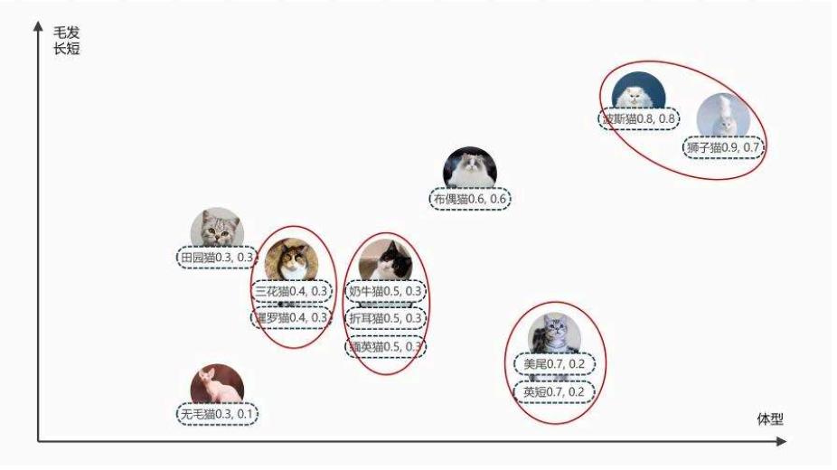
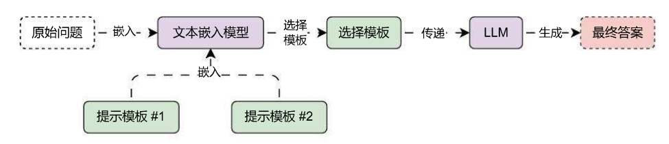

# 使用语义路由选择不同的 Prompt 模板

在 RAG 应用开发中，针对不同场景的问题使用**特定化的 prompt 模板**效果一般都会比通用模板会好一些，例如在教培场景，制作一个可以教学**物理 + 数学**的授课机器人，如果使用通用的 prompt 模板，会导致 prompt 编写变得非常复杂；反过来如果 prompt 写的简单，有可能没法起到很好的回复效果。

如果能针对用户的提问，例如用户提问的内容是数学相关的则使用数学的模板，提问的内容是物理相关的则使用物理的模板，针对性选择不同的模板，LLM 生成的内容会比使用通用模板会更好，例如下方有两个 prompt 模板：

```
physics_template = """你是一位非常聪明的物理教授。
你擅长以简洁易懂的方式回答物理问题。
当你不知道问题的答案时，你会坦率承认自己不知道。

这是一个问题：
{query}"""

math_template = """你是一位非常优秀的数学家。你擅长回答数学问题。
你之所以如此优秀，是因为你能将复杂的问题分解成多个小步骤。
并且回答这些小步骤，然后将它们整合在一起回来更广泛的问题。

这是一个问题：
{query}"""
```

基于这个思想和我们前面学习的**向量**与**文本嵌入模型**，我们其实可以猜测，提问如果是数学问题 (能介绍下余弦计算公式么？)，在向量空间上，正常情况下和**数学模板**的向量靠的更近；映射到物理问题 (黑洞是什么？) 上也是一样的。

用前面的猫猫向量表示就是更接近，相似度更高，如下：



所以利用向量执行相似性搜索，不仅可以作用于**向量数据库**，我们还可以利用**原始问题**与**prompt 模板**的相似性，来找到类型、语义上更接近的模板，从而实现对 **prompt 模板** 的动态路由。

该语义路由的运行流程其实也非常简单，如下：



在 LangChain 中，实现的代码示例如下：

```python
import dotenv
from langchain.utils.math import cosine_similarity
from langchain_core.output_parsers import StrOutputParser
from langchain_core.prompts import ChatPromptTemplate
from langchain_core.runnables import RunnablePassthrough, RunnableLambda
from langchain_openai import OpenAIEmbeddings, ChatOpenAI

dotenv.load_dotenv()

# 1.定义两份不同的prompt模板(物理模板、数学模板)
physics_template = """你是一位非常聪明的物理教授。
你擅长以简洁易懂的方式回答物理问题。
当你不知道问题的答案时，你会坦率承认自己不知道。

这是一个问题：
{query}"""

math_template = """你是一位非常优秀的数学家。你擅长回答数学问题。
你之所以如此优秀，是因为你能将复杂的问题分解成多个小步骤。
并且回答这些小步骤，然后将它们整合在一起回来更广泛的问题。

这是一个问题：
{query}"""

# 2.创建文本嵌入模型，并执行嵌入
embeddings = OpenAIEmbeddings(model="text-embedding-3-small")
prompt_templates = [physics_template, math_template]
prompt_embeddings = embeddings.embed_documents(prompt_templates)


def prompt_router(input) -> ChatPromptTemplate:
    """根据传递的query计算返回不同的提示模板"""
    # 1.计算传入query的嵌入向量
    query_embedding = embeddings.embed_query(input["query"])

    # 2.计算相似性
    similarity = cosine_similarity([query_embedding], prompt_embeddings)[0]
    most_similar = prompt_templates[similarity.argmax()]
    print("使用数学模板" if most_similar == math_template else "使用物理模板")

    # 3.构建提示模板
    return ChatPromptTemplate.from_template(most_similar)


chain = (
    {"query": RunnablePassthrough()}
    | RunnableLambda(prompt_router)
    | ChatOpenAI(model="gpt-3.5-turbo-16k")
    | StrOutputParser()
)

print(chain.invoke("黑洞是什么?"))
print("------------------------")
print(chain.invoke("能介绍下余弦计算公式么？"))
```

输出内容：

```
使用物理模板
黑洞是一种极为密集的天体，其引力非常强大，甚至连光都无法逃离它的吸引力。黑洞形成于恒星坍缩或者质量非常大的天体的坍塌过程中。在黑洞的中心，存在一个称为“奇点”的点，其中物质密度无限大，空间弯曲度也达到了极限。黑洞周围的区域被称为“事件视界”，在这个视界内，一切进入的物质都无法逃脱黑洞的吸引力。黑洞是宇宙中极为神秘而又引人入胜的天体。
------------------------
使用数学模板
余弦（cosine）计算公式是三角函数中的一种，用于计算一个三角形的两个边长和夹角之间的关系。

在一个直角三角形中，余弦的定义是：余弦值等于直角边上的斜边与该直角边的比值。

余弦的计算公式如下：
cos(θ) = adjacent / hypotenuse

其中，θ表示夹角的大小（以弧度为单位），adjacent表示夹角边的邻边长度，hypotenuse表示斜边的长度。

需要注意的是，余弦计算公式只适用于直角三角形，当夹角不是直角时，需要使用其他三角函数（如正弦、正切等）来计算。

通过将复杂的问题分解成小步骤，我们可以先计算出夹角的余弦值，然后再将其应用到更广泛的问题中，如求解三角形的面积、边长等。
```