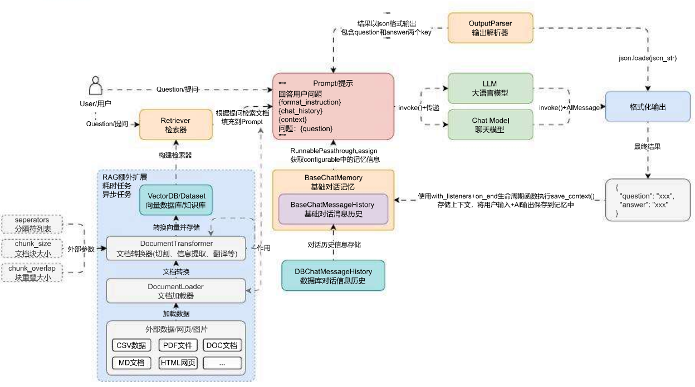

# 非分割类型的文档转换器使用技巧

## 01. DocumentTransformer 组件

在 LangChain 中，另一种非分割类型的文档转换器，这类转换器也是传递**文档列表**并返回**文档列表**，一般是将某种文档按照需求转换成另外一种格式（例如：翻译文档、文档重排、HTML 转文本、文档元数据提取、文档转问答等）。

这类文档转换器由于接收**文档列表**，返回的也是**文档列表**，所以可以在 LLM 应用中任何存在**文档列表**的地方使用，例如下方的 LLM 应用架构流程图中的**文档加载**、**文档切割**、**检索器检索**的环节交互数据都是**文档列表**，所以这几个环节都可以添加文档转换器组件。



在 LangChain 中，使用文档转换器技巧非常简单，按照对应组件的构造函数进行传参，然后调用`transformer_documents`函数即可完成对文档的快速转换（每个转换器生成的格式不一样，需查看文档了解生成内容详情）。

LangChain 封装的文档转换器组件：[https://imooc-langchain.shortvar.com/docs/integrations/document_transformers/](https://link.wtturl.cn/?target=https%3A%2F%2Fimooc-langchain.shortvar.com%2Fdocs%2Fintegrations%2Fdocument_transformers%2F&scene=im&aid=497858&lang=zh)。

## 02. 问答转换器

在 RAG 的外挂知识库中，向量存储知识库中使用的文档通常以叙述或对话格式存储。但是，绝大部分用户的查询都是问题格式，所以如果我们在对文档进行向量化之前先将其转换为**问答格式**，可以在一定程度上增加检索相关文档的可能性，降低检索不相关文档的可能性。

这个技巧也是 RAG 应用开发中常见的一种优化策略，即将原始数据转换成**QA 数据**后进行存储，除此之外，对于绝大部分 LLM 的微调，使用的也是**QA 问答数据**，也可以考虑使用该问答转换器进行转换。

在 LangChain 中封装了`doctran`库并实现了`DoctranQATransformer`类可以快捷实现该功能，这个库底层使用 OpenAI 的函数回调来实现对问答数据的提取，首先安装该库：

```
pip install -U doctran
```

假设有一段如下的文本，需要转换成 QA 数据：

```
机密文件 - 仅供内部使用
日期：2023 年 7 月 1 日
主题：各种话题的更新和讨论

亲爱的团队，

希望这封邮件能找到你们一切安好。在这份文件中，我想向你们提供一些重要的更新，并讨论需要我们关注的各种话题。请将此处包含的信息视为高度机密。

安全和隐私措施
作为我们不断致力于确保客户数据安全和隐私的一部分，我们已在所有系统中实施了强有力的措施。我们要赞扬 IT 部门的 John Doe（电子邮件：john.doe@example.com）在增强我们网络安全方面的勤奋工作。未来，我们提醒每个人严格遵守我们的数据保护政策和准则。此外，如果您发现任何潜在的安全风险或事件，请立即向我们专门的团队报告，联系邮箱为security@example.com。

人力资源更新和员工福利
最近，我们迎来了几位为各自部门做出重大贡献的新团队成员。我要表扬 Jane Smith（社保号：049‑45‑5928）在客户服务方面的出色表现。Jane 一直受到客户的积极反馈。此外，请记住我们的员工福利计划的开放报名即将到来。如果您有任何问题或需要帮助，请联系我们的人力资源代表 Michael Johnson（电话：418‑492‑3850，电子邮件：michael.johnson@example.com）。

营销倡议和活动
我们的营销团队一直在积极制定新策略，以提高品牌知名度并推动客户参与。我们要感谢 Sarah Thompson（电话：415‑555‑1234）在管理我们的社交媒体平台方面的杰出努力。Sarah 在过去一个月内成功将我们的关注者基数增加了 20%。此外，请记住 7 月 15 日即将举行的产品发布活动。我们鼓励所有团队成员参加并支持我们公司的这一重要里程碑。

研发项目
在追求创新的过程中，我们的研发部门一直在为各种项目不懈努力。我要赞扬 David Rodriguez（电子邮件：david.rodriguez@example.com）在项目负责人角色中的杰出工作。David 对我们尖端技术的发展做出了重要贡献。此外，我们希望每个人在 7 月 10 日定期举行的研发头脑风暴会议上分享他们的想法和建议，以开展潜在的新项目。

请将此文档中的信息视为最机密，并确保不与未经授权的人员分享。如果您对讨论的话题有任何疑问或顾虑，请随时直接联系我。

感谢您的关注，让我们继续共同努力实现我们的目标。

此致，
Jason Fan
联合创始人兼首席执行官
Psychic
jason@psychic.dev
```

使用示例：

```
import dotenv
from langchain_community.document_transformers import DoctranQATransformer
from langchain_core.documents import Document

dotenv.load_dotenv()

# 1.构建文档列表
page_content = """..."""
documents = [Document(page_content=page_content)]

# 2.构建问答转换器并转换
qa_transformer = DoctranQATransformer(openai_api_model="gpt-3.5-turbo-16k")
transformer_documents = qa_transformer.transform_documents(documents)

# 3.输出内容
for qa in transformer_documents[0].metadata.get("questions_and_answers"):
    print(qa)
```

输出内容：

```
{'question': '文件日期是什么？', 'answer': '2023年7月1日'}
{'question': '文件主题是什么？', 'answer': '各种话题的更新和讨论'}
{'question': '谁是IT部门的网络安全负责人？', 'answer': 'John Doe（电子邮件：john.doe@example.com）'}
{'question': '如果发现安全风险或事件，应该向谁报告？', 'answer': '专门的团队，联系邮箱为security@example.com'}
{'question': '谁在客户服务方面表现出色？', 'answer': 'Jane Smith（社保号：049‑45‑5928）'}
{'question': '员工福利计划的开放报名期是什么时候？', 'answer': '即将到来'}
{'question': '人力资源代表的联系信息是什么？', 'answer': 'Michael Johnson（电话：418‑492‑3850，电子邮件：michael.johnson@example.com）'}
{'question': '谁在管理社交媒体平台方面做出了杰出努力？', 'answer': 'Sarah Thompson（电话：415‑555‑1234）'}
{'question': '产品发布活动的日期是什么时候？', 'answer': '7月15日'}
{'question': '谁在研发部门担任项目负责人角色？', 'answer': 'David Rodriguez（电子邮件：david.rodriguez@example.com）'}
{'question': '研发头脑风暴会议的日期是什么时候？', 'answer': '7月10日'}
```

## 03. 翻译转换器

在 RAG 应用开发中，将文档通过嵌入 / 向量的方式进行比较的好处在于能跨语言工作，例如：`你好，世界！`、`Hello, world!` 和 `こんにちは、世界！`分别是中英日三国的语言，但是因为语义相近，所以在向量空间中的位置也是非常接近的。

当一个 RAG 应用需要跨语言工作时，一般有两种策略：

1. 在将文档切块并嵌入存储到向量数据库时，同时将文档翻译成多国语言并进行相同的操作。
2. 在进行检索操作时，将检索出来的文档执行翻译功能，然后使用翻译后的文档。

这两种策略都涉及到一个功能，就是**文档的翻译**，或者是说将**文档**转换成另外一种形式的**文档**，这类操作其实和**文档转换器**的作用一模一样，所以可以考虑使用该组件来实现这个功能，LangChain 中针对翻译的转换器就提供了不少，例如`Doctran`。

首先执行命令安装`doctran`，这是一个文本翻译库，底层使用 OpenAI 的函数调用功能来在不同语言之间实现翻译：

```
pip install -U doctran
```

接下来就可以使用`DoctranTextTranslator`组件来实现对文档的快速中英文转换，示例如下：

```python
import dotenv
from langchain_community.document_transformers import DoctranTextTranslator
from langchain_core.documents import Document

dotenv.load_dotenv()

# 1.构建文档列表
page_content = """..."""
documents = [Document(page_content=page_content)]

# 2.构建翻译转换器并翻译
text_translator = DoctranTextTranslator(openai_api_model="gpt-3.5-turbo-16k")
translator_documents = text_translator.transform_documents(documents)

# 3.输出翻译内容
print(translator_documents[0].page_content)
```

输出内容：

```
Confidential Document - For Internal Use Only
Date: July 1, 2023
Subject: Updates and Discussions on Various Topics

Dear Team,

I hope this email finds you all well. In this document, I would like to provide you with some important updates and discuss various topics that require our attention. Please consider the information included here as highly confidential.

Security and Privacy Measures

As part of our ongoing commitment to ensuring customer data security and privacy, we have implemented strong measures across all systems. We commend John Doe from the IT department (email: john.doe@example.com) for his diligent work in enhancing our network security. Going forward, we remind everyone to strictly adhere to our data protection policies and guidelines. Additionally, if you come across any potential security risks or incidents, please report them immediately to our dedicated team at security@example.com.

Human Resources Updates and Employee Benefits

Recently, we have welcomed several new team members who have made significant contributions to their respective departments. I would like to commend Jane Smith (Social Security Number: 049‑45‑5928) for her outstanding performance in customer service. Jane has consistently received positive feedback from clients. Furthermore, please note that the open enrollment period for our employee benefits program is approaching. If you have any questions or need assistance, please contact our HR representative, Michael Johnson (phone: 418‑492‑3850, email: michael.johnson@example.com).

Marketing Initiatives and Events

Our marketing team has been actively developing new strategies to increase brand awareness and drive customer engagement. We would like to thank Sarah Thompson (phone: 415‑555‑1234) for her exceptional efforts in managing our social media platforms. Sarah has successfully increased our follower base by 20% in the past month. Additionally, please remember the product launch event scheduled for July 15th. We encourage all team members to attend and support this important milestone for our company.

Research and Development Projects

Our R&D department has been tirelessly working on various projects in pursuit of innovation. I would like to commend David Rodriguez (email: david.rodriguez@example.com) for his outstanding work in the role of project lead. David has made significant contributions to the development of our cutting‑edge technology. Furthermore, we encourage everyone to share their ideas and suggestions at the R&D brainstorming meeting scheduled for July 10th to explore potential new projects.

Please consider the information in this document as highly confidential and ensure that it is not shared with unauthorized individuals. If you have any questions or concerns regarding the topics discussed, please feel free to contact me directly.

Thank you for your attention, and let's continue working together towards our goals.

Sincerely,

Jason Fan
Co‑founder and CEO
Psychic
jason@psychic.dev
```