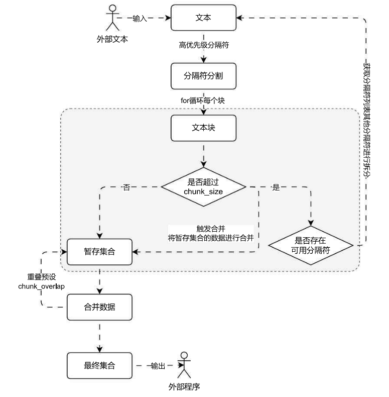
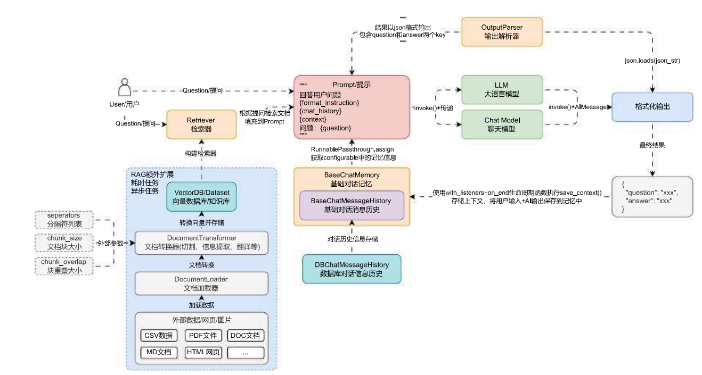

# 递归字符文本分割器的使用与运行流程

## 01. 递归字符文本分割器

普通的字符文本分割器只能使用单个分隔符对文本内容进行划分，在划分的过程中，可能会出现文档块**过小**或者**过大**的情况，这会让 RAG 变得不可控，例如：

1. 文档块可能会变得非常大，极端的情况下某个块的内容长度可能就超过了 LLM 的上下文长度限制，这样这个文本块永远不会被引用到，相当于存储了数据，但是数据又丢失了。
2. 文档块可能会远远小于窗口大小，导致文档块的信息密度太低，块内容即使填充到 Prompt 中，LLM 也无法提取出有用的信息。

那么有没有一种分割方案，可以解决这个问题呢？按照**分隔符**初次分割的时候，去检测块内容，如果太大就按照提供的**备选分隔符**二次分割，如果太小则合并前后的块，最后让所有的块内容长度都控制在指定的大小并尽可能接近呢？

在 LangChain 中就为这种方案提供了一个分割器组件 ——`RecursiveCharacterTextSplitter`，即递归字符串分割，这个分割器可以传递**一组分隔符**和**设定块内容大小**，根据分隔符的优先顺序对文本进行预分割，然后将小块进行合并，将大块进行递归分割，直到获得所需块的大小，最终这些文档块的大小并不能完全相同，但是仍然会逼近指定长度。

`RecursiveCharacterTextSplitter`的分隔符参数默认为 `["\n\n", "\n", " ", ""]`，即优先使用换两行的数据进行分割，然后在使用单个换行符，如果块内容还是太大，则使用空格，最后再拆分成单个字符。

所以如果使用默认参数，这个字符文本分割器最后得到的文档块长度一定不会超过预设的大小，但是仍然会有小概率出现远小于的情况（目前也没有很好的解决方案）。

例如使用递归字符文本分割器修改上节课的需求，示例代码如下：

```python
from langchain_community.document_loaders import UnstructuredMarkdownLoader
from langchain_text_splitters import RecursiveCharacterTextSplitter

loader = UnstructuredMarkdownLoader("./项目API文档.md")
documents = loader.load()

text_splitter = RecursiveCharacterTextSplitter(
    chunk_size=500,
    chunk_overlap=50,
    add_start_index=True,
)
chunks = text_splitter.split_documents(documents)

for chunk in chunks:
    print(f"块大小:{len(chunk.page_content)}, 块元数据:{chunk.metadata}")
```

输出内容：

```
块大小:251, 块元数据:{'source': './项目API文档.md', 'start_index': 0}
块大小:451, 块元数据:{'source': './项目API文档.md', 'start_index': 246}
块大小:490, 块元数据:{'source': './项目API文档.md', 'start_index': 699}
块大小:305, 块元数据:{'source': './项目API文档.md', 'start_index': 1165}
块大小:435, 块元数据:{'source': './项目API文档.md', 'start_index': 1472}
块大小:497, 块元数据:{'source': './项目API文档.md', 'start_index': 1859}
块大小:237, 块元数据:{'source': './项目API文档.md', 'start_index': 2359}
块大小:483, 块元数据:{'source': './项目API文档.md', 'start_index': 2598}
块大小:486, 块元数据:{'source': './项目API文档.md', 'start_index': 3092}
块大小:438, 块元数据:{'source': './项目API文档.md', 'start_index': 3580}
块大小:293, 块元数据:{'source': './项目API文档.md', 'start_index': 4013}
块大小:498, 块元数据:{'source': './项目API文档.md', 'start_index': 4261}
块大小:463, 块元数据:{'source': './项目API文档.md', 'start_index': 4712}
块大小:438, 块元数据:{'source': './项目API文档.md', 'start_index': 5129}
块大小:474, 块元数据:{'source': './项目API文档.md', 'start_index': 5569}
块大小:93, 块元数据:{'source': './项目API文档.md', 'start_index': 6018}
块大小:464, 块元数据:{'source': './项目API文档.md', 'start_index': 6113}
块大小:478, 块元数据:{'source': './项目API文档.md', 'start_index': 6579}
块大小:379, 块元数据:{'source': './项目API文档.md', 'start_index': 7035}
块大小:489, 块元数据:{'source': './项目API文档.md', 'start_index': 7416}
```

`RecursiveCharacterTextSplitter`底层的运行流程其实也非常简单，可以拆分成 **预分割、大文档块递归分割、小文档块合并**。运行流程图如下（需掌握，目前 LLM 应用开发中高频提问到的一个问题）：



对比普通的字符文本分割器，递归字符文本分割器可以传递多个分隔符，并且根据不同分隔符的优先级来执行相应的分割。在 LangChain 中通过`RecursiveCharacterTextSplitter`类实现对文本的递归字符串分割。

| 中文               | 英文                             | 说明                                                         |
| ------------------ | -------------------------------- | ------------------------------------------------------------ |
| 递归字符文本分割器 | `RecursiveCharacterTextSplitter` | LangChain 最常用 RAG 分割器，**不会输出超过 chunk_size 的块** |
| 预分割             | pre‑split                        | 按优先级高的分隔符先切                                       |
| 大文档块递归分割   | recursively split large chunks   | 块超过上限，使用下一级分隔符继续切分                         |
| 小文档块合并       | merge small chunks               | 短片段向后合并，贴近 chunk_size                              |
| `add_start_index`  | add_start_index                  | 元数据增加`start_index`，标记片段在原文的起始偏移位置        |
| 默认分隔符         | `["\n\n", "\n", " ", ""]`        | 段落→换行→空格→字符逐级降级分割                              |

```
核心区别：CharacterTextSplitter用单一分隔符切，切出来的片段可能大于 chunk_size；RecursiveCharacterTextSplitter多分隔符递归降级，保证输出块不大于 chunk_size。
```

## 02. 衍生代码分割器

递归字符文本分割器的核心部分在于传递不同的分割符列表，通过不同的优先级的列表，可以实现一些复杂文件的拆分，例如在该分割器内部预先构建了大量的的分割列表，用于在特定的编程语言中拆分文本。

支持的编程语言类型存储在 `langchain_text_splitters.Language` 枚举中，涵盖如下：

```python
class Language(str, Enum):
    """Enum of the programming languages."""

    CPP = "cpp"
    GO = "go"
    JAVA = "java"
    KOTLIN = "kotlin"
    JS = "js"
    TS = "ts"
    PHP = "php"
    PROTO = "proto"
    PYTHON = "python"
    RST = "rst"
    RUBY = "ruby"
    RUST = "rust"
    SCALA = "scala"
    SWIFT = "swift"
    MARKDOWN = "markdown"
    LATEX = "latex"
    HTML = "html"
    SQL = "sql"
    CSHARP = "csharp"
    COBOL = "cobol"
    C = "c"
    LUA = "lua"
    PERL = "perl"
    HASKELL = "haskell"
```

要想查看给定语言的分隔符，可以使用 `RecursiveCharacterTextSplitter.get_separators_for_language()` 函数获取，例如查看 Python 语言的分隔符，如下：

```python
from langchain_text_splitters import Language, RecursiveCharacterTextSplitter

separators = RecursiveCharacterTextSplitter.get_separators_for_language(Language.PYTHON)
print(separators)

# 输出
['\nclass ', '\ndef ', '\n\tdef ', '\n\n', '\n', ' ', '']
```

可以从分隔符列表中看到 Python 文件的分割逻辑，优先将所有类都分割出来，然后分割函数，接下来分割类方法、模块语句等内容。

要想使用这些编程语言分隔符，其实非常简单，在构造分割器的时候传递即可，或者使用 `from_language()` 并传递编程语言枚举数据也可以实现，示例如下：

```python
from langchain_community.document_loaders import UnstructuredFileLoader
from langchain_text_splitters import Language, RecursiveCharacterTextSplitter

loader = UnstructuredFileLoader("./demo.py")
text_splitter = RecursiveCharacterTextSplitter.from_language(
    Language.PYTHON,
    chunk_size=500,
    chunk_overlap=50,
)

documents = loader.load()
chunks = text_splitter.split_documents(documents)

for chunk in chunks:
    print(f"块大小: {len(chunk.page_content)}, 元数据:{chunk.metadata}")
```

输出内容：

```python
块大小: 151, 元数据:{'source': './demo.py'}
块大小: 335, 元数据:{'source': './demo.py'}
块大小: 439, 元数据:{'source': './demo.py'}
块大小: 499, 元数据:{'source': './demo.py'}
块大小: 108, 元数据:{'source': './demo.py'}
块大小: 187, 元数据:{'source': './demo.py'}
块大小: 352, 元数据:{'source': './demo.py'}
块大小: 450, 元数据:{'source': './demo.py'}
块大小: 446, 元数据:{'source': './demo.py'}
块大小: 431, 元数据:{'source': './demo.py'}
块大小: 347, 元数据:{'source': './demo.py'}
块大小: 492, 元数据:{'source': './demo.py'}
块大小: 491, 元数据:{'source': './demo.py'}
块大小: 471, 元数据:{'source': './demo.py'}
块大小: 489, 元数据:{'source': './demo.py'}
块大小: 474, 元数据:{'source': './demo.py'}
块大小: 476, 元数据:{'source': './demo.py'}
块大小: 492, 元数据:{'source': './demo.py'}
块大小: 472, 元数据:{'source': './demo.py'}
块大小: 490, 元数据:{'source': './demo.py'}
块大小: 469, 元数据:{'source': './demo.py'}
块大小: 452, 元数据:{'source': './demo.py'}
块大小: 490, 元数据:{'source': './demo.py'}
块大小: 497, 元数据:{'source': './demo.py'}
块大小: 492, 元数据:{'source': './demo.py'}
块大小: 496, 元数据:{'source': './demo.py'}
块大小: 497, 元数据:{'source': './demo.py'}
块大小: 498, 元数据:{'source': './demo.py'}
块大小: 491, 元数据:{'source': './demo.py'}
块大小: 466, 元数据:{'source': './demo.py'}
块大小: 348, 元数据:{'source': './demo.py'}
```

递归分割会尽可能从大分块上保证数据的连续性，打印其中一个分块，示例如下：

```
print(chunks[2].page_content)
```

输出内容：

```python
def split_text(self, text: str) -> List[str]:
"""Split incoming text and return chunks."""

# First we naively split the large input into a bunch of smaller ones.
separator = (
self._separator if self._is_separator_regex else re.escape(self._separator)
)
splits = _split_text_with_regex(text, separator, self._keep_separator)
_separator = "" if self._keep_separator else self._separator
return self._merge_splits(splits, _separator)
```

## 03. 中文场景下的递归分割

`RecursiveCharacterTextSplitter` 默认配置的分隔符均是英文场合下的，在中文场合下，除了换行 / 空格，一般还有更加复杂的语句结束判断标识，例如：。、！、？等标识符，如果想更好去切割中英文文档，可以考虑重设分隔符列表（或者继承该类进行重写）。

不同符号的优先级如下：

1. `\n\n`：换行两次优先级最高。
2. `\n`：普通换行符优先级其次，一般切断后都不会导致上下文语义丢失。
3. `。|！|？`：中文句号、感叹号、问号一般都表示句子结束，也可以尝试切割。
4. `\.\s|\!\s|\?\s`：对应到英文中就是点、感叹号、问号，并且标准的英文写法在这些符号后通常需要添加空格。
5. `：|;\s`：其次就是中英文的分段，在英文分段后一般会添加空格；
6. `，|,\s`：接下来优先级是中英文中的逗号，逗号一般都表示句子语义还未结束，所以一般不切割，除非文本块仍然超过大小。
7. `" "`：空格和空字符串是优先级最低的切割符号之一，特别是在英文场合中，有时候两个词才有意义，切割出来意义就不大，而空字符串则是优先级最低的切割符，空字符串会把中文切割成单个汉字，在英文场合下切割成单个字母，几乎完全丢失语义。

更改后的示例如下：

```python
from langchain_community.document_loaders import UnstructuredMarkdownLoader
from langchain_text_splitters import RecursiveCharacterTextSplitter

# 1.创建加载器和文本分割器
loader = UnstructuredMarkdownLoader("./项目API文档.md")
text_splitter = RecursiveCharacterTextSplitter(
    separators=[
        "\n\n",
        "\n",
        "。|！|？",
        "\\.\\s|\\!\\s|\\?\\s",  # 英文标点符号后面通常需要加空格
        "：|;\\s",
        "，|,\\s",
        " ",
        ""
    ],
    is_separator_regex=True,
    chunk_size=500,
    chunk_overlap=50,
    add_start_index=True,
)

# 2.加载文档与分割
documents = loader.load()
chunks = text_splitter.split_documents(documents)

# 3.输出信息
for chunk in chunks:
    print(f"块大小: {len(chunk.page_content)}, 元数据: {chunk.metadata}")
```

输出示例：

```python
块大小: 251, 元数据: {'source': './项目API文档.md', 'start_index': 0}
块大小: 451, 元数据: {'source': './项目API文档.md', 'start_index': 246}
块大小: 490, 元数据: {'source': './项目API文档.md', 'start_index': 699}
块大小: 305, 元数据: {'source': './项目API文档.md', 'start_index': 1165}
块大小: 435, 元数据: {'source': './项目API文档.md', 'start_index': 1472}
块大小: 497, 元数据: {'source': './项目API文档.md', 'start_index': 1859}
块大小: 237, 元数据: {'source': './项目API文档.md', 'start_index': 2359}
块大小: 483, 元数据: {'source': './项目API文档.md', 'start_index': 2598}
块大小: 486, 元数据: {'source': './项目API文档.md', 'start_index': 3092}
块大小: 438, 元数据: {'source': './项目API文档.md', 'start_index': 3580}
块大小: 293, 元数据: {'source': './项目API文档.md', 'start_index': 4013}
块大小: 498, 元数据: {'source': './项目API文档.md', 'start_index': 4261}
块大小: 463, 元数据: {'source': './项目API文档.md', 'start_index': 4712}
块大小: 438, 元数据: {'source': './项目API文档.md', 'start_index': 5129}
块大小: 474, 元数据: {'source': './项目API文档.md', 'start_index': 5569}
块大小: 93, 元数据: {'source': './项目API文档.md', 'start_index': 6018}
块大小: 464, 元数据: {'source': './项目API文档.md', 'start_index': 6113}
块大小: 478, 元数据: {'source': './项目API文档.md', 'start_index': 6579}
块大小: 379, 元数据: {'source': './项目API文档.md', 'start_index': 7035}
块大小: 489, 元数据: {'source': './项目API文档.md', 'start_index': 7416}
```

在 LLMOps 项目中，具体的文本分割逻辑由创建知识库的用户决定，所以分隔符、文档块大小 和 块重叠大小 均是通过外部传递，然后再生成 RecursiveCharacterTextSplitter 分割器，而文档加载器使用 扩展名 + 通用非结构化文件加载器 来实现，更新后的聊天机器人的架构运行流程如下：


