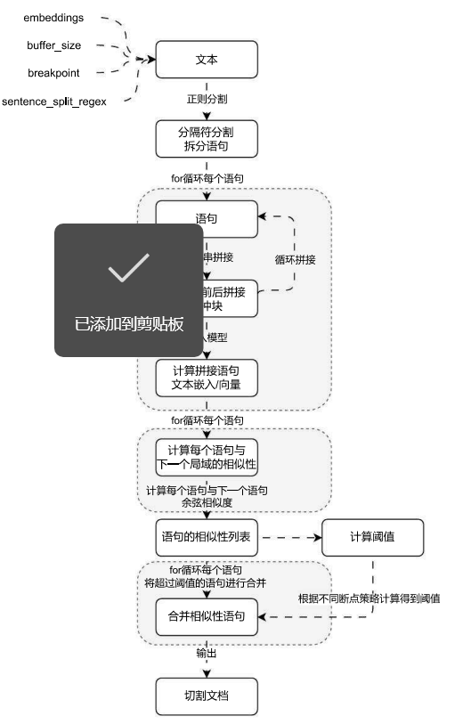

# 语义文档分割器与其他文档分割器的使用

## 01. 语义文档分割器的使用与背景

在前面课时中使用的文档分割器都是使用**特定字符**对文本进行拆分，这种拆分模式虽然考虑了文档中的上下文切断的问题，但是并没有考虑句子之间的语义相似性，如果有一篇长文本，需要将其分割成语义相关的块，以便更好地理解和处理，这个时候可以使用 LangChain 中的**语义相似性分割器（SemanticChunker）**来实现这个任务。

**语义相似性分割器**目前仍处于实验性，这个类目前位于 `langchain_experimental` 包中（这个包中的类与方法未来极大概率会发生变更，需要谨慎使用），安装命令：

```
pip install -Uqq langchain_experimental
```

`SemanticChunker` 在使用上和其他的文档分割器存在一些差异，并且该类并没有继承 `TextSplitter`，实例化参数含义如下：

1. **embeddings**：文本嵌入模型，在该分类器底层使用向量的**余弦相似度**来识别语句之间的相似性。
2. **buffer_size**：文本缓冲区大小，默认为 1，即在计算相似性时，该文本会叠加前后各 1 条文本，如果不够则不叠加（例如第 1 条和最后 1 条）。
3. **add_start_index**：是否添加起点索引，默认为 False。
4. **breakpoint_threshold_type**：断点阈值类型，默认为 `percentile` 即百分位
5. **breakpoint_threshold_amount**：端点阈值金额 / 得分。
6. **number_of_chunks**：分割后的文档块个数，默认为 None。
7. **sentence_split_regex**：句子切割正则，默认为 `(?<=[.!?])\s+`，即以英文的点、问号、感叹号切割语句，不同的文档需要传递不同的切割正则表达式。

例如想要将 `科幻短篇.txt` 按照语义切割成 10 个文档，可以使用如下代码示例：

```python
import dotenv
from langchain_community.document_loaders import UnstructuredFileLoader
from langchain_experimental.text_splitter import SemanticChunker
from langchain_openai import OpenAIEmbeddings

dotenv.load_dotenv()

# 1.构建加载器和文本分割器
loader = UnstructuredFileLoader("./科幻短篇.txt")
text_splitter = SemanticChunker(
    embeddings=OpenAIEmbeddings(model="text-embedding-3-small"),
    sentence_split_regex=r"(?<=[。？！])",
    number_of_chunks=10,
)

# 2.加载文本与分割
documents = loader.load()
chunks = text_splitter.split_documents(documents)

for chunk in chunks:
    print(f"块大小：{len(chunk.page_content)}，元数据：{chunk.metadata}")
```

输出内容：

```
块大小: 201, 元数据: {'source': './科幻短篇.txt'}
块大小: 25, 元数据: {'source': './科幻短篇.txt'}
块大小: 31, 元数据: {'source': './科幻短篇.txt'}
块大小: 46, 元数据: {'source': './科幻短篇.txt'}
块大小: 203, 元数据: {'source': './科幻短篇.txt'}
块大小: 19, 元数据: {'source': './科幻短篇.txt'}
块大小: 91, 元数据: {'source': './科幻短篇.txt'}
块大小: 466, 元数据: {'source': './科幻短篇.txt'}
块大小: 116, 元数据: {'source': './科幻短篇.txt'}
块大小: 0, 元数据: {'source': './科幻短篇.txt'}
```

`SemanticChunker` 的原理其实非常简单，核心思想是将文档拆分成独立的每一句，接下来根据传递的缓冲大小前后拼接字符串，然后计算拼接后的新字符串的文本嵌入 / 向量，然后计算这些文本的相似度，并根据传入的分块数 + 断点类型计算得到一个阈值，最后将相似度超过某个阈值的合并到一起，从而实现相似度分割。

目前在 `SemanticChunker` 底层检测相似度阈值的方法有 4 种：**百分位数 (默认)、标准差、四分位数、梯度**。



## 02. 其他文档分割器的使用

除了上述的文档分割器，在 LangChain 中还封装了一些其他场合下的分割器（使用频率不高），涵盖了：基于 HTML 标题 / 段的分割器、Markdown 标题分割器、递归 JSON 分割器、基于 Token 计数的分割器等，使用起来和字符文本分割器非常接近。

LangChain 文档分割器翻译文档：https://imooc‑[langchain.shortvar.com/docs/how_to/](https://link.wtturl.cn/?target=https%3A%2F%2Flangchain.shortvar.com%2Fdocs%2Fhow_to%2F&scene=im&aid=497858&lang=zh)#检索器

### 2.1 HTML/Markdown 标题 / 段分割器

在 LangChain 中设计了针对 HTML 类型文档的分割器 ——`HTMLHeaderTextSplitter` 与 `HTMLSectionSplitter`，分割器的作用如下：

1. **HTMLHeaderTextSplitter**：在 HTML 文档中按照元素级别进行分割，查找出每一块文本的内容与其所有关联的标题，并为每个相关的标题块提供元数据（顺序往上逐层查找，直到找到所有嵌套层级的标题）。
2. **HTMLSectionSplitter**：在 HTML 文档中按照元素级别进行分割，查找出每一块文本的内容及其副标题（顺序往上查找，找到最近的副标题则停止）。

理解起来其实也非常简单，层级关系并不是嵌套，而是看目录导航，例如在课件的左侧可以看到对应的导航，分别是一级标题、二级标题和三级标题，这块内容在哪个标题内下使用，就可以看成是被嵌套到哪个标题下，和实际的 HTML 层级没有任何关系。

使用示例：

```python
from langchain_text_splitters import HTMLHeaderTextSplitter

html_string = """
<!DOCTYPE html>
<html>
<body>
    <div>
        <h1>标题1</h1>
        <p>关于标题1的一些介绍文本。</p>
        <div>
            <h2>子标题1</h2>
            <p>关于子标题1的一些介绍文本。</p>
            <h3>子子标题1</h3>
            <p>关于子子标题1的一些文本。</p>
            <h3>子子标题2</h3>
            <p>关于子子标题2的一些文本。</p>
        </div>
        <div>
            <h3>子标题2</h3>
            <p>关于子标题2的一些文本。</p>
        </div>
        <br>
        <p>关于标题1的一些结束文本。</p>
    </div>
</body>
</html>
"""

headers_to_split_on = [
    ("h1", "一级标题"),
    ("h2", "二级标题"),
    ("h3", "三级标题"),
]

html_splitter = HTMLHeaderTextSplitter(headers_to_split_on)
html_header_splits = html_splitter.split_text(html_string)

print(html_header_splits)
```

输出内容：

```
[
Document(page_content='标题1'),
Document(metadata={'一级标题': '标题1'}, page_content='关于标题1的一些介绍文本。 \n子标题1 子子标题1 子子标题2'),
Document(metadata={'一级标题': '标题1', '二级标题': '子标题1'}, page_content='关于子标题1的一些介绍文本。'),
Document(metadata={'一级标题': '标题1', '二级标题': '子标题1', '三级标题': '子子标题1'}, page_content='关于子子标题1的一些文本。'),
Document(metadata={'一级标题': '标题1', '二级标题': '子标题1', '三级标题': '子子标题2'}, page_content='关于子子标题2的一些文本。'),
Document(metadata={'一级标题': '标题1'}, page_content='子标题2'),
Document(metadata={'一级标题': '标题1', '三级标题': '子标题2'}, page_content='关于子标题2的一些文本。'),
Document(metadata={'一级标题': '标题1'}, page_content='关于标题1的一些结束文本。')
]
```

另外在 LangChain 中除了 HTML 类型的文档可以使用这套分割规则，Markdown 类的文件也有类似的分割规则，可以使用 Markdown 标题分割器 ——MarkdownHeaderTextSplitter 完成同样的文档分割。

详细文档：https://imooc‑langchain.shortvar.com/docs/how_to/markdown_header_metadata_splitter/

### 2.2 递归 JSON 分割器

对于 JSON 类的数据，在 LangChain 中也封装了一个递归 JSON 分割器 ——`RecursiveJsonSplitter`，这个分割器会按照深度优先的方式遍历 JSON 数据，并构建较小的 JSON 块，而且尽可能保持嵌套 JSON 对象完整，但如果需要保持文档块大小在最小块大小和最大块大小之间，则会将它们拆分。

在 JSON 数据中，如果值不是嵌套的 JSON，而是一个非常大的字典，则不会对该字符串进行拆分，可以配合**递归字符文本分割器**强制性拆分字符串，确保块大小在限制的范围内。

`RecursiveJsonSplitter`的参数非常简单，只需传递`max_chunk_size`和`min_chunk_size`(可选) 即可。

例如这里有一个很大的 json 文本（[https://api.smith.langchain.com/openapi.json](https://link.wtturl.cn/?target=https%3A%2F%2Fapi.smith.langchain.com%2Fopenapi.json&scene=im&aid=497858&lang=zh)），使用递归 JSON 分割器对其进行拆分，如下：

```python
import requests
from langchain_text_splitters import RecursiveJsonSplitter

# 1.获取并加载json
url = "https://api.smith.langchain.com/openapi.json"
json_data = requests.get(url).json()

# 2.递归JSON分割器
text_splitter = RecursiveJsonSplitter(max_chunk_size=300)

# 3.分割json数据并创建文档
json_chunks = text_splitter.split_json(json_data=json_data)
chunks = text_splitter.create_documents(json_chunks)

for chunk in chunks[:3]:
    print(chunk)
```

输出内容：

```json
page_content='{"openapi": "3.1.0", "info": {"title": "LangSmith", "version": "0.1.0"}, "paths": {"/api/v1/sessions/{session_id}": {"get": {"tags": ["tracer‑sessions"], "summary": "Read Tracer Session", "description": "Get a specific session."}}}}'
page_content='{"paths": {"/api/v1/sessions/{session_id}": {"get": {"operationId": "read_tracer_session_api_v1_sessions__session_id__get", "security": [{"API Key": []}, {"Tenant ID": []}, {"Bearer Auth": []}]}}}}'
page_content='{"paths": {"/api/v1/sessions/{session_id}": {"get": {"parameters": [{"name": "session_id", "in": "path", "required": true, "schema": {"type": "string", "format": "uuid", "title": "Session Id"}}, {"name": "include_stats", "in": "query", "required": false, "schema": {"type": "boolean", "default": false, "title": "Include Stats"}}, {"name": "accept", "in": "header", "required": false, "schema": {"anyOf": [{"type": "string"}, {"type": "null"}], "title": "Accept"}}]}}}}'
```

`RecursiveJsonSplitter`分割器的运行流程其实也非常简单，这个分割器会按照**深度优先**的方式遍历整个 JSON，即一层一层往下读取数据，然后将对应的数据提取生成一个新的 JSON，直到数据大小接近块大小（极端情况下还是会超过预设的块大小，例如 JSON 数据中的 Key 很长，亦或者 Value 很长，甚至出现单条数据就超过了预设大小）。

所以如果要使用该分割器，一般会结合`RecursiveCharacterTextSplitter`降低单条数据超过预设大小的风险，思路就是将递归 JSON 分割器生成的文档列表进行二次分割。

### 2.3 基于标记的分割器

对于大语言模型来说，上下文的长度计算应该通过 token 进行计算，而不是通过字符长度`len()`函数，在 OpenAI 的 GPT 模型中，一个汉字大约等于 1.5 个 Token，一个单词为 1 个 Token，所以使用`len()`函数可能会导致很大的误差。

在 LLM 应用开发中，不同的模型对于 Token 的计算并不相同，但是可以使用`tiktoken`这个包来大致计算文本的 token 数，误差也相对较小，首先安装`tiktoken`包，命令如下：

```
pip install -U tiktoken
```

接下来定义一个基于`tiktoken`的长度计算函数，如下：

```python
def calculate_token_count(query: str) -> int:
    """计算传入文本的token数"""
    encoding = tiktoken.encoding_for_model("text‑embedding‑3‑large")
    return len(encoding.encode(query))
```

然后将该函数传递给分割器的`length_function`，例如前几节课时的案例，修改优化后，代码如下：

```python
import tiktoken
from langchain_community.document_loaders import UnstructuredFileLoader
from langchain_text_splitters import RecursiveCharacterTextSplitter

# 1.定义加载器和文本分割器
loader = UnstructuredFileLoader("./科幻短篇.txt")
text_splitter = RecursiveCharacterTextSplitter(
    separators=[
        "\n\n",
        "\n",
        "。|！|？",
        "\\.\\s|\\!\\s|\\?\\s",  # 英文标点符号后面通常需要加空格
        "; |;\\s",
        ", |,\\s",
        " ",
        ""
    ],
    is_separator_regex=True,
    chunk_size=500,
    chunk_overlap=50,
    length_function=calculate_token_count,
)

# 2.加载文档并执行分割
documents = loader.load()
chunks = text_splitter.split_documents(documents)

# 3.循环打印分块内容
for chunk in chunks:
    print(f"块大小: {len(chunk.page_content)}, 元数据: {chunk.metadata}")
```

输出内容：

```
块大小: 334, 元数据: {'source': './科幻短篇.txt'}
块大小: 409, 元数据: {'source': './科幻短篇.txt'}
块大小: 372, 元数据: {'source': './科幻短篇.txt'}
块大小: 95, 元数据: {'source': './科幻短篇.txt'}
```

在 LangChain 中，除了传递`length_function`方法，还可以直接调用分割器的类方法`from_tiktoken_encoder()`来快速创建基于 tiktoken 分词器的文本分割器（确保分词器使用的模型和开发的 LLM 保持一致即可），例如：

```
RecursiveCharacterTextSplitter.from_tiktoken_encoder(
    model_name="gpt‑4",
    chunk_size=500,
    chunk_overlap=50,
    separators=[
        "\n\n",
        "\n",
        "。|！|？",
        "\\.\\s|\\!\\s|\\?\\s",  # 英文标点符号后面通常需要加空格
        "; |;\\s",
        ", |,\\s",
        " ",
        ""
    ],
    is_separator_regex=True,
)
```