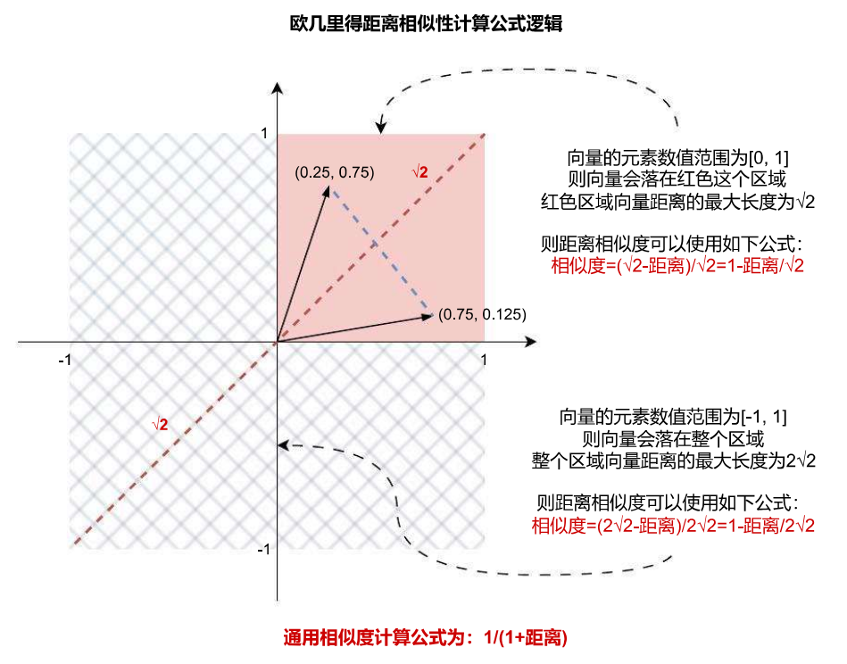

# Faiss 向量数据库的配置与使用

目前关于向量数据库的技术进展非常迅速，所以不同服务商提供的向量数据库使用差异非常大，数据的存储结构、支持的相似性检索方式、集合、条件筛选等功能差异也比较大，在 LangChain 中对于向量数据库类只做了通用性的封装，减轻了部分迁移成本，在使用向量数据库时一定要综合衡量下各个向量数据库的差异。

按照部署方式和提供的服务类型进行划分，向量数据库可以划分成几种：

1. **本地文件向量数据库**：用户将向量数据存储到本地文件系统中，通过数据库查询的接口来检索向量数据，例如：Faiss。
2. **本地部署 API 向量数据库**：这类数据库不仅允许本地部署，而且提供了方便的 API 接口，使用户可以通过网络请求来访问和查询向量数据，这类数据库通常提供了更复杂的功能和管理选项，例如：Milvus、Annoy、Weaviate 等。
3. **云端 API 向量数据库**：将向量数据存储在云端，通过 API 提供向量数据的访问和管理功能，例如：TCVectorDB、Pinecone 等。

要想快速上手向量数据库的使用，只需要把向量数据库看成是 Excel 电子表格 使用即可，按照使用办公软件的流程：安装、写入数据、查找数据、删除数据、更新数据、保存数据等相同的流程去学习 + 使用向量数据库即可。

而且向量数据库没有 SQL 数据库这么多复杂的查询功能，也没有事务，学习起来其实比绝大部分传统数据库都要容易上手。

## 01. Faiss 向量数据库简介

Faiss 是 Facebook 团队开源的向量检索工具，针对高维空间的海量数据，提供高效可靠的相似性检索方式，被广泛用于推荐系统、图片和视频搜索等业务。Faiss 支持 Linux、macOS 和 Windows 操作系统，在百万级向量的相似性检索表现中，Faiss 能实现 < 10ms 的响应（需牺牲搜索准确度）。

Faiss 官网：https://faiss.ai/

Faiss 仓库：https://github.com/facebookresearch/faiss

Faiss 使用 C++ 开发，提供了 Python 接口，可以通过 pip 安装 Faiss 库：

```
# CPU环境下使用
pip install faiss‑cpu

# GPU环境下使用并且已经安装了CUDA，则可以使用GPU版本
pip install faiss‑gpu
```

目前绝大部分向量数据库都支持多种对数据的操作方法：新增数据、检索数据、带得分的数据检索、带筛选条件的数据检索、删除数据等，但是几乎都不支持**修改数据**，这是因为向量数据库通常使用特定的索引结构（如向量索引树或近似最临搜索算法），这些结构需要再数据插入后进行构建和优化，如果允许修改数据，索引结构可能需要频繁更新，这会显著增加系统的复杂性和开销，所以一般是删除后再新增。

Faiss 也类似，不过由于 Faiss 是本地文件向量数据库，还额外支持了将向量数据持久化到本地、从本地文件夹加载向量数据库等操作。

## 02. Faiss 向量数据库使用技巧

### 2.1 数据的导入与相似性搜索

在 LangChain 中，提供了 `from_texts` 和 `from_documents` 两个通用方法，这两个方法可以快捷从文本和文档中导入数据到向量数据库中，由于向量数据库存储的向量，所以需要传入文本嵌入模型，让向量数据库自动将传入的文本转换成向量。

示例如下：

```python
import dotenv
from langchain_community.vectorstores import FAISS
from langchain_openai import OpenAIEmbeddings

dotenv.load_dotenv()

embedding = OpenAIEmbeddings(model="text‑embedding‑3‑small")

db = FAISS.from_texts([
    "笨笨是一只很喜欢睡觉的猫咪",
    "我喜欢在夜晚听音乐，这让我感到放松。",
    "猫咪在窗台上打盹，看起来非常可爱。",
    "学习新技能是每个人都应该追求的目标。",
    "我最喜欢的食物是意大利面，尤其是番茄酱的那种。",
    "昨晚我做了一个奇怪的梦，梦见自己在太空飞行。",
    "我的手机突然关机了，让我有些焦虑。",
    "阅读是我每天都会做的事情，我觉得很充实。",
    "他们一起计划了一次周末的野餐，希望天气能好。",
    "我的狗喜欢追逐球，看起来非常开心。",
], embedding)

print(db.index.ntotal)
```

完成数据的填充后，即可在向量数据库中进行对应的检索，LangChain 为所有的向量数据库都设计封装了一致的搜索接口，最常用的有以下 4 种：

1. `similarity_search()`：基础相似度搜索，传递 query (搜索语句)、k (返回条数)、filter (过滤器)、fetch_k (富余条数) 等。
2. `similarity_search_with_score()`：携带得分的相似性搜索，参数和 `similarity_search()` 函数保持一致，只是会返回得分，这里的得分并不是相似性得分，而是欧几里得距离。
3. `similarity_search_with_relevance_scores()`：携带相关性得分的相似性搜索，得分范围是 0‑1
4. `as_retriever()`：将向量数据库转换成检索器，检索器是 Runnable 可运行组件。

在向量数据库中进行检索并携带得分（这里的得分并不是相似性得分，默认是欧几里得距离），效果如下：

```
print(db.similarity_search_with_score("我养了一只猫，叫笨笨"))
```

输出内容：

```
[(Document(page_content='我养了一只猫，叫大笨'), 0.11375141),
 (Document(page_content='猫咪在窗台上打盹，看起来非常可爱。'), 1.0895041),
 (Document(page_content='我的狗喜欢追逐球，看起来非常开心。'), 1.3836973),
 (Document(page_content='我的手机突然关机了，让我有些焦虑。'), 1.5533546)]
```

由于不同文本嵌入模型生成向量的范围不一致，LangChain 封装的 Faiss 计算相关性得分的时候，可能会出现 bug（比如出现负数）。

```
print(db.similarity_search_with_relevance_scores("我养了一只猫，叫笨笨"))

# 输出
[(Document(page_content='笨笨是一只很喜欢睡觉的猫咪', metadata={'page': 1}),
0.4592331743070337), (Document(page_content='猫咪在窗台上打盹，看起来非常可爱。',
metadata={'page': 3}), 0.22960424668403867), (Document(page_content='我的狗喜欢追逐球，看起来非常开心。', metadata={'page': 10}), 0.02157827632118159),
(Document(page_content='我的手机突然关机了，让我有些焦虑。', metadata={'page': 7}),
‑0.09838758604956)]
```

Faiss 计算相关性得分的核心代码如下（默认使用欧几里得距离计算相关性）：

```python
# langchain_community/vectorstores/faiss.py -> FAISS
def _euclidean_relevance_score_fn(distance: float) -> float:
    return 1.0 - distance / math.sqrt(2)
```

这个公式计算正确的前提是向量只有 2 维，并且向量的每个值范围是 [0, 1]，这个公式的几何意义如下：



扩展到三维向量空间中（向量的范围是 [0,1]），两个向量点之间最大距离为 \(\sqrt{3}\)，并不是 \(\sqrt{2}\)，所以直接套用公式，可能会出现负得分，在 N 维向量空间下，两点的最大距离是 \(\sqrt{N}\)，所以出现负数的概率大大增加。

可以修改成以下方式进行修正：

```python
def _euclidean_relevance_score_fn(distance: float) -> float:
    return 1.0 / (1.0 + distance)
```

在使用 LangChain 封装的向量数据库时，一定要注意测试和校验下文本嵌入模型生成向量的数值范围，避免出现明显的错误。由于向量数据库目前更新太快，而且 LangChain 封装了太多的第三方组件（数百个），在很多场合下，LangChain 可能没有对每一种情况进行测试，有可能会出现一些莫名其妙的计算结果。

### 2.2 带过滤的相似性搜索

在绝大部分向量数据库中，除了存储向量数据，还支持存储对应的元数据，这里的元数据可以是文本原文、扩展信息、页码、归属文档 id、作者、创建时间等等任何自定义信息，一般在向量数据库中，会通过元数据来实现对数据的检索。

```
向量数据库记录 = 向量(vector)+元数据(metadata)+id
```

比较遗憾的是 Faiss 原生并不支持过滤，所以在 LangChain 封装的 FAISS 中对过滤功能进行了相应的处理。首先获取比 k 更多的结果 fetch_k（默认为 20 条），然后先进行搜索，接下来再搜索得到的 fetch_k 条结果上进行过滤，得到 k 条结果，从而实现带过滤的相似性搜索。

而且 Faiss 的搜索都是针对元数据的，在 Faiss 中执行带过滤的相似性搜索非常简单，只需要在搜索时传递 filter 参数即可，filter 可以传递一个元数据字典，也可以接收一个函数（函数的参数为元数据字典，返回值为布尔值）。

例如下方的代码只会对 `page>5` 的文档进行检索，代码如下：

```python
import dotenv
from langchain_community.vectorstores import FAISS
from langchain_openai import OpenAIEmbeddings

dotenv.load_dotenv()

embedding = OpenAIEmbeddings(model="text‑embedding‑3‑small")

texts: list = [
    "笨笨是一只很喜欢睡觉的猫咪",
    "我喜欢在夜晚听音乐，这让我感到放松。",
    "猫咪在窗台上打盹，看起来非常可爱。",
    "学习新技能是每个人都应该追求的目标。",
    "我最喜欢的食物是意大利面，尤其是番茄酱的那种。",
    "昨晚我做了一个奇怪的梦，梦见自己在太空飞行。",
    "我的手机突然关机了，让我有些焦虑。",
    "阅读是我每天都会做的事情，我觉得很充实。",
    "他们一起计划了一次周末的野餐，希望天气能好。",
    "我的狗喜欢追逐球，看起来非常开心。",
]

metadatas: list = [
    {"page": 1},
    {"page": 2},
    {"page": 3},
    {"page": 4},
    {"page": 5},
    {"page": 6},
    {"page": 7},
    {"page": 8},
    {"page": 9},
    {"page": 10},
]

db = FAISS.from_texts(texts, embedding, metadatas)

print(db.index_to_docstore_id)
print(db.similarity_search_with_score("我养了一只猫，叫笨笨", filter=lambda x: x["page"] > 5))
```

输出结果：

```
{0: '452f290d‑3afa‑4989‑a168‑2d222a92093e', 1: '71bc9dcf‑751c‑4e65‑9b61‑5003c43c8474', 2: '66a7bc83‑df40‑4036‑b7c3‑1b747ca4ee98', 3: '829e5148‑139b‑4185‑95c1‑341681d6ca5a', 4: '24038a82‑a083‑4ec5‑99cd‑adaf81036f98', 5: 'b0f16e08‑8cf3‑4f08‑87fb‑d635604dee82', 6: '668e6593‑5f2c‑4f86‑95ff‑93cf679e05a7', 7: '9c6359ae‑42c4‑438e‑bcf0‑d35037c857e4', 8: '7f2c926e‑d390‑46f8‑8485‑6685c898bc45', 9: 'b347b82e‑ec1a‑4583‑baa8‑61d5f68e92a0'}

[(Document(page_content='我的狗喜欢追逐球，看起来非常开心。', metadata={'page': 10}), 1.3836973), (Document(page_content='我的手机突然关机了，让我有些焦虑。', metadata={'page': 7}), 1.5533546), (Document(page_content='阅读是我每天都会做的事情，我觉得很充实。', metadata={'page': 8}), 1.5989475), (Document(page_content='他们一起计划了一次周末的野餐，希望天气能好。', metadata={'page': 9}), 1.7179501)]
```

### 2.3 删除指定数据

在 Faiss 中，支持删除向量数据库中特定的数据，目前仅支持传入数据条目 id 进行删除，并不支持条件筛选（但是可以通过条件筛选找到符合的数据，然后提取 id 列表，然后批量删除）。

代码示例：

```
print("删除前数量:", db.index.ntotal)
# 获取向量数据库的索引id列表信息
db.delete([db.index_to_docstore_id[0]])
print("删除后数量:", db.index.ntotal)
```

输出结果：

```
删除前数量: 10
删除后数量: 9
```

### 2.4 保存和加载本地数据

除了从文本和文档列表中加载数据到向量数据库，Faiss 还支持将整个数据库持久化到本地文件，亦或者从本地文件一键加载数据，这样就不需要在每次使用向量数据库的时候重新创建，可以极大提升向量数据库的使用效率，两个方法如下：

1. `save_local()`：将向量数据库持久化到本地，传递 `folder_path` 和 `index` 分别代表文件夹路径与索引名字。
2. `load_local()`：将本地的数据加载到向量数据库，传递 `folder_path`、`embeddings` 和 `index` 分别代表文件夹路径、嵌入模型、索引名字。

示例：

```
db.save_local("./vector‑store/")
new_db = FAISS.load_local("./vector‑store/", embedding, allow_dangerous_deserialization=True)
docs = new_db.similarity_search("我养了一只猫，叫笨笨")
```

输出结果：

```
[Document(page_content='笨笨是一只很喜欢睡觉的猫咪', metadata={'page': 1}),
Document(page_content='猫咪在窗台上打盹，看起来非常可爱。', metadata={'page': 3}),
Document(page_content='我的狗喜欢追逐球，看起来非常开心。', metadata={'page': 10}),
Document(page_content='我的手机突然关机了，让我有些焦虑。', metadata={'page': 7})]
```