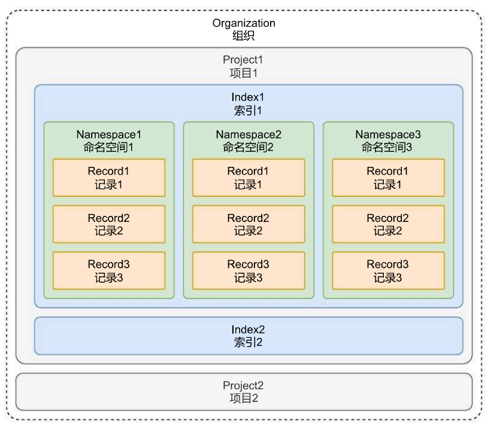

# Pinecone 向量数据库的配置与使用

## 01. Pinecone 向量数据库简介

Pinecone 是一个托管的、云原生的向量数据库，具有极简的 API，并且无需在本地部署即可快速使用，Pinecone 服务提供商还为每个账户设置了足够的免费空间，在开发阶段，可以快速基于 Pinecone 快速开发 AI 应用。

相关资料：

1. Pinecone 官网：https://www.pinecone.io/
2. Pinecone 翻译文档：https://www.pinecone‑[io.com/](https://io.com/)
3. langchain‑pinecone 翻译文档：http://imooc‑https://langchain.shortvar.com/docs/integrations/vectorstores/pinecone/

Pinecone 向量数据库的设计架构与 Faiss 差异较大，Pinecone 由于是一个面向商业端的向量数据库，在功能和概念上会更加丰富，有几个核心概念 + 架构图如下：



概念的解释如下：

1. **组织**：组织是使用相同结算方式的一个或者多个项目的集合，例如个人账号、公司账号等都算是一个组织。
2. **项目**：项目是用来管理向量数据库、索引、硬件资源等内容的整合，可以将不同的项目数据进行区分。
3. **索引**：索引是 Pinecone 中数据的最高组织单位，在索引中需要定义向量的存储维度、查询时使用的相似性指标，并且在 Pinecone 中支持两种类型的索引：无服务器索引（根据数据大小自动扩容）和 Pod 索引（预设空间 / 硬件）。
4. **命名空间**：命名空间是索引内的分区，用于将索引中的数据区分成不同的组，以便于在不同的组内存储不同的数据，例如知识库、记忆的数据可以存储到不同的组中，类似 Excel 中的 sheet 表。
5. **记录**：记录是数据的基本单位，一条记录涵盖了 ID、向量 (values)、元数据 (metadata) 等。

所以在 Pinecone 中使用向量数据库，要确保**组织、项目、索引、命名空间、记录**等内容均配置好才可以使用，并且由于 Pinecone 是云端向量数据库，使用时还需配置对应的 API 秘钥（可在注册好 Pinecone 后管理页面的 API Key 中设置）。

对于 Pinecone，LangChain 团队也封装了相应的包，安装命令：

```
pip install -U langchain-pinecone
```

然后在 `.env` 文件中配置对应的 API 秘钥，如下：

```
# Pinecone向量数据库
PINECONE_API_KEY=xxx
```

接下来就可以像 Faiss 一样去使用 LangChain 封装好的向量数据库了（会有稍许差异，这是不同向量数据库之间的一些差异）。

# 02. Pinecone 向量数据库使用技巧

## 2.1 数据的导入

Pinecone 和 Faiss 一样拥有 `from_texts` 和 `from_documents` 方法，支持快捷从文本列表和文档列表中构建向量数据库，也支持通过构造函数实例化 Pinecone 向量数据库后，通过 `add_texts` 的方式添加数据。

在配置好 Index (11mops)、namespace (dataset)、api_key 后，可执行以下代码完成向量数据库数据的添加：

```python
import dotenv
from langchain_openai import OpenAIEmbeddings
from langchain_pinecone import PineconeVectorStore

dotenv.load_dotenv()

embedding = OpenAIEmbeddings(model="text‑embedding‑3‑small")
db = PineconeVectorStore(index_name="11mops", embedding=embedding, namespace="dataset")
db.add_texts([
    "笨笨是一只很喜欢睡觉的猫咪",
    "我喜欢在夜晚听音乐，这让我感到放松。",
    "猫咪在窗台上打盹，看起来非常可爱。",
    "学习新技能是每个人都应该追求的目标。",
    "我最喜欢的食物是意大利面，尤其是番茄酱的那种。",
    "昨晚我做了一个奇怪的梦，梦见自己在太空飞行。",
    "我的手机突然关机了，让我有些焦虑。",
    "阅读是我每天都会做的事情，我觉得很充实。",
    "他们一起计划了一次周末的野餐，希望天气能好。",
    "我的狗喜欢追逐球，看起来非常开心。",
], [
    {"page": 1},
    {"page": 2},
    {"page": 3},
    {"page": 4},
    {"page": 5},
    {"page": 6, "account_id": 1},
    {"page": 7},
    {"page": 8},
    {"page": 9},
    {"page": 10},
], namespace="dataset")

print(db.similarity_search_with_relevance_scores("我养了一只猫，叫笨笨"))
```

输出内容：

```
[(Document(page_content='笨笨是一只很喜欢睡觉的猫咪', metadata={'page': 1.0}), 0.8095565), (Document(page_content='猫咪在窗台上打盹，看起来非常可爱。', metadata={'page': 3.0}), 0.7276270835), (Document(page_content='我的狗喜欢追逐球，看起来非常开心。', metadata={'page': 10.0}), 0.6540447475), (Document(page_content='我的手机突然关机了，让我有些焦虑。', metadata={'page': 7.0}), 0.611671284)]
```

## 2.2 带过滤的相似性搜索

和 Faiss 不同，Pinecone 支持原生的带过滤的相似性检索功能（元数据筛选），使用元数据过滤器会精确检索与过滤器匹配的最近结果数，在 Pinecone 中，过滤器格式为 json，其中**键**是元数据字段对应字符串，**值**是字符串、数字、布尔值、列表、json 中的一种。

例如下方是精确筛选的过滤器：

```
{
  "genre": "action",
  "year": 2020,
  "length_hrs": 1.5
}
{
  "color": "blue",
  "fit": "straight",
  "price": 29.99,
  "is_jeans": true
}
```

除此之外，筛选器的值还可以传递 json 数据，用于支持更加复杂的条件搜索，而且还可以和 AND/OR 配合。

| 筛选条件  | 描述                                  | 支持的类型           |
| --------- | ------------------------------------- | -------------------- |
| `$eq`     | 将元数据值等于指定值的向量进行匹配    | 数字、字符串、布尔值 |
| `$ne`     | 匹配元数据值不等于指定值的向量        | 数字、字符串、布尔值 |
| `$gt`     | 匹配元数据值大于指定值的向量          | 数字                 |
| `$gte`    | 匹配元数据值大于或等于指定值的向量    | 数字                 |
| `$lt`     | 匹配元数据值小于指定值的向量          | 数字                 |
| `$lte`    | 匹配元数据值小于或等于指定值的向量    | 数字                 |
| `$in`     | 将向量与指定数组中的元数据值进行匹配  | 字符串，数字         |
| `$nin`    | 与不在指定数组中的元数据值的向量匹配  | 字符串，数字         |
| `$exists` | 与存在 / 不存在特定元数据值的向量匹配 | 布尔值               |
| `$and`    | 多个条件同时符合                      | -                    |
| `$or`     | 多个条件只需要满足一个                | -                    |

例如检索页数小于等于 5 页的数据，代码示例：

```
import dotenv
from langchain_openai import OpenAIEmbeddings
from langchain_pinecone import PineconeVectorStore

dotenv.load_dotenv()

embedding = OpenAIEmbeddings(model="text‑embedding‑3‑small")
db = PineconeVectorStore(index_name="11mops", embedding=embedding, namespace="dataset")

resp = db.similarity_search_with_relevance_scores(
    "我养了一只猫叫笨笨",
    filter={"page": {"$lte": 5}}
)
```

输出内容：

```
[(Document(page_content='笨笨是一只很喜欢睡觉的猫咪', metadata={'page': 1.0}), 0.8121996819999999), (Document(page_content='猫咪在窗台上打盹，看起来非常可爱。', metadata={'page': 3.0}), 0.7371905), (Document(page_content='我喜欢在夜晚听音乐，这让我感到放松。', metadata={'page': 2.0}), 0.5996375455), (Document(page_content='我最喜欢的食物是意大利面，尤其是番茄酱的那种。', metadata={'page': 5.0}), 0.5745788215000001)]
```

例如下方，在 `page=5` 并且 `account_id=1` 的向量数据里进行相似性检索：

```
resp = db.similarity_search_with_relevance_scores(
    "我养了一只猫叫笨笨",
    filter={"$and": [{"page": 5}, {"account_id": 1}]}
)
# 输出，没有符合条件的数据
[]
```

改成 `$or` 则为符合其中一个条件即可：

```
resp = db.similarity_search_with_relevance_scores(
    "我养了一只猫叫笨笨",
    filter={"$or": [{"page": 5}, {"account_id": 1}]}
)
#输出
[(Document(page_content='我最喜欢的食物是意大利面，尤其是番茄酱的那种。', metadata={'page': 5.0}), 0.574801199), (Document(page_content='昨晚我做了一个奇怪的梦，梦见自己在太空飞行。', metadata={'account_id': 1.0, 'page': 6.0}), 0.5700240435)]
```

关于 Pinecone 更详细的筛选用法文档：https://docs.pinecone.io/guides/data/filter-with-metadata

## 2.3 删除指定数据

Pinecone 向量数据库中同样支持删除数据，并且支持按照 id 列表、按照命名空间删除全部数据、条件删除等多种策略，`delete()` 函数参数如下：

1. `ids`：需要删除的 id 列表，非必填参数。
2. `delete_all`：是否删除全部数据，一般结合 namespace 一起使用，代表删除命名空间内的所有数据，非必填参数。
3. `namespace`：需要删除的命名空间数据，非必填参数。
4. `filter`：过滤器，格式为 json/dict，删除符合条件的所有数据，在无服务器索引的情况下，不支持通过元数据筛选器删除对应的数据，只在 Pod 索引下支持，检索器的用法和相似性搜索一模一样。

例如，删除 `id=21c694f3‑1e12‑47b5‑af9d‑c93de29ad093` 对应的向量数据，如下：

```
db.delete(["21c694f3‑1e12‑47b5‑af9d‑c93de29ad093"])
```

关于 Pinecone 删除数据的用法文档：https://docs.pinecone.io/guides/data/delete‑data

## 2.4 获取原始实例

如果 LangChain 封装的 VectorStore 对应的方法并不能满足相应的需求，一般情况下，还可以获取到向量数据库的原始实例，例如 Pinecone 提供了 `update` 方法，但是在 LangChain 封装的 PineconeVectorStore 并没有提供这个方法，所以可以考虑从原始实例上调用该方法。

可以通过 `.get_pinecone_index()` 函数来获取对应的 Index，从而进行相应的操作：

```
11mops_index = db.get_pinecone_index("11mops")
11mops_index.update(id="xxx", values=[xxx], namespace="dataset")
```