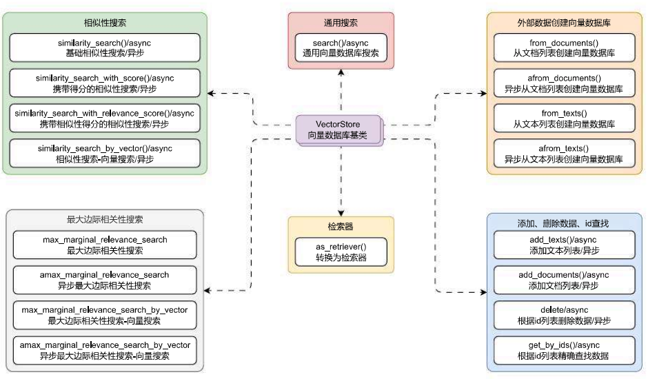
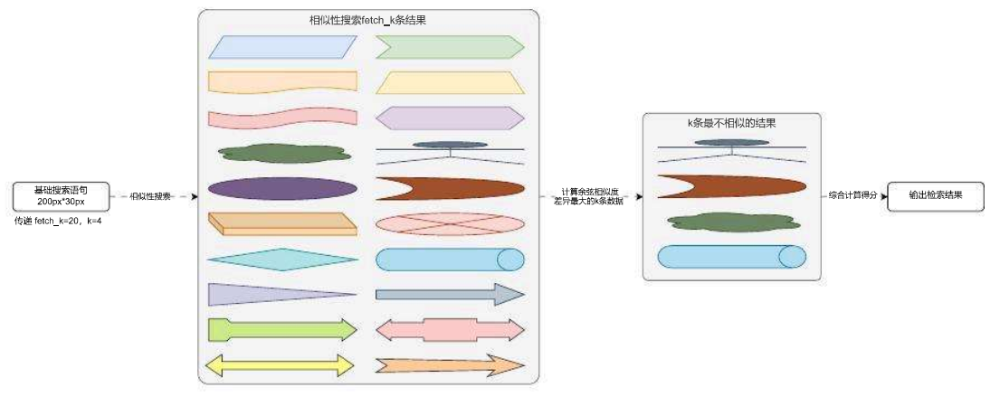

# VectorStore 组件深入学习与检索方法

## 01. VectorStore 组件深入学习

考虑到目前市面上的向量数据库众多，每个数据库的操作方式也无统一标准，但是仍然存在着一些公共特征，LangChain 基于这些通用的特征封装了 `VectorStore` 基类，在这个基类下，可以将方法划分成 5 种：**相似性搜索**、**最大边际相关性搜索**、**通用搜索**、**添加删除精确查找数据**、**通用搜索**，类图如下：



### 1.1 带得分阈值的相似性搜索

在 LangChain 的相似性搜索中，无论结果多不匹配，只要向量数据库中存在数据，一定会查找出相应的结果，在 RAG 应用开发中，一般是将高相似文档插入到 Prompt 中，所以可以考虑添加一个**相似性得分阈值**，超过该数值的部分才等同于有相似性。

在 `similarity_search_with_relevance_scores()` 函数中，可以传递 `score_threshold` 阈值参数，过滤低于该得分的文档。

例如没有添加阈值检索 `我养了一只猫，叫笨笨`，示例与输出如下：

```
import dotenv
from langchain_community.vectorstores import FAISS
from langchain_core.documents import Document
from langchain_openai import OpenAIEmbeddings

dotenv.load_dotenv()

embedding = OpenAIEmbeddings(model="text-embedding-3-small")

documents = [
    Document(page_content="笨笨是一只很喜欢睡觉的猫咪", metadata={"page": 1}),
    Document(page_content="我喜欢在夜晚听音乐，这让我感到放松。", metadata={"page": 2}),
    Document(page_content="猫咪在窗台上打盹，看起来非常可爱。", metadata={"page": 3}),
    Document(page_content="学习新技能是每个人都应该追求的目标。", metadata={"page": 4}),
    Document(page_content="我最喜欢的食物是意大利面，尤其是番茄酱的那种。", metadata={"page": 5}),
    Document(page_content="昨晚我做了一个奇怪的梦，梦见自己在太空飞行。", metadata={"page": 6}),
    Document(page_content="我的手机突然关机了，让我有些焦虑。", metadata={"page": 7}),
    Document(page_content="阅读是我每天都会做的事情，我觉得很充实。", metadata={"page": 8}),
    Document(page_content="他们一起计划了一次周末的野餐，希望天气能好。", metadata={"page": 9}),
    Document(page_content="我的狗喜欢追逐球，看起来非常开心。", metadata={"page": 10}),
]
db = FAISS.from_documents(documents, embedding)

print(db.similarity_search_with_relevance_scores("我养了一只猫，叫笨笨", score_threshold=0.4))

# 输出内容
# [(Document(metadata={'page': 1}, page_content='笨笨是一只很喜欢睡觉的猫咪'), 0.4592331743070337), (Document(metadata={'page': 3}, page_content='猫咪在窗台上打盹，看起来非常可爱。'), 0.22960424668403867), (Document(metadata={'page': 10}, page_content='我的狗喜欢追逐球，看起来非常开心。'), 0.02157827632118159), (Document(metadata={'page': 7}, page_content='我的手机突然关机了，让我有些焦虑。'), -0.09838758604956)]
```

添加阈值 0.4，搜索输出示例如下：

```
print(db.similarity_search_with_relevance_scores("我养了一只猫，叫笨笨", score_threshold=0.4))

# 输出
# [(Document(metadata={'page': 1}, page_content='笨笨是一只很喜欢睡觉的猫咪'), 0.45919389344422157)]
```

对于 `score_threshold` 的具体数值，要看相似性搜索方法使用的逻辑、计算相似性得分的逻辑进行设置，并没有统一的标准，并且与向量数据库的数据大小也存在间接关系，数据集越大，检索出来的准确度相比少量数据会更准确。

------

### 1.2 as_retriever () 检索器

在 LangChain 中，`VectorStore` 可以通过 `as_retriever()` 方法转换成检索器，在 `as_retriever()` 中可以传递一下参数：

1. `search_type`：搜索类型，支持
   - `similarity`(基础相似性搜索)
   - `similarity_score_threshold`(携带相似性得分 + 阈值判断的相似性搜索)
   - `mmr`(最大边际相关性搜索)。
2. `search_kwargs`：其他键值对搜索参数，类型为字典，例如：`k`、`filter`、`score_threshold`、`fetch_k`、`lambda_mult` 等，当搜索类型配置为 `similarity_score_threshold` 后，必须添加 `score_threshold` 配置选项，否则会报错，参数的具体信息要看 `search_type` 类型对应的函数配合使用。

并且由于检索器是 `Runnable` 可运行组件，所以可以使用 `Runnable` 组件的所有功能（组件替换、参数配置、重试、回退、并行等）。

例如将向量数据库转换成**携带得分 + 阈值判断的相似性搜索**，并设置得分阈值为 0.5，数据条数为 10 条，代码示例如下：

```
import dotenv
import weaviate
from langchain_community.document_loaders import UnstructuredMarkdownLoader
from langchain_openai import OpenAIEmbeddings
from langchain_text_splitters import RecursiveCharacterTextSplitter
from langchain_weaviate import WeaviateVectorStore
from weaviate.auth import AuthApiKey

dotenv.load_dotenv()

# 1.构建加载器与分割器
loader = UnstructuredMarkdownLoader("./项目API文档.md")
text_splitter = RecursiveCharacterTextSplitter(
    separators=["\n\n", "\n", "。|！|？", "\.\s|\!\s|\?\s", ";|；", "，|\s", "", "" ],
    is_separator_regex=True,
    chunk_size=500,
    chunk_overlap=50,
    add_start_index=True,
)

# 2.加载文档并分割
documents = loader.load()
chunks = text_splitter.split_documents(documents)

# 3.将数据存储到向量数据库
db = WeaviateVectorStore(
    client=weaviate.connect_to_wcs(
        cluster_url="https://eftofnujtxqcsa0sn272jw.co.us‑west3.gcp.weaviate.cloud",
        auth_credentials=AuthApiKey("21pzyYy0orl2dxH9xCoZG1O2b0euDeKJNEbB0"),
    ),
    index_name="DatasetDemo",
    text_key="text",
    embedding=OpenAIEmbeddings(model="text‑embedding‑3‑small"),
)

# 4.转换检索器
retriever = db.as_retriever(
    search_type="similarity_score_threshold",
    search_kwargs={"k": 10, "score_threshold": 0.5},
)

# 5.检索结果
documents = retriever.invoke("关于配置接口的信息有哪些")

print(list(document.page_content[:50] for document in documents))
print(len(documents))
```

输出内容：

```
['接口说明：用于更新对应用的调试长记忆内容，如果应用没有开启长记忆功能，则调用接口会发生报错。\n\n接', '如果接口需要授权，需要在 headers 中添加 Authorization ，并附加 access', '接口示例：\n\njson\n{\n    "code": "success",\n    "data": {', '接口信息: 授权\n+POST:/apps/:app_id/debug\n接口参数：\n\n请求参数：\n\nap', '1.2 [todo]更新应用草稿配置信息\n接口说明：更新应用的草稿配置信息，涵盖：模型配置、长记忆', '请求参数：\n\napp_id -> uuid: 路由参数，必填，需要获取的应用 id。\n\n响应参数：\n\n', '"memory_mode -> string: 记忆类型，涵盖长记忆 long_term_memory ', '1.6 [todo]获取应用调试历史对话列表\n接口说明：用于获取应用调试历史对话列表信息，该接口支', 'LLMOps 项目 API 文档\n应用 API 接口统一以 JSON 格式返回，并且包含 3 个字', '响应参数：\n\nsummary -> str: 该应用最新调试会话的长记忆内容。\n\n响应示例：\n\nnjso']
10
```

> ⚠️ Caution 课后练习：检索器返回的数据为文档列表，并没有携带相关性得分信息，如果想携带得分信息，应该如何操作？
>
> 思路：构建一个自定义函数，调用 `similarity_search_with_relevance_scores()` 函数，将检索结果的得分填充到文档的元数据中，使用 `RunnableLambda` 函数将自定义函数包装成 `Runnable` 可运行组件 / 函数。

------

## 02. MMR 最大边际相关性

最大边际相关性（MMR，`max_marginal_relevance_search`）的基本思想是同时考量查询与文档的**相关度**，以及文档之间的**相似度**。相关度确保返回结果对查询高度相关，相似度则鼓励不同语义的文档被包含进结果集。具体来说，它计算每个候选文档与查询的**相关度**，并减去与已经入选结果集的文档的最大**相似度**，这样更不相似的文档会有更高分。

而在 LangChain 中 MMR 的实现过程和 FAISS 的带过滤器的相似性搜索非常接近，同样也是先执行相似性搜索，并得到一个远大于 k 的结果列表，例如 `fetch_k` 条数据，然后对搜索得到的 `fetch_k` 条数据计算文档之间的相似度，通过加权得分找到最终的 k 条数据。

Important

> 简单来说，MMR 就是在一大堆最相似的文档中查找最不相似的，从而保证**结果多样化**。

所以 MMR 在保证查询准确的同时，尽可能提供**多样化结果**，以增加信息检索的有效性和多样性，MMR 的运行演示图如下：



根据上面的运行流程，执行一个 MMR 最大边际相似性搜索需要的参数为：**搜索语句**、**k 条搜索结果数据**、**fetch_k 条中间数据**、**多样性系数 (0 代表最大多样性，1 代表最小多样性)**，在 LangChain 中也是基于这个思想进行封装，`max_marginal_relevance_search()` 函数的参数如下：

1. `query`：搜索语句，类型为字符串，必填参数。
2. `k`：搜索的结果条数，类型为整型，默认为 4。
3. `fetch_k`：要传递给 MMR 算法的的文档数，默认为 20。
4. `lambda_mult`：函数系数，数值范围从 0‑1，底层计算得分 = `lambda_mult * 相关性 + (1 ‑ lambda_mult) * 相似性`，所以 0 代表最大多样性、1 代表最小多样性。
5. `kwargs`：其他传递给搜索方法的参数，例如 `filter` 等，这个参数使用和相似性搜索类似，具体取决于使用的向量数据库。

**使用示例**

```python
import dotenv
import weaviate
from langchain_community.document_loaders import UnstructuredMarkdownLoader
from langchain_openai import OpenAIEmbeddings
from langchain_text_splitters import RecursiveCharacterTextSplitter
from langchain_weaviate import WeaviateVectorStore

dotenv.load_dotenv()

# 1.构建加载器与分割器
loader = UnstructuredMarkdownLoader("./项目API文档.md")
text_splitter = RecursiveCharacterTextSplitter(
    separators=["\n\n", "\n", "。|！|？", "\.\s|\!\s|\?\s", ";|；", "，|\s", "", "" ],
    is_separator_regex=True,
    chunk_size=500,
    chunk_overlap=50,
    add_start_index=True,
)

# 2.加载文档并分割
documents = loader.load()
chunks = text_splitter.split_documents(documents)

# 3.将数据存储到向量数据库
db = WeaviateVectorStore(
    client=weaviate.connect_to_local("192.168.2.120", "8080"),
    index_name="DatasetDemo",
    text_key="text",
    embedding=OpenAIEmbeddings(model="text‑embedding‑3‑small"),
)
db.add_documents(chunks)

# 4.执行最大边际相关性搜索
search_documents = db.max_marginal_relevance_search("关于应用配置的接口有哪些?")

# 5.打印搜索的结果
print(list(document.page_content[:100] for document in search_documents))
```

**返回结果**

```
['1.2 [todo]更新应用草稿配置信息\n\n接口说明：更新应用的草稿配置信息，涵盖：模型配置、长记忆模式等，该接口会查找该应用原始的草稿配置并进行更新，如果没有原始草稿配置，则创建一个新配置作为草稿配',
 'LLMOps 项目 API 文档\n\n应用 API 接口统一以 JSON 格式返回，并且包含 3 个字段：code、data 和 message，分别代表业务状态码、业务数据和接口附加信息。\n\n业务状态',
 '如果接口需要授权，需要在 headers 中添加 Authorization ，并附加 access_token 即可完成授权登录，示例：\n\njson\nAuthorization: Bearer ey',
 'memory_mode -> string: 记忆类型，涵盖长记忆 long_term_memory 和 none 代表无。\nstatus -> string: 应用配置的状态，drafted 代表草稿、']
```

在 LangChain 封装的 VectorStore 组件中，内置了两种搜索策略：**相似性搜索**、**最大边际相关性搜索**，这两种策略有不同的使用场景，一般来说 80% 的场合使用相似性搜索都可以得到不错的效果，对于一些追求创新 / 创意 / 多样性的 RAG 场景，可以考虑使用**最大边际相关性搜索**。

在使用**相似性搜索**时，尽可能使用 `similarity_search_with_relevance_scores()` 方法并传递阈值信息，确保在向量数据库数据较少的情况下，不将一些不相关的数据也检索出来，并且着重调试**得分阈值（score_threshold）**，对于不同的文档 / 分割策略 / 向量数据库，得分阈值并不一致，需要经过调试才能得到一个相对比较正确的值（阈值过大检索不到内容，阈值过小容易检索到不相关内容）。